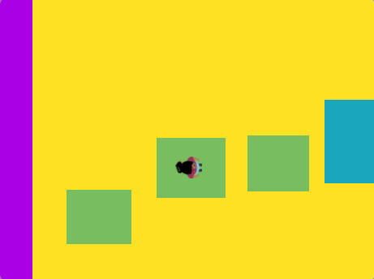
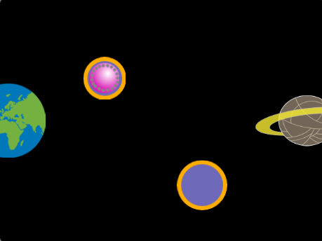

## You will make

تصميم وبناء عرض من أعلى لأسفل ، أو عقبة أو منصة ، لعبة باركور. ستحتاج شخصيتك إلى القفز ، أو القفز ، أو الانزلاق ، أو الارتداد ، أو الطيران للركوب على منصات متحركة والوصول إلى النهاية.

** ألعاب من أعلى إلى أسفل / رؤية عين الطائر ** انظر إلى أسفل على اللعبة من أعلى. أحيانًا يكون للعبة بأكملها وجهة النظر هذه. تستخدم الألعاب الأخرى طرق العرض من أعلى لأسفل عند الدخول إلى وضع التصميم. هل يمكنك التفكير في أي ألعاب تلعبها تستخدم العرض من أعلى لأسفل؟ 

سوف تفعلها:
+ اصنع لعبة بهدف باستخدام خوارزمية تتحقق من ظروف اللعبة المهمة
+ قم بإضفاء الطابع الشخصي على لعبة حسب اهتماماتك
+ اضبط مستوى صعوبة اللعبة ، بحيث يكون اللعب ممتعًا

--- no-print ---

--- task ---

  

### Play ▶️ 

Click the space bar or tap the Stage to jump to the next platform. حان وقت قفزاتك حتى لا تقع في الكاسترد.

+ كيف تنشئ اللعبة المشهد من أعلى لأسفل؟ 
+ كيف يتغير حجم الشخصية عندما تطير؟ 
+ ماذا يحدث إذا لم تهبط على منصة؟ (استمر ، تسقط في الكاسترد!)

** لا تقع في الكسترد! **: [اطلع على البرنامج] (https://scratch.mit.edu/projects/525202210/editor) {: target = "_blank"}

  <iframe allowtransparency="true" width="485" height="402" src="https://scratch.mit.edu/projects/embed/525202210/?autostart=false" frameborder="0"></iframe>

--- /task ---

### Get ideas 💭

أنت بصدد اتخاذ بعض قرارات التصميم لإنشاء لعبة منصة من أعلى إلى أسفل خاصة بك. ستختار الثيم والألوان والشخصية وعدد الأنظمة الأساسية ومستوى الصعوبة.

--- task ---

استكشف هذه المشاريع النموذجية للحصول على مزيد من الأفكار:

**طائر صغير**: [اطلع على البرنامج](https://scratch.mit.edu/projects/525236983/editor){: target = "_ blank"}

  <iframe allowtransparency="true" width="485" height="402" src="https://scratch.mit.edu/projects/embed/525236983/?autostart=false" frameborder="0"></iframe>

**قفز هوبر **: [اطلع على البرنامج](https://scratch.mit.edu/projects/525236345/editor){:target="_blank"}

  <iframe allowtransparency="true" width="485" height="402" src="https://scratch.mit.edu/projects/embed/525236345/?autostart=false" frameborder="0"></iframe>

**ارتداد الكوكب **: [اطلع على البرنامج](https://scratch.mit.edu/projects/525236603/editor){:target="_blank"}

--- /no-print ---

--- print-only ---

### Get ideas 💭

أنت بصدد اتخاذ بعض قرارات التصميم لإنشاء لعبة منصة من أعلى إلى أسفل خاصة بك. ستختار الثيم والألوان والشخصية وعدد الأنظمة الأساسية ومستوى الصعوبة. انظر من الداخل أمثلة المشاريع في [ Scratch 2: لا تقع في - أمثلة ](https://scratch.mit.edu/studios/29599110/) {: "target="_blank} Scratch استوديو.

   

--- /print-only ---

 
