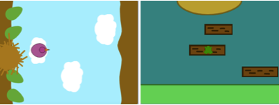

## اختر الموضوع الخاص بك

<div style="display: flex; flex-wrap: wrap">
<div style="flex-basis: 200px; flex-grow: 1; margin-right: 15px;">
في هذه الخطوة ، ستضيف شخصية وخلفية ، وستنشئ منصات بداية ونهاية. 
</div>
<div>
{:width="300px"}
</div>
</div>

--- task ---

افتح [مشروع Scratch جديد](http://rpf.io/scratch-new){: "target = "_ blank} واحذف كائن القط. سيتم فتح Scratch في علامة تبويب متصفح أخرى.

--- /task ---

--- task ---

إنشاء خلفية ملونة صلبة.

[[[scratch-paint-single-colour-backdrop]]]

--- /task ---

--- task ---

** اختر: ** هل ستنتقل شخصيتك من اليسار إلى اليمين, أم من الأسفل إلى الأعلى؟



--- /task ---

--- task ---

قم برسم ** ابدأ ** كائن منصة جديد .

ابدأ بشكل بسيط بلون واحد. يمكنك إضافة المزيد من التفاصيل في وقت لاحق.

قم بتوسيط المظهر في محرر الرسام.

[[[scratch-crosshair]]]

ضع كائن المنصة **ابدأ ** حيث تريد أن تبدأ شخصيتك اللعبة.

--- /task ---

--- task ---

إنشاء ** النهاية ** كائن منصة بسيط. يمكنك إضافة المزيد من التفاصيل في وقت لاحق.

قم بتوسيط المظهر في محرر الرسام.

ضع كائنك **النهاية** على المنصة حيث تريد أن تنهي شخصيتك اللعبة.

--- /task ---

--- task ---

أنشئ **شخصية** الكائن.

**اختر:** هل تريد إضافة أو رسم كائن مكون من **شخصية** الكائن ؟

قد ترغب في إضافة من أعلى لأسفل **شخصية** مثل الكائن **تاتيانا**, **تايلور**, او **تريشا**.


أو ارسم كائنًا واحدًا مكونًا من **شخصية** الكائن. ابدأ بأشكال بسيطة وأضف التفاصيل لاحقًا. قم بتوسيط المظهر في محرر الرسام.

[[[generic-scratch3-draw-sprite]]]

--- /task ---

--- task ---

يحتاج كائن **شخصيتك** نص بداية لبدء التهيئة لبداية اللعبة.

--- collapse ---

---
title: احصل على شخصيتك جاهزة للبدء
---

قم بعمل `متغير`{ class = "block3variables":} بالاسم `نزل`، وقم بتعيينه على الحجم الذي يجب أن يكون عليه الكائن الخاص بك عندما يهبط ولا يقفز.

اجعل شخصيتك تذهب إلى **ابدأ** `عند النقر على العلم`{: class = "block3events"}. أضف `انتقل إلى كتلة الطبقة الأمامية`{:" class = "block3looks} الكتلة، بحيث تكون شخصيتك على اعلى المنصة.

**الشخصية:**

```blocks3
when flag clicked // setup
go to (Start v)
set [landed v] to [40] // size when not jumping
set size to (landed) % // not jumping
go to [front v] layer
show
broadcast (start v) // start other scripts
```

**نصيحة:** قم بإلغاء تحديد متغير `نزل`{class = "block3variables":} في قائمة كتل `المتغيرات`{: class = "block3variables"} حتى لا تظهر على المسرح. لا يحتاج المستخدم لرؤية هذا المتغير.

--- /collapse ---

**نصيحة:** إنها فكرة جيدة أن تقوم `بث`{: "class="block3events} رسالة `بدء`{:" class="block3events} في نهاية البرنامج النصي للإعداد للسماح للنصوص الأخرى بمعرفة وقت البدء، وإلا قد يبدأون قبل أن يصبح كل شيء جاهزًا.

--- /task ---

--- task ---

**التصحيح:**

--- collapse ---

---
title: الكائن الخاص بي يشير في الاتجاه الخاطئ
---

يمكن استخدام خاصية **اتجاه** في جزء الكائن للتحكم في الاتجاه الذي يشير إليه الكائن. لف العجلة لعمل نقطة كائن في الاتجاه الذي تريده.


--- /collapse ---

--- /task ---

--- task ---

امنح مشروعك عنوانًا يصف لعبتك.

--- /task ---

--- save ---
