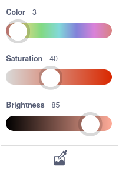

## الفائز

<div style="display: flex; flex-wrap: wrap">
<div style="flex-basis: 200px; flex-grow: 1; margin-right: 15px;">
في هذه الخطوة ، ستكتشف وصول اللاعب إلى المنصة ** النهاية ** للفوز باللعبة. 
</div>
<div>
{:width="300px"}
</div>
</div>

ستضيف حلقة `كرر باستمرار`{class="block3control":} للتحقق مما إذا كانت **الشخصية الخاصة بك** على مستوى المنصة، وإذا كان الأمر كذلك ، فإن عبارة `اذا`{:class="block3control"} قد وصلت إلى **نهاية** المنصة.

--- task ---

**اختر:** أضف صوتًا رابحًا إلى شخصيتك.

--- /task ---

###  End the game when touching a coloured platform

--- task ---

Use a `touching color`{:class="block3sensing"} block to detect when your character sprite reaches the **End** platform.


```blocks3
when I receive [start v]
forever
if <(size) = (landed)> then // not in the air
if <touching color (#b89d2f) ?> then // at end
broadcast (stop v) // stop other sprites
stop [other scripts in sprite v] // stop jumping after win
go to (End v)
play sound (Win v) until done
stop [all v]
end
end
end
```

`توقف النصية الأخرى في الكائن`{:" class = "block3control} توقف الحلقة التي تجعل الشخصية يقفز.

A `broadcast (stop v)`{:class="block3events"} message is used when your game is finished so that other sprites can stop, but this sprite can do something such as playing a sound before it stops.

--- /task ---

Use the eyedropper to pick the colour of your **End** platform

--- task ---

```blocks3
<touching color (#20f73b) ?>

```
Click on the colour input to open the colour picker and then click on the eyedropper at the bottom.



Move the mouse pointer over to the End platform on the Stage and click to select the colour.


The colour in the block input will change to match the colour you chose. Click in the Code area to close the colour picker.

--- /task ---

--- task ---

** اختبار: ** انقر فوق العلم الأخضر ثم قفز شخصيتك عبر المنصة. تأكد من سماع الصوت الفائز عندما تصل إلى منصة **النهاية**.

**نصيحة:** من المهم حقًا أن تختبر مشروعك قبل الانتقال إلى الخطوة التالية وإضافة المزيد من التعليمات البرمجية. من الصعب العثور على الأخطاء وإصلاحها عند إضافة المزيد من التعليمات البرمجية.

--- /task ---


--- task ---

**التصحيح:**

--- collapse ---

---
title: لا ينتقل الكائن الخاص بي إلى مركز منصة النهاية
---

تحتاج إلى التأكد من أن جميع أزياء الرموز الخاصة بك مركزة في محرر الرسام.

يقوم `إلى (كائن آخر)`{:" class = "block3motion} الكتلة بتحريك الكائن بحيث يكون مركزه في نفس موضع مركز الكائن الآخر. إذا كانت مراكزهم في المكان الخطأ ، فلن ينتقل الطابع **الشخصية** الخاص بك إلى وسط منصات.

--- /collapse ---

--- collapse ---

---
title: تنتهي اللعبة في وقت قريب جدًا
---

تأكد من أن الكائن الخاص بك لا يلمس لون النهاية عندما لا يكون على منصة **النهاية** - إذا كنت تستخدم نفس اللون في مكان آخر في مشروعك ، فقد تموت شخصيتك في وقت قريب جدًا.

--- /collapse ---

--- collapse ---

---
title: لا يتم تشغيل الصوت عندما أصعد على منصة النهاية
---

انقر على **الشخصية** كائن ثم على علامة التبويب "الأصوات". تأكد من أنك أضفت صوت النهاية إلى كائنك. انقر فوق الزر **تشغيل** للتأكد من عمل الصوت على جهاز الكمبيوتر الخاص بك.

انقر فوق علامة التبويب **التعليمات البرمجية** وتحقق من أن الصوت الصحيح في `تشغيل الصوت`كتلة {: " class = "block3sound} التي يتم تشغيلها عندما يصل الكائن إلى منصة **النهاية**.

تأكد من صحة اللون في كتلة اللون `لمس اللون`{:" class = "block3sensing}. حدده مرة أخرى إذا لم تكن متأكدًا. تبدو الألوان أحيانًا متشابهة ولكنها ليست متشابهة.

```blocks3
when I receive [start v]
forever
if < (size) = (landed) > then // not in the air
+if <touching color (#b89d2f) ?> then // at end
broadcast (stop v) // stop other sprites
go to (End v)
+play sound (Win v) until done
stop [all v]
end
end
end
```

--- /collapse ---

إذا كان لديك خطأ لم نغطه هنا ، فأخبرنا بذلك في التعليقات. إذا أصلحت الخطأ بنفسك (أحسنت!) ، فأخبرنا بذلك أيضًا.

**نصيحة:** إذا كنت عالقًا ، فحاول قراءة التعليمات البرمجية الخاص بك بصوت عالٍ أو في رأسك للتأكد من أنه يوضح ما تعتقد أنه يفعله. قد تجد الخطأ.

--- /task ---

--- save ---
