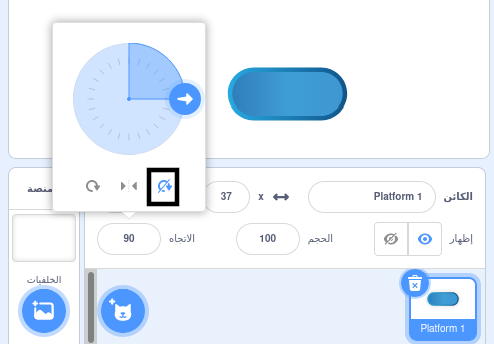

## ركوب على منصات

<div style="display: flex; flex-wrap: wrap">
<div style="flex-basis: 200px; flex-grow: 1; margin-right: 15px;">
حسنًا ، هذا سهل للغاية! 

في هذه الخطوة ، ستضيف منصات لتهبط عليها. القفز عليها سوف يتجنب الوقوع فيها. 
</div>
<div>
{:width="300px"}
</div>
</div>

--- task ---

أنشئ **منصة 1** كائن للهبوط عليه.

ارسم زي الخاص بك **منصة 1** كائن.

**نصيحة:** إذا كنت تريد أن يرتد الكائن الخاص بك إلى `ترتد`{:class="block3motion"} بدون أن يظهر المظهر لتغيير الاتجاه ، فستحتاج إلى زي متماثل ، أو اضبط نمط التدوير على **لا تستدير**.



--- /task ---

--- task ---

أنشئ التعلياتك البرمجية **منصة 1** كائن للهبوط عليه.

قد تحتاج إلى كائن **منصة 1** إلى `في الاتجاه`{:class="block3motion"} `0` للتحرك لأعلى ولأسفل الشاشة.

--- collapse ---

---
title: اجعل الكائن الخاص بك يتحرك
---

```blocks3
when I receive [start v]
point in direction (0) // add this block for left to right games
forever
move (4) steps // try different numbers
if on edge, bounce
end
```

--- /collapse ---

--- /task ---

--- task ---

**اختبار:** انقر فوق العلم الأخضر وتأكد من أن الكائن الخاص بك يتحرك بشكل صحيح.

--- /task ---

--- task ---

قم بتكرار كائن **منصة 1** الخاص بك وقم بتسميته **منصة 2**.

**اختر:** إذا كنت تريد أن يكون لديك 3 منصات ، قم بتكرار **منصة 1** كائن مرة أخرى وقم بتسميتها **منصة 3**.

[[[scratch3-duplicate-sprite]]]

جرب عدد الخطوات وحجم الرموز لجعل كل منصة أسهل أو يصعب القفز عليها.

--- /task ---

اكتشف `اذا`{:class="block3control"} أن كائن **الشخصية** الخاص بك قد هبط على **المنصة** وهو آمن، `وإلا`{:class="block3control"}فقد سقطت **الشخصية** الخاصة بك!

--- task ---

أضف التعليمات البرمجية إلى كائن **الشخصية** الخاص بك لتتحسس `اذا ملامس`{:class="block3sensing"} للون موجود على **منصة** الكائنات.

**اختر:** إذا كانت منصتك تحتوي على ألوان متعددة ، فاختر اللون الذي تريد شخصيتك أن تهبط عليه. قد ترغب في أن يسقطوا إذا كانوا على حافة الهاوية فقط!

--- collapse ---

---
title: إذا لمس الكائن
---

```blocks3
when I receive [start v]
forever
if <(size) = (landed) > then // not in the air
if <touching color (#b89d2f) ?> then // at end
broadcast (stop v) // stop other sprites
stop [other scripts in sprite v]
go to (End v)
play sound (Win v) until done
stop [all v]
end
+ if <touching color (#762356) ?> then // choose a colour on your platform
if <touching (Platform 1 v)> then
go to (Platform 1 v)
end
if <touching (Platform 2 v)> then
go to (Platform 2 v)
end
if <touching (Platform 3 v)> then
go to (Platform 3 v)
end
else
end
end
end
```

--- /collapse ---

--- /task ---

--- task ---

**اختبار:** انقر فوق العلم الأخضر وتأكد من أن الكائن الخاص بك يمكنه الركوب على المنصات.

--- /task ---

--- task ---

أضف تعليمات برمجية إلى الكائن **الشخصية** الخاص بك إلى الإحساس `اذا`{:class="block3control"} `ملامس`{:class="block3sensing"} لون الخلفية، ثم قم بإنهاء اللعبة.

--- collapse ---

---
title: خلفية مؤثرة أخرى
---

```blocks3
when I receive [start v]
forever
if <(size) = (landed)> then // not in the air
if <touching color (#b89d2f) ?> then // at end
broadcast (stop v) // stop other sprites
stop [other scripts in sprite v] 
go to (End v)
play sound (Win v) until done
stop [all v]
end
if <touching color (#762356) ?> then // choose a colour on your platform
if <touching (Platform 1 v)> then
go to (Platform 1 v)
end
if <touching (Platform 2 v)> then
go to (Platform 2 v)
end
if <touching (Platform 3 v)> then
go to (Platform 3 v)
end
else
+ if <touching color (#37ab37) ?> then // choose your backdrop colour
broadcast (stop v)
stop [other scripts in sprite v] // prevent jumping after losing
hide
play sound (lose v) until done // add a sound of your choice
stop [all v]
end
end
end
```

--- /collapse ---

--- /task ---

--- task ---

**اختبار:** العب لعبتك وحاول تفويت منصة. تأكد من سماع صوت الخسارة.

--- /task ---

--- task ---

أضف تعليمات البرمحية إلى **منصة** الكائنات الخاص بك منعهم من التحرك عندما **شخصية** الكائن تصل الى **نهاية** المنصة أو يقع فيه!

```blocks3
when I receive [stop v]
stop [other scripts in sprite v]
```

--- /task ---

--- task ---

**اختبار:** العب مرة أخرى وتأكد من توقف المنصات عند انتهاء اللعبة. تنتهي اللعبة عندما تصل إلى منصة **نهاية** ، أو عندما تسقط فيها.

--- /task ---

--- task ---

**التصحيح:**

--- collapse ---

---
title: تنتهي اللعبة في وقت قريب جدًا
---

تأكد من أن كتل `اذا`{:class="block3control"} مرتبة بالترتيب الصحيح داخل كتلة `كرر باستمرار`{:class="block3control"}. تحقق بعناية من تعليمات البرمجية المثال.

إذا تحققت من أن **الشخصية** يلامس الخلفية قبل أن تتاح له فرصة الهبوط على منصة ، فقد تنتهي لعبتك بشكل غير عادل!

تأكد من أن كتل `اذا`{:class="block3control"} التي تتحقق من شروط اللعبة تكون داخل كتلة `اذا`{:class="block3control"} التي تتحقق من حجم **الشخصية** اذا كان طبيعي. لا بأس أن يلامس كائنك لون الخلفية عند القفز. إنها مشكلة فقط إذا هبطوا في الكاسترد أو الحمم البركانية أو اللزوجة المشعة أو أي خطر اخترته.

--- /collapse ---

--- collapse ---

---
title: المنصات لا تتوقف عندما أفوز أو أخسر
---

انظر إلى **المنصة** الخاص بك الكائن `عندما أتلقى`{:class="block3events"} نص وتحقق من أن الرسالة هي `التوقف`{:class="block3events"}.

```blocks3
when I receive [stop v]
stop [other scripts in sprite v]
```
تحقق من أن كتلة `البث`{:class="block3events"} داخل كتلة `اذا`{:class="block3control"} للفوز والخسارة هي `توقف`{:class="block3events"}.

```blocks3
broadcast (stop v)
```

--- /collapse ---

--- /task ---

<p style="border-left: solid; border-width:10px; border-color: #0faeb0; background-color: aliceblue; padding: 10px;">
لا يوجد الكثير <span style="color: #0faeb0">منصة ألعاب</span> في ذلك الألعاب ثنائية وثلاثية الأبعاد. المنصات شائعة في ألعاب العوائق (obby) وألعاب الباركور. تحتوي بعض الألعاب على منصات تتحرك وتظهر وتختبئ أو تختفي تدريجيًا عند القفز عليها. هل يمكنك التفكير في الألعاب التي لعبتها والتي تحتوي على منصات يجب عليك القفز عليها؟ ماذا عن الألعاب ذات المنصات المتحركة؟
</p>

--- save ----
