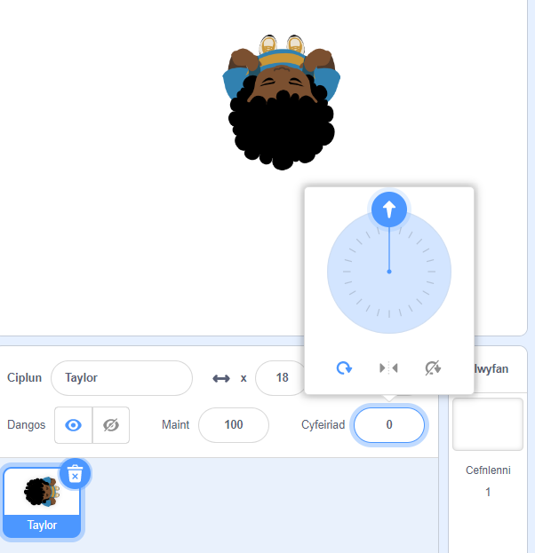

## Dewis dy thema

<div style="display: flex; flex-wrap: wrap">
<div style="flex-basis: 200px; flex-grow: 1; margin-right: 15px;">
Yn y cam yma, byddi di'n ychwanegu cymeriad a chefnlen, ac yn creu platfformau dechrau a diwedd. 
</div>
<div>
{:width="300px"}
</div>
</div>

--- task ---

Agora [brosiect Scratch newydd](http://rpf.io/scratch-new){:target="_blank"} a dileu corlun y gath. Bydd Scratch yn agor mewn tab arall ar y porwr.

--- /task ---

--- task ---

Crea gefndir lliw solet.

[[[scratch-paint-single-colour-backdrop]]]

--- /task ---

--- task ---

**Dewis:** Fydd dy gymeriad yn symud o'r chwith i'r dde, neu o'r gwaelod i'r brig?


--- /task ---

--- task ---

Paentia gorlun platfform **Dechrau** newydd.

Dechreua gyda siâp un lliw syml. Galli di ychwanegu mwy o fanylion nes ymlaen.

Canola dy wisg yn y Golygydd paent.

[[[scratch-crosshair]]]

Gosoda dy gorlun platfform **Dechrau** lle rwyt ti am i dy gymeriad ddechrau'r gêm.

--- /task ---

--- task ---

Crea gorlun platfform **Diwedd** syml. Galli di ychwanegu rhagor o fanylion nes ymlaen.

Canola dy wisg yn y Golygydd paent.

Gosoda dy gorlun platfform **Diwedd** lle rwyt ti am i dy gymeriad orffen y gêm.

--- /task ---

--- task ---

Crea gorlun **cymeriad**.

**Dewis:** Wyt ti am ychwanegu neu beintio corlun **cymeriad**?

Efallai hoffet ti ychwanegu corlun **cymeriad** o'r brig i lawr fel **Tatiana**, **Taylor**, neu **Trisha**.


Neu, gallet ti beintio dy gorlun **cymeriad** dy hun. Dechreua gyda siapiau syml ac ychwanega'r manylion yn ddiweddarach. Creua dy wisg newydd yn y Golygydd Paent.

[[[generic-scratch3-draw-sprite]]]

--- /task ---

--- task ---

Mae angen sgript dechrau ar dy gorlun **cymeriad** er mwyn rhoi popeth yn ei le ar gyfer dechrau'r gêm.

--- collapse ---

---
title: Paratoi dy gymeriad i ddechrau
---

Crea `newidyn`{:class="block3variables"} o'r enw `glanio`, a'i osod i'r maint y dylai dy gorlun fod pan fydd wedi glanio a heb fod yn neidio.

Dywed i dy gymeriad fynd i'r **Dechrau** `pan fydd y faner wedi'i chlicio`{:class="block3events"}. Ychwanega floc `mynd i'r haen flaen`{:class="block3looks"}, fel bod dy gymeriad ar ben y platfformau.

**Cymeriad:**

```blocks3
when flag clicked // setup
go to (Start v)
set [landed v] to [40] // size when not jumping
set size to (landed) % // not jumping
go to [front v] layer
show
broadcast (start v) // start other scripts
```

**Awgrym:** Dad-dicia'r newidyn `glanio`{:class="block3variables"} yn y ddewislen `Newidynnau`{:class="block3variables"} fel nad yw'n ymdddangos ar y Llwyfan. Does dim angen i'r defnyddiwr weld y newidyn yma.

--- /collapse ---

**Awgrym:** Mae'n syniad `darlledu`{:class="block3events"} neges `dechrau`{:class="block3events"} ar ddiwedd dy sgript gosod i roi gwybod i sgriptiau eraill pryd i ddechrau, fel arall efallai byddan nhw'n dechrau cyn bod popeth yn barod.

--- /task ---

--- task ---

**Difa chwilod:**

--- collapse ---

---
title: Mae fy nghorlun yn pwyntio i'r cyfeiriad anghywir
---

Galli di ddefnyddio'r briodwedd **Cyfeiriad** yn y cwarel Sprite i reoli'r cyfeiriad mae'r corlun yn pwyntio iddo. Tro'r olwyn i wneud i'r corlun bwyntio i'r cyfeiriad sydd ei angen arnat.



--- /collapse ---

--- /task ---

--- task ---

Rho deitl i dy brosiect sy'n disgrifio dy gêm.

--- /task ---

--- save ---
