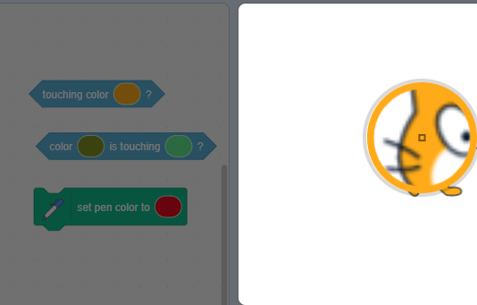

## Enillydd

<div style="display: flex; flex-wrap: wrap">
<div style="flex-basis: 200px; flex-grow: 1; margin-right: 15px;">
Yn y cam yma, byddi di'n canfod y chwaraewr yn cyrraedd y platfform **Diwedd** i ennill y gêm. 
</div>
<div>
{:width="300px"}
</div>
</div>

Rwyt ti'n mynd i ychwanegu dolen `am byth`{:class="block3control"} sy'n gwirio a ydy dy **gymeriad** ar lefel y platfform, ac os felly, `os`{:class="block3control"} yw wedi cyrraedd y platfform **Diwedd**.

--- task ---

**Dewis:** Ychwanega sain ennill i dy gymeriad.

--- /task ---

###  End the game when touching a coloured platform

--- task ---

Use a `touching color`{:class="block3sensing"} block to detect when your character sprite reaches the **End** platform.


```blocks3
when I receive [start v]
forever
if <(size) = (landed)> then // not in the air
if <touching color (#b89d2f) ?> then // at end
broadcast (stop v) // stop other sprites
stop [other scripts in sprite v] // stop jumping after win
go to (End v)
play sound (Win v) until done
stop [all v]
end
end
end
```

Mae'r bloc `aros sgriptiau eraill yn y ciplun`{:class="block3control"} yn stopio'r ddolen sy'n gwneud i'r cymeriad neidio.

A `broadcast (stop v)`{:class="block3events"} message is used when your game is finished so that other sprites can stop, but this sprite can do something such as playing a sound before it stops.

--- /task ---

Use the eyedropper to pick the colour of your **End** platform

--- task ---

```blocks3
<touching color (#20f73b) ?>

```
Click on the colour input to open the colour picker and then click on the eyedropper at the bottom.


Move the mouse pointer over to the End platform on the Stage and click to select the colour.



The colour in the block input will change to match the colour you chose. Click in the Code area to close the colour picker.

--- /task ---

--- task ---

**Prawf:** Clicia'r faner werdd ac wedyn neidio dy gymeriad ar draws y Llwyfan. Gwna'n siŵr dy fod ti'n clywed y sain ennill pan fyddi di'n cyrraedd y platfform **Diwedd**.

**Awgrym:** Mae'n bwysig iawn dy fod yn profi dy brosiect cyn symud i'r cam nesaf ac ychwanegu mwy o god. Mae'n anoddach dod o hyd i chwilod a'u trwsio pan fyddi di wedi ychwanegu mwy o god.

--- /task ---


--- task ---

**Difa chwilod:**

--- collapse ---

---
title: Dydy fy nghorlun ddim yn mynd i ganol y platfform Diwedd
---

Mae angen sicrhau bod dy holl wisgoedd corlun wedi'u canoli yn y golygydd Paent.

Mae'r bloc `mynd i (corlun arall)`{:class="block3motion"}{:class="block3motion"} yn symud corlun fel bod ei ganol yn yr un safle â chanol y corlun arall. Os ydy eu canolau yn y lle anghywir, yna fydd dy **gymeriad** ddim yn mynd i ganol y platfformau.

--- /collapse ---

--- collapse ---

---
title: Mae'r gêm yn dod i ben yn rhy fuan
---

Gwna'n siŵr nad ydy dy gorlun yn cyffwrdd â'r lliw Diwedd pan nad yw ar y platfform **Diwedd** - os wyt ti'n defnyddio'r un lliw mewn man arall yn dy brosiect, yna gallai dy gymeriad farw'n rhy fuan.

--- /collapse ---

--- collapse ---

---
title: Dydy'r sain ddim yn chwarae pan fydda i'n glanio ar y platfform End
---

Clicia ar dy gorlun **cymeriad** ac yna'r tab 'Seiniau'. Gwna'n siŵr dy fod wedi ychwanegu'r sain Diwedd at dy gorlun. Clicia'r botwm **Chwarae** i sicrhau bod y sain yn gweithio ar dy gyfrifiadur.

Clicia'r tab **Cod** a gwirio fod y sain gywir yn y bloc `chwarae sain`{:class="block3sound"} sy'n rhedeg pan fydd y corlun yn cyrraedd y platfform **Diwedd**.

Gwna'n siŵr fod y lliw yn gywir yn y bloc `cyffwrdd lliw`{:class="block3sensing"}. Dewisa'r lliw eto os nad wyt ti'n siŵr. Weithiau mae lliwiau'n edrych yn debyg ond dydyn nhw ddim yr un fath.

```blocks3
when I receive [start v]
forever
if < (size) = (landed) > then // not in the air
+if <touching color (#b89d2f) ?> then // at end
broadcast (stop v) // stop other sprites
go to (End v)
+play sound (Win v) until done
stop [all v]
end
end
end
```

--- /collapse ---

Os oes gen ti chwilen nad ydyn ni wedi ymdrin â hi yma, rho wybod i ni yn yr adborth. Os wnes di drwsio'r chwilen dy hun (da iawn!), rho wybod am hynny i ni hefyd.

**Awgrym:** Os wyt ti methu datrys dy broblem, rho gynnig ar ddarllen dy god yn uchel neu yn dy ben i wneud yn siŵr ei fod yn dweud yr hyn rwyt ti'n meddwl. Efallai byddi di'n dod o hyd i'r chwilen.

--- /task ---

--- save ---
