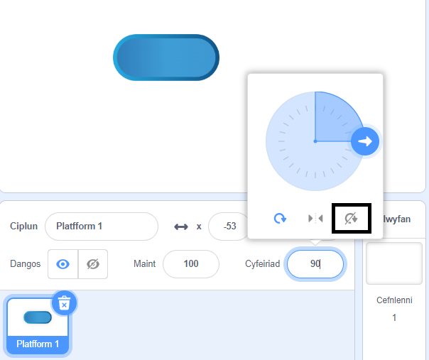

## Reidio ar blatfformiau

<div style="display: flex; flex-wrap: wrap">
<div style="flex-basis: 200px; flex-grow: 1; margin-right: 15px;">
Wel mae hynny'n rhy hawdd! 

Yn y cam yma, byddi di'n ychwanegu mwy o blatfformiau i lanio arnyn nhw. Jumping on them will stop your sprite falling in. 
</div>
<div>
{:width="300px"}
</div>
</div>

--- task ---

Crea gorlun **Platfform 1** i lanio arno.

Paentia wisg ar gyfer dy gorlun **Platfform 1**.

**Awgrym:** Os wyt ti am i dy gorlun `fowndio`{:class="block3motion"} heb i'r wisg ymddangos ei bod yn newid cyfeiriad, bydd angen gwisg sy'n gymesur, neu bydd angen gosod yr arddull cylchdroi i **Peidio troi**.



--- /task ---

--- task ---

Ychwanega god at dy gorlun **Platform 1** i wneud iddo symud.

Efallai bydd angen i dy gorlun **Platfform 1** `bwyntio i gyfeiriad`{:class="block3motion"} `0` er mwyn symud i fyny ac i lawr y sgrin.

--- collapse ---

---
title: Gwneud i dy blatfform symud
---

```blocks3
when I receive [start v]
point in direction (0) // add this block for left to right games
forever
move (4) steps // try different numbers
if on edge, bounce
end
```

--- /collapse ---

--- /task ---

--- task ---

**Prawf:** Clicia'r faner werdd a gwneud yn siŵr bod dy blatfform yn symud yn gywir.

--- /task ---

--- task ---

Dyblyga dy gorlun **Platfform 1** corlun a'i enwi yn **Platfform 2**.

**Dewis:** Os wyt ti am gael 3 phlatfform, dyblyga'r corlun **Platfform 1** eto a'i enwi yn **Platfform 3**.

[[[scratch3-duplicate-sprite]]]

Arbrofa gyda nifer y camau a maint y corlun i wneud pob platfform yn haws neu'n anoddach neidio arno.

--- /task ---

Synhwyra `os`{:class="block3control"} mae dy gorlun **cymeriad** wedi glanio ar gorlun **platfform** a'i fod yn ddiogel, neu `fel arall`{:class="block3control"} mae dy gorlun **cymeriad** wedi disgyn i mewn!

--- task ---

Ychwanega god at dy gorlun **cymeriad** i synhwyro `os yn cyffwrdd`{:class="block3sensing"} lliw ar y corluniau **platfform**.

**Dewis:** Os oes gan dy blatfform sawl lliw, dewisa ba liw y mae angen i dy gymeriad lanio arno. Efallai byddi di am iddo syrthio i mewn hyd yn oed os yw ar ymyl y platfform!

--- collapse ---

---
title: Os yw'n cyffwrdd â'r platfform
---

```blocks3
when I receive [start v]
forever
if <(size) = (landed) > then // not in the air
if <touching color (#b89d2f) ?> then // at end
broadcast (stop v) // stop other sprites
stop [other scripts in sprite v]
go to (End v)
play sound (Win v) until done
stop [all v]
end
+ if <touching color (#762356) ?> then // choose a colour on your platform
if <touching (Platform 1 v)> then
go to (Platform 1 v)
end
if <touching (Platform 2 v)> then
go to (Platform 2 v)
end
if <touching (Platform 3 v)> then
go to (Platform 3 v)
end
else
end
end
end
```

--- /collapse ---

--- /task ---

--- task ---

**Prawf:** Clicia'r faner werdd a gwneud yn siŵr bod dy gorlun yn gallu reidio ar y platfformau.

--- /task ---

--- task ---

Ychwanega god at dy gorlun **cymeriad** i synhwyro `os`{:class="block3control"} `yn cyffwrdd`{:class="block3sensing"} lliw'r cefndir, yna mae angen gorffen y gêm.

--- collapse ---

---
title: Fel arall os yw'n cyffwrdd â'r gefnlen
---

```blocks3
when I receive [start v]
forever
if <(size) = (landed)> then // not in the air
if <touching color (#b89d2f) ?> then // at end
broadcast (stop v) // stop other sprites
stop [other scripts in sprite v] 
go to (End v)
play sound (Win v) until done
stop [all v]
end
if <touching color (#762356) ?> then // choose a colour on your platform
if <touching (Platform 1 v)> then
go to (Platform 1 v)
end
if <touching (Platform 2 v)> then
go to (Platform 2 v)
end
if <touching (Platform 3 v)> then
go to (Platform 3 v)
end
else
+ if <touching color (#37ab37) ?> then // choose your backdrop colour
broadcast (stop v)
stop [other scripts in sprite v] // prevent jumping after losing
hide
play sound (lose v) until done // add a sound of your choice
stop [all v]
end
end
end
```

--- /collapse ---

--- /task ---

--- task ---

**Prawf:** Chwarea dy gêm a cheisio methu'r platfform yn fwriadol. Gwna'n siŵr dy fod yn clywed y sain colli.

--- /task ---

--- task ---

Ychwanega god at dy gorluniau **platfform** i'w stopio rhag symud pan fydd y corlun **cymeriad** yn cyrraedd y platfform **Diwedd** — neu'n disgyn i mewn!

```blocks3
when I receive [stop v]
stop [other scripts in sprite v]
```

--- /task ---

--- task ---

**Profi:** Chwarea eto a gwna'n siŵr bod y platfformiau'n stopio pan ddaw'r gêm i ben. Daw'r gêm i ben pan fyddi di'n cyrraedd y platfform **Diwedd**, neu pan fyddi di'n disgyn i mewn.

--- /task ---

--- task ---

**Difa chwilod:**

--- collapse ---

---
title: Mae'r gêm yn dod i ben yn rhy fuan
---

Gwna'n siŵr fod gen ti y blociau `os`{:class="block3control"} yn y drefn gywir y tu mewn i dy floc `am byth`{:class="block3control"}. Gwiria hyn yn ofalus yn erbyn y cod enghreifftiol.

Os wyt ti'n gwneud yn siŵr fod y **cymeriad** yn cyffwrdd â'r cefndir cyn iddo gael cyfle i lanio ar blatfform, yna fe allai dy gêm ddod i ben mewn ffordd annheg!

Gwna'n siŵr fod dy flociau `os`{:class="block3control"} ar gyfer gwirio amodau'r gêm y tu mewn i floc `os`{:class="block3control"} sy'n gwirio a ydy maint y **cymeriad** yn normal. Mae'n iawn os ydy dy gorlun yn cyffwrdd â lliw'r cefndir wrth neidio. Dim ond os bydd dy gymeriad yn glanio yn y cwstard, y lafa, y slwtsh ymbelydrol, neu ba bynnag berygl rwyt ti wedi'i ddewis, mae problem.

--- /collapse ---

--- collapse ---

---
title: Dydy'r platfformau ddim yn stopio pan fydda i'n ennill neu'n colli
---

Edrycha ar sgript `pan rwy'n derbyn`{:class="block3events"}</strong> dy gorluniau **platfform** a gwneud yn siŵr mai `stop` ydy'r neges.

```blocks3
when I receive [stop v]
stop [other scripts in sprite v]
```
Gwna'n siŵr fod y bloc `darlledu`{:class="3events"} y tu mewn i'r blociau `os`{:class="block3control"} ennill a cholli yn dweud `stop`{:class="block3events"}.

```blocks3
broadcast (stop v)
```

--- /collapse ---

--- /task ---

--- save ---
