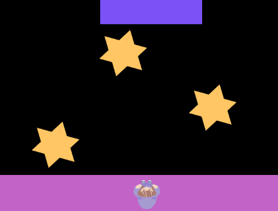

## Addasu lefel yr anhawster

Ydy dy gêm yn rhy galed neu'n rhy hawdd? Yn y cam yma, addasa lefel yr anhawster i wella'r profiad chwarae. 

{:width="300px"}

--- task ---

Dyma rai pethau y gallu di roi cynnig arnyn nhw i arbrofi gyda lefel yr anhawster:

+ Newid maint y platfformau neu'r cymeriad
+ Newid y cyflymder mae'r platfformau symud
+ Newid faint o amser mae'n ei gymryd i'r cymeriad neidio i wneud yr amseru'n anoddach

--- /task ---

--- task ---

**Chwarae:** Mae chwarae dy gêm yn rhan o brofi bod y gêm yn gweithio'n iawn. Mae hefyd yn ddefnyddiol ac yn hwyl!

--- /task ---

--- save ---
