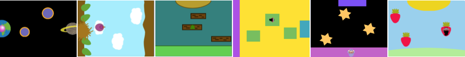
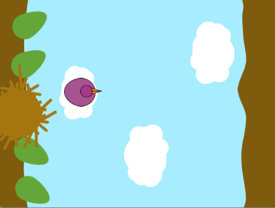

## Εισαγωγή

Σχεδίασε και δημιούργησε ένα παιχνίδι parkour με θέα από πάνω προς τα κάτω ή σε πλατφόρμες. Ο χαρακτήρας σας θα χρειαστεί να πηδήξει, να πηδήξει, να γλιστρήσει, να αναπηδήσει ή να πετάξει για να κινηθεί ανάμεσα σε κινούμενες πλατφόρμες και να φτάσει στο τέλος.

**Παιχνίδια με οπτική γωνία από ψηλά** κοίταξε το παιχνίδι από ψηλά. Μερικές φορές όλο το παιχνίδι έχει αυτή την οπτική γωνία. Άλλα παιχνίδια χρησιμοποιούν οπτική γωνία από ψηλά όταν μπαίνεις σε λειτουργία σχεδίασης. Μπορείς να σκεφτείς παιχνίδια που παίζεις, που χρησιμοποιούν οπτική γωνία από ψηλά; 

Θα χρειαστεί να:
+ Δημιουργήσεις ένα παιχνίδι με ένα στόχο χρησιμοποιώντας έναν αλγόριθμο που ελέγχει αν τηρούνται σημαντικές συνθήκες του παιχνιδιού
+ Εξατομικεύσεις ένα παιχνίδι σύμφωνα με τα ενδιαφέροντά σου
+ Προσαρμόσεις τη δυσκολία ενός παιχνιδιού, έτσι ώστε να είναι διασκεδαστικό όταν παίζεις

--- no-print ---

--- task ---

  

### Δοκίμασέ το 

Κάνε κλικ στο πλήκτρο διαστήματος ή πάτησε στην Σκηνή για να μεταβείς στην επόμενη πλατφόρμα. Υπολόγισε σωστά τη στιγμή που πηδάς για να μην πέσεις στην κρέμα custard.

+ Πώς δημιουργεί το παιχνίδι μια οπτική γωνία από ψηλά; 
+ Πώς αλλάζει το μέγεθος του χαρακτήρα όταν πετάει; 
+ Τι θα συμβεί αν δεν προσγειωθείς σε μια πλατφόρμα; (Δοκίμασέ το, πέσε στην κρέμα custard!)

**Μην πέσεις στην κρέμα!**: [Κοίτα μέσα](https://scratch.mit.edu/projects/525202210/editor){:target="_blank"}

  <iframe allowtransparency="true" width="485" height="402" src="https://scratch.mit.edu/projects/embed/525202210/?autostart=false" frameborder="0"></iframe>

--- /task ---

### Βρες έμπνευση

Θα πάρεις κάποιες σχεδιαστικές αποφάσεις για να φτιάξεις ένα δικό σου παιχνίδι πλατφόρμας από ψηλά. Θα επιλέξεις το θέμα, τα χρώματα, τον χαρακτήρα, τον αριθμό των πλατφορμών και το επίπεδο δυσκολίας.

--- task ---

Μελέτησε τα παρακάτω παραδείγματα έργων για να πάρεις ιδέες:

**Νεοσσός**: [Δείτε μέσα](https://scratch.mit.edu/projects/525236983/editor){:target="_blank"}

  <iframe allowtransparency="true" width="485" height="402" src="https://scratch.mit.edu/projects/embed/525236983/?autostart=false" frameborder="0"></iframe>

**Παρκούρ στους κορμούς**: [Δείτε μέσα](https://scratch.mit.edu/projects/525236345/editor){:target="_blank"}

  <iframe allowtransparency="true" width="485" height="402" src="https://scratch.mit.edu/projects/embed/525236345/?autostart=false" frameborder="0"></iframe>

**Διαπλανητικό παρκούρ**: [Δείτε μέσα](https://scratch.mit.edu/projects/525236603/editor){:target="_blank"}

  <iframe allowtransparency="true" width="485" height="402" src="https://scratch.mit.edu/projects/embed/525236603/?autostart=false" frameborder="0"></iframe>

--- /task ---

--- /no-print ---

--- print-only ---

### Βρες έμπνευση

Θα πάρεις κάποιες σχεδιαστικές αποφάσεις για να φτιάξεις ένα δικό σου παιχνίδι πλατφόρμας από ψηλά. Θα επιλέξεις το θέμα, τα χρώματα, τον χαρακτήρα, τον αριθμό των πλατφορμών και το επίπεδο δυσκολίας. Δες τα παραδείγματα έργων στο Scratch studio [Scratch 2: Μην πέσεις μέσα - Παραδείγματα](https://scratch.mit.edu/studios/29599110/){:target="_blank"}.

   

--- /print-only ---

 
