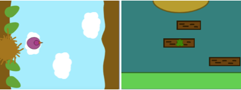
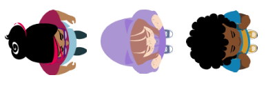
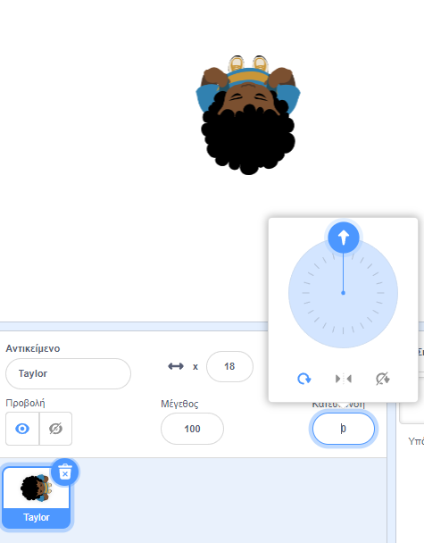

## Επίλεξε το θέμα σου

<div style="display: flex; flex-wrap: wrap">
<div style="flex-basis: 200px; flex-grow: 1; margin-right: 15px;">
Σε αυτό το βήμα, θα προσθέσεις έναν χαρακτήρα και ένα υπόβαθρο και θα δημιουργήσεις πλατφόρμες έναρξης και λήξης. 
</div>
<div>
{:width="300px"}
</div>
</div>

--- task ---

Άνοιξε ένα [νέο έργο Scratch](http://rpf.io/scratch-new){:target="_blank"} και διέγραψε το αντικείμενο γάτα. Το Scratch θα ανοίξει σε νέα καρτέλα του φυλλομετρητή.

--- /task ---

--- task ---

Δημιούργησε ένα μονόχρωμο σκηνικό.

[[[scratch-paint-single-colour-backdrop]]]

--- /task ---

--- task ---

**Επίλεξε:** Ο χαρακτήρας σου θα μετακινηθεί από αριστερά προς τα δεξιά ή από κάτω προς τα πάνω;



--- /task ---

--- task ---

Ζωγράφισε ένα νέο αντικείμενο πλατφόρμας **Έναρξη**.

Ξεκίνησε με ένα απλό μονόχρωμο σχήμα. You can turn the outline off by choosing the red diagonal line.


Μπορείς να προσθέσεις περισσότερες λεπτομέρειες αργότερα.

Δημιούργησε μία νέα ενδυμασία στον επεξεργαστή ζωγραφικής.

[[[scratch-crosshair]]]

Τοποθέτησε το αντικείμενο πλατφόρμας **Έναρξη** όπου θέλεις ο χαρακτήρας σου να ξεκινήσει το παιχνίδι.

--- /task ---

--- task ---

Δημιούργησε ένα απλό αντικείμενο πλατφόρμας **Λήξη**. Μπορείς να προσθέσεις περισσότερες λεπτομέρειες αργότερα.

Δημιούργησε μία νέα ενδυμασία στον επεξεργαστή ζωγραφικής.

Τοποθέτησε το αντικείμενο πλατφόρμας **Λήξη** όπου θέλεις ο χαρακτήρας σου να τερματίσει το παιχνίδι.

--- /task ---

--- task ---

Δημιούργησε ένα αντικείμενο **χαρακτήρα**.

**Επίλεξε:** Θέλεις να προσθέσεις ή να ζωγραφίσεις ένα αντικείμενο **χαρακτήρα**;

Ίσως, θέλεις να προσθέσεις ένα αντικείμενο **χαρακτήρα** από ψηλά, όπως η **Tatiana**, η **Taylor** ή η **Trisha**.



Η ζωγράφισε το δικό σου αντικείμενο **χαρακτήρα**. Ξεκίνησε με απλά σχήματα και πρόσθεσε λεπτομέρειες αργότερα. Δημιούργησε μία νέα ενδυμασία στον επεξεργαστή ζωγραφικής.

[[[generic-scratch3-draw-sprite]]]

--- /task ---

--- task ---

Το αντικείμενο **χαρακτήρα** χρειάζεται ένα script έναρξης για να ρυθμίσεις τα πάντα για την αρχή του παιχνιδιού.

Make a `variable`{:class="block3variables"} called `landed`, and set it to the size your sprite should be when it has landed and is not jumping.

Get your character to go to the **Start** `when flag clicked`{:class="block3events"}. Add a `go to front layer`{:class="block3looks"} block, so your character is on top of the platforms.

**Character:**

```blocks3
when flag clicked // setup
go to (Start v)
set [landed v] to [40] // size when not jumping
set size to (landed) % // not jumping
go to [front v] layer
show
broadcast (start v) // start other scripts
```

**Tip:** Uncheck the `landed`{:class="block3variables"} variable in the `Variables`{:class="block3variables"} Blocks menu so that it doesn't show on the Stage. The user doesn't need to see this variable.

**Συμβουλή:** Είναι καλή ιδέα να `μεταδώσεις`{:class="block3events"} ένα μήνυμα `έναρξη`{:class="block3events"} στο τέλος του script προετοιμασίας για να ενημερώσεις τα άλλα script πότε πρέπει να ξεκινήσουν, διαφορετικά μπορεί να ξεκινήσουν πριν να είναι όλα έτοιμα.

--- /task ---

--- task ---

**Εντοπισμός σφαλμάτων:**

--- collapse ---

---
title: Το αντικείμενο μου δείχνει προς τη λάθος κατεύθυνση
---

Η ιδιότητα **Κατεύθυνση** στο παράθυρο αντικείμενο μπορεί να χρησιμοποιηθεί για τον έλεγχο της κατεύθυνσης προς την οποία δείχνει το αντικείμενο. Γύρισε τον τροχό για να κάνεις ένα αντικείμενο να δείχνει προς την κατεύθυνση που χρειάζεσαι.



--- /collapse ---

--- /task ---

--- task ---

Δώσε στο έργο σου έναν τίτλο που να περιγράφει το παιχνίδι σου.

--- /task ---

--- save ---
