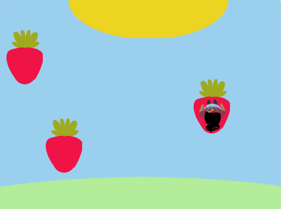
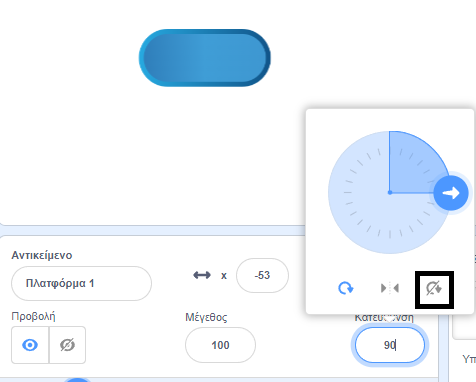

## Άλματα σε πλατφόρμες

<div style="display: flex; flex-wrap: wrap">
<div style="flex-basis: 200px; flex-grow: 1; margin-right: 15px;">
Λοιπόν αυτό είναι πολύ εύκολο! 

Σε αυτό το βήμα, θα προσθέσεις πλατφόρμες για να προσγειώνεσαι. Αν πηδήξεις πάνω τους, θα αποφύγεις να πέσεις μέσα. 
</div>
<div>
{:width="300px"}
</div>
</div>

--- task ---

Δημιούργησε ένα αντικείμενο **Πλατφόρμα 1** για να προσγειωθείς.

Ζωγράφισε μία ενδυμασία για το αντικείμενο **Πλατφόρμα 1**.

**Συμβουλή:** Εάν θέλεις το αντικείμενό σου να `αναπηδά`{:class="block3motion"} χωρίς να φαίνεται η στολή να αλλάζει κατεύθυνση, θα χρειαστείς μία ενδυμασία που να είναι συμμετρική ή να ορίσειςτο στυλ περιστροφής σε **Χωρίς περιστροφή**.



--- /task ---

--- task ---

Πρόσθεσε κώδικα στο αντικείμενο **Πλατφόρμα1** για να το μετακινήσεις.

Μπορεί να χρειαστεί, το αντικείμενο **Πλατφόρμα 1** να `δείχνει στην κατεύθυνση`{:class="block3motion"} `0` έτσι ώστε να κινείται πάνω και κάτω στην οθόνη.

--- collapse ---

---
title: Κάνε την πλατφόρμα σου να κινείται
---

```blocks3
when I receive [start v]
point in direction (0) // add this block for left to right games
forever
move (4) steps // try different numbers
if on edge, bounce
end
```

--- /collapse ---

--- /task ---

--- task ---

**Δοκιμή:** Κάνε κλικ στην πράσινη σημαία κι επιβεβαίωσε ότι η πλατφόρμα σου κινείται σωστά.

--- /task ---

--- task ---

Φτιάξε ένα αντίγραφο του αντικειμένου **Πλατφόρμα 1** κι ονόμασέ το **Πλατφόρμα 2** .

**Επίλεξε:** Εάν θέλεις να έχεις 3 πλατφόρμες, φτιάξε ξανά ένα αντίγραφο της **Πλατφόρμα 1** κι ονόμασέ το **Πλατφόρμα 3**.

[[[scratch3-duplicate-sprite]]]

Πειραματίσου με τον αριθμό των βημάτων και το μέγεθος αντικειμένου για να κάνεις κάθε πλατφόρμα ευκολότερη ή δυσκολότερη στο άλμα.

--- /task ---

Εντόπίσε `εάν`{:class="block3control"} το αντικείμενο του **χαρακτήρα** σου έχει προσγειωθεί σε ένα αντικείμενο **πλατφόρμας** και είναι ασφαλές, `αλλιώς`{:class="block3control"} το αντικείμενο του **χαρακτήρα** σου έχει πέσει!

--- task ---

Πρόσθέσε κώδικα στο αντικείμενο του **χαρακτήρα** σου για να ανιχνεύσείς `αν αγγίζει`{:class="block3sensing"} ένα χρώμα στα αντικείμενα **πλατφόρμας**.

**Επίλέξε:** Εάν η πλατφόρμα σου έχει πολλά χρώματα, επιλέξε σε ποιο χρώμα χρειάζεται να προσγειωθεί ο χαρακτήρας σου. Μπορεί να θέλεις να πέσει μέσα αν είναι μόνο στην άκρη!

--- collapse ---

---
title: Αν αγγίζει την πλατφόρμα
---

```blocks3
when I receive [start v]
forever
if <(size) = (landed) > then // not in the air
if <touching color (#b89d2f) ?> then // at end
broadcast (stop v) // stop other sprites
stop [other scripts in sprite v]
go to (End v)
play sound (Win v) until done
stop [all v]
end
+ if <touching color (#762356) ?> then // choose a colour on your platform
if <touching (Platform 1 v)> then
go to (Platform 1 v)
end
if <touching (Platform 2 v)> then
go to (Platform 2 v)
end
if <touching (Platform 3 v)> then
go to (Platform 3 v)
end
else
end
end
end
```

--- /collapse ---

--- /task ---

--- task ---

**Δοκιμή:** Κάνε κλικ στην πράσινη σημαία κι επιβεβαίωσε ότι το αντικείμενό σου κινείται σωστά στις πλατφόρμες.

--- /task ---

--- task ---

Πρόσθεσε κώδικα στο αντικείμενο του **χαρακτήρα** σου για να ανιχνεύσεις το `εάν`{:class="block3control"} `αγγίζει`{:class="block3sensing"} το χρώμα του φόντου και, στη συνέχεια, τερμάτισε το παιχνίδι.

--- collapse ---

---
title: Αλλιώς αγγίζει το υπόβαθρο
---

```blocks3
when I receive [start v]
forever
if <(size) = (landed)> then // not in the air
if <touching color (#b89d2f) ?> then // at end
broadcast (stop v) // stop other sprites
stop [other scripts in sprite v] 
go to (End v)
play sound (Win v) until done
stop [all v]
end
if <touching color (#762356) ?> then // choose a colour on your platform
if <touching (Platform 1 v)> then
go to (Platform 1 v)
end
if <touching (Platform 2 v)> then
go to (Platform 2 v)
end
if <touching (Platform 3 v)> then
go to (Platform 3 v)
end
else
+ if <touching color (#37ab37) ?> then // choose your backdrop colour
broadcast (stop v)
stop [other scripts in sprite v] // prevent jumping after losing
hide
play sound (lose v) until done // add a sound of your choice
stop [all v]
end
end
end
```

--- /collapse ---

--- /task ---

--- task ---

**Δοκιμή:** Παίξε το παιχνίδι σου και προσπάθησε να χάσεις μια πλατφόρμα. Βεβαιώσου ότι ακούς τον ήχο ήττας.

--- /task ---

--- task ---

Πρόσθεσε κώδικα στα αντικείμενα **πλατφόρμας** για να τα σταματήσεις να κινούνται όταν το αντικείμενο του **χαρακτήρα** φτάσει στην πλατφόρμα **Τέλος** — ή πέσει μέσα!

```blocks3
when I receive [stop v]
stop [other scripts in sprite v]
```

--- /task ---

--- task ---

**Δοκιμή:** Παίξε ξανά και βεβαιώσου ότι οι πλατφόρμες σταματούν όταν τελειώσει το παιχνίδι. Το παιχνίδι τελειώνει όταν φτάσεις στην πλατφόρμα **Τέλος** ή όταν πέσεις.

--- /task ---

--- task ---

**Εντοπισμός σφαλμάτων:**

--- collapse ---

---
title: Το παιχνίδι τελειώσε πολύ νωρίς
---

Βεβαιώσου ότι έχεις τα μπλοκ `εάν`{:class="block3control"} με τη σωστή σειρά μέσα στο μπλοκ `για πάντα`{:class="block3control"}. Έλεγξε προσεκτικά τον κώδικα του παραδείγματος.

Εάν διαπιστώσεις ότι ο **χαρακτήρας** αγγίζει το υπόβαθρο προτού έχει την ευκαιρία να προσγειωθεί σε μια πλατφόρμα, τότε το παιχνίδι σου μπορεί να τελειώσει άδικα!

Βεβαιώσου ότι τα μπλοκ `εάν`{:class="block3control"} για έλεγχο των συνθηκών του παιχνιδιού βρίσκονται μέσα σε ένα μπλοκ `εάν`{:class="block3control"} που ελέγχει ότι το μέγεθος του **χαρακτήρα** είναι φυσιολογικό. Είναι εντάξει ο χαρακτήρας σου να αγγίζει το χρώμα του υποβάθρου όταν πηδά. Είναι πρόβλημα μόνο αν προσγειωθούν σε κρέμα, λάβα, ραδιενεργή ουσία ή οποιονδήποτε κίνδυνο έχεις επιλέξει.

--- /collapse ---

--- collapse ---

---
title: Οι πλατφόρμες δεν σταματούν όταν κερδίζω ή χάνω
---

Κοίταξε στο script `όταν λάβω`{:class="block3events"} του αντικειμένου **πλατφόρμας** σου και έλεγξε αν το μήνυμα είναι `λήξη`{:class="block3events"}.

```blocks3
when I receive [stop v]
stop [other scripts in sprite v]
```
Βεβαιώσου ότι το μπλοκ `μετάδωσε`{:class="block3events"} εντός του `εάν`{:class="block3control"} μπλοκ νίκης και ήττας αφορά το μήνυμα `λήξη`{:class="block3events"}.

```blocks3
broadcast (stop v)
```

--- /collapse ---

--- /task ---

<p style="border-left: solid; border-width:10px; border-color: #0faeb0; background-color: aliceblue; padding: 10px;">
Υπάρχουν πολλά <span style="color: #0faeb0">παιχνίδια πλατφόρμας</span>, και 2D και 3D. Οι πλατφόρμες είναι κοινές σε παιχνίδια με εμπόδια (obby) και παιχνίδια parkour. Ορισμένα παιχνίδια έχουν πλατφόρμες που κινούνται, εμφανίζονται και κρύβονται ή εξαφανίζονται σταδιακά όταν πηδάς πάνω τους. Μπορείς να σκεφτείς παιχνίδια που έχεις παίξει και έχουν πλατφόρμες στις οποίες πρέπει να πηδήξεις; Τι γίνεται με τα παιχνίδια με κινούμενες πλατφόρμες;
</p>

--- save ----
