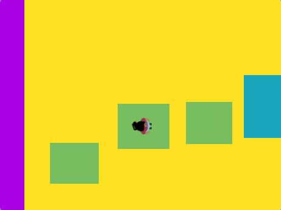

## What you will make

Design and build a top-down view, obstacle or platform, parkour game. Your character will need to jump, hop, glide, bounce, or fly to catch a ride on moving platforms and make it to the end.

**Top-down/bird's-eye view games** look down on the game from above. Sometimes the whole game has this view. Other games use top-down views when you enter a design mode. Can you think of any games you play that use top-down view? 

--- no-print ---

  

### Play

Click the space bar or tap the Stage to jump to the next platform. Time your jumps so you don't fall in the custard.

+ How does the game create a top-down view? 
+ How does the character's size change when it flies? 
+ What happens if you don’t land on a platform? (Go on, do fall in the custard!)

**Don't fall in the custard!**: [See inside](https://scratch.mit.edu/projects/525202210/editor){:target="_blank"}

  <iframe allowtransparency="true" width="485" height="402" src="https://scratch.mit.edu/projects/embed/525202210/?autostart=false" frameborder="0"></iframe>

### Get ideas 💭

You are going to make some design decisions to make a top-down platform game of your own. You'll choose the theme, colours, character, number of platforms, and the difficulty level.

--- task ---

Explore these example projects to get more ideas:

**Baby bird**: [See inside](https://scratch.mit.edu/projects/525236983/editor){:target="_blank"}

  <iframe allowtransparency="true" width="485" height="402" src="https://scratch.mit.edu/projects/embed/525236983/?autostart=false" frameborder="0"></iframe>

**Log hopper**: [See inside](https://scratch.mit.edu/projects/525236345/editor){:target="_blank"}

  <iframe allowtransparency="true" width="485" height="402" src="https://scratch.mit.edu/projects/embed/525236345/?autostart=false" frameborder="0"></iframe>

**Planet bounce**: [See inside](https://scratch.mit.edu/projects/525236603/editor){:target="_blank"}

  <iframe allowtransparency="true" width="485" height="402" src="https://scratch.mit.edu/projects/embed/525236603/?autostart=false" frameborder="0"></iframe>

--- /task ---

--- /no-print ---

--- print-only ---

### Get ideas 💭 

You are going to make some design decisions to make a top-down platform game of your own. You'll choose the theme, colours, character, number of platforms and the difficulty level. See inside example projects in [Scratch 2: Don't fall in - Examples](https://scratch.mit.edu/studios/29599110/){:target="_blank"} Scratch studio.

--- /print-only ---

 
