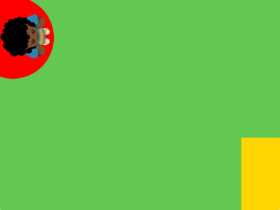
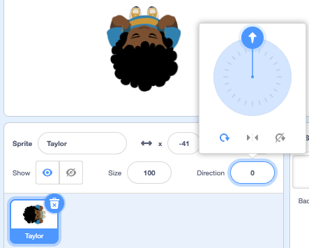

## Choose your theme

In this step, you will add a character and backdrop and create start and end platforms. 

{:width="300px"}

--- task ---

Open a [new Scratch project](http://rpf.io/scratch-new){:target="_blank"} and delete the cat sprite. Scratch will open in another browser tab.

--- /task ---

--- task ---

Create a solid colour backdrop. 

[[[scratch-paint-single-colour-backdrop]]]

--- /task ---

--- task ---

**Choose:** Will your character move from left to right or top to bottom? 

--- /task ---

--- task ---

Create a **Start platform** sprite. 

Start with a simple single coloured shape. You can add more detail later. 

Centre your costume in the Paint editor.

[[[scratch-crosshair]]]

Position your **Start platform** sprite where you want your character to start the game.

--- /task ---

--- task ---

Create a simple **End platform** sprite. You can add more detail later. 

Centre your costume in the Paint editor.

Position your **End platform** sprite on the Stage where you want your character to finish the game.

--- /task ---

--- task ---

Add a character sprite. 

**Choose:** Do you want to add a top-down character sprite such as **Tatiana**, **Taylor** or **Trisha**? 

Or, do you want to paint your own character sprite? You can start with simple shapes and add details later.

Centre your costume in the Paint editor.

[[[generic-scratch3-draw-sprite]]]

--- /task ---

--- task ---
**Debug:***

--- collapse ---

---
title: My sprite is pointing in the wrong direction
---

The **Direction** property in the Sprite pane can be used to control the direction the sprite is pointing in. Turn the wheel to make a sprite point in the direction you need. 

--- /collapse ---

--- /task ---

--- save ---
