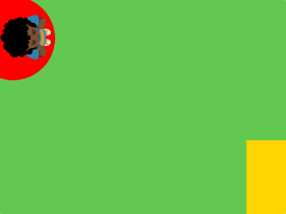
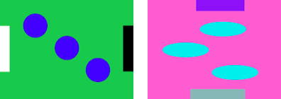

## Choose your theme

In this step, you will add a character and backdrop and create start and end platforms. 

{:width="300px"}

--- task ---

Open a [new Scratch project](http://rpf.io/scratch-new){:target="_blank"} and delete the cat sprite. Scratch will open in another browser tab.

--- /task ---

--- task ---

Create a solid colour backdrop. 

[[[scratch-paint-single-colour-backdrop]]]

--- task ---

--- task ---

**Choose:** Will your character move from left to right or top to bottom? 

 <mark>add image showing example of each direction </mark>

--- /task ---

--- task ---

Create a **start platform** sprite. 

Start with a simple single coloured shape. You can add more detail later. 

Position your **start platform** sprite where you want your character to start the game.

--- /task ---

--- task ---

Create an **end platform** sprite. 

Remember to start with a simple single coloured shape. You can add more detail later. 

Position your **end platform** sprite where you want your character to finish the game.

--- /task ---

--- task ---

Add a character sprite. 

**Choose:** Do you want to add a top-down character sprite such as **Tatiana**, **Taylor** or **Trisha**? Or do you want to paint your own character sprite? You can start with simple shapes and add details later.

--- /task ---

--- save ---