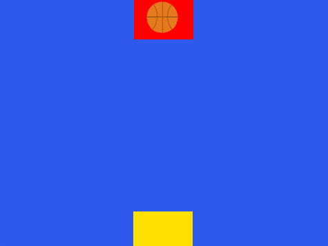

## Jump, hop, bounce or glide!

<div style="display: flex; flex-wrap: wrap">
<div style="flex-basis: 200px; flex-grow: 1; margin-right: 15px;">
In this step, you will code your character to jump from start to end platforms. 
</div>
<div>
{:width="300px"}
</div>
</div>

You're going to make your character jump across the Stage. Don't worry about falling in yet.

--- task ---

**Choose:** Add a jumping sound that suits your character.

[[[generic-scratch3-sound-from-library]]]

Now make your character jump across the Stage.  If you have a computer keyboard then you can use `when space key pressed`{:class="block3events"} to jump, if you are on a touchscreen you can make your character jump `when stage clicked`{:class="block3events"} by `broadcasting`{:class="block3events"} a `jump`{:class="block3events"} message.

[[[scratch3-top-down-jumping]]]

--- /task ---

--- task ---
**Test:** Tap the space bar or Stage to make your character jump across the Stage to the **End** platform.

Adjust your code until the character jumps across the stage in three or four jumps.

--- /task ---

**Tip:** It's really common for games to have a `forever`{:class="block3control"} block with `if`{:class="block3control"} statements inside it to do something when important conditions become true.

--- task ---
**Debug:**

--- collapse ---

---
title: My sprite doesn't go to the Start platform when I click the green flag
---

Check that you have a setup script on your **Character** sprite:


```blocks3
when flag clicked // setup
+go to (Start v)
set [landed v] to [0]
set size to (landed) %
+go to [front v] layer
show
broadcast (start v) // start other scripts
```

Check that that name in the `go to`{:class="block3motion"} block matches the name of your Start sprite.

Check that you have a `go to front layer`{:class="block3looks"} blocks, your sprite might be underneath the Start plaform!

Make sure you haven't hidden your **Character** sprite. Add a `show`{:class="block3looks"} block to your setup script if you need to.


--- /collapse ---

--- collapse ---

---
title: My sprite doesn't go to the centre of the Start platform
---

You need to make sure all your sprite costumes are centered in the 'Paint editor'. 

The `go to`{:class="block3motion"} `other sprite` block moves a sprite so that it's center is in the same position as the center of the 'other sprite'. If their centers are in the wrong place then your **Character** won't go to the center of the platforms.

--- /collapse ---

--- collapse ---

---
title: My sprite won't jump - I have a keyboard
---

Check that you have a `when space key pressed`{:class="block3events"} script which `broadcasts`{:class="block3events"} a `jump`{:class="block3events"} message. Check that your `when I recieve [jump]`{:class="block3events"} script is correct.

--- /collapse ---

--- collapse ---

---
title: My sprite won't jump - I'm using a tablet
---

Make sure you have a `when stage clicked`{:class="block3events"} script on the **Stage** which `broadcasts`{:class="block3events"} a `jump`{:class="block3events"} message. Check that the `when I recieve [jump]`{:class="block3events"} script on your **Character** sprite is correct.

--- /collapse ---

--- collapse ---

---
title: My sprite points or jumps in the wrong direction!
---

Add a `point in direction`{:class="block3motion"} block to the **Character**'s set up script or change the direction in the sprite pane. You might also need to change the `rotation style`{:class="block3motion"}. You might also need to rotate the **costume** of your sprite so that it faces to the right.

--- /collapse ---

--- collapse ---

---
title: My sprite doesn't jump the right distance
---

Look at your **Character**'s `when I receieve [jump]`{:class="block3events"} script. Try changing the number of steps in the `move`{:class="block3motion"} blocks, or the number of repeats in the `repeat`{:class="block3control"} blocks.

Remember you will need to change the numbers for the up and down parts of the jump. 

```blocks3
when I receive [jump v] // jump
if < (size) = (landed) > then // avoid double jumping
start sound (Drum Boing v) // add a sound
+repeat [10] // jump up
+move [5] steps
change size by [3]
end
+repeat [10] // come back down
+move [5] steps
change size by [-3]
end
set size to (landed) % // back to normal size
end
```

--- /collapse ---

--- collapse ---

---
title: My sprite doesn't grow and shrink correctly when it jumps
---

Look at your **Character**'s `when I receieve [jump]`{:class="block3events"} script. 

Check that you use the same normal size for your **Character** sprite throughout the project, this example uses `50`.

Make sure that the `change size`{:class="block3looks"} block in the second `repeat`{:class="block3events"} block has a negative number to make the sprite smaller, the example uses `-3`.

```blocks3
when I receive [jump v] // jump
+if < (size) = (landed) > then // avoid double jumping
start sound (Drum Boing v) // add a sound
repeat [10] // jump up
move [5] steps
+change size by [3]
end
repeat [10] // come back down
move [5] steps
+change size by [-3]
end
+set size to (landed) % // back to normal size
end
```

--- /collapse ---


If you have a bug that we haven't covered here then let us know in the feedback, and if you fixed the bug yourself (well done!) let us know that too. 

**Tip:** If you're stuck, try reading your code out loud or in your head and make sure it says what you think it does. You might find the bug.

--- /task ---

--- save ----
