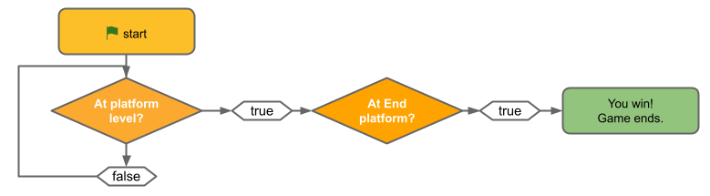

## Jump, hop, bounce or glide!

<div style="display: flex; flex-wrap: wrap">
<div style="flex-basis: 200px; flex-grow: 1; margin-right: 15px;">
In this step, you will code your character to jump from start to end platforms. 
</div>
<div>
{:width="300px"}
</div>
</div>

In the previous step you added a `forever`{:class="block3control"} loop that checks if your **Character** is at platform level, and if so, if it has reached the End platform. 

You're going to add a `forever`{:class="block3control"} loop that checks if your **Character** is at platform level, and if so, `if`{:class="block3control"} it has reached the End platform.



--- task ---

Get your character to go to the **Start** `when flag clicked`{:class="block3events"} and set the `size`{:class="block3looks"} and `go to front layer`{:class="block3looks"}. 

This is the set up code that gets your game ready at the start. 

**Tip:** It's a good idea to `broadcast`{:class="block3events"} a `start`{:class="block3events"} message at the end of your setup script to let other scripts know when to start, otherwise they might start before everything is ready.

--- collapse ---

---
title: Go to the start platform
---

```blocks3
when flag clicked // setup
go to (Start v)
set size to [100] %
go to [front v] layer
broadcast (start v) // start other scripts
```

--- /collapse ---

--- /task ---

You're going to make your character jump across the Stage. Don't worry about falling in yet.

--- task ---

Now make your character jump across the Stage.  Choose a jumping sound that suits your character.

[[[generic-scratch3-sound-from-library]]]

If you have a computer keyboard then you can use `when space key pressed`{:class="block3events"} to jump, if you are on a touchscreen you can make your character jump `when stage clicked`{:class="block3events"} by `broadcasting`{:class="block3events"} a `jump`{:class="block3events"} message.

[[[scratch3-top-down-jumping]]]

--- /task ---

--- task ---
**Test:** Tap the space bar or Stage to make your character jump across the Stage to the End platform.

Adjust your code until the character jumps across the stage in three or four jumps.

--- /task ---

When the player reaches the end platform, they should hear a reward sound and the platforms should stop moving.

**Tip:** It's really common for games to have a `forever`{:class="block3control"} block with `if`{:class="block3control"} statements inside it to do something when important conditions become true.

--- task ---

Add code to detect when your character reaches the End platform using `touching color`{:class="block3sensing"}.

--- collapse ---

---
title: End the game when touching colour
---

```blocks3
when I receive [start v]
forever
if <(size) = [100]> then // not in the air
if <touching color (#b89d2f) ?> then // at end
broadcast (stop v) // stop other sprites
go to (End v)
play sound (Win v) until done
stop [all v]
end
end
end
```

--- /collapse ---

You will need to set the colour that is sensed to the colour of your End platform.

[[[scratch3-set-block-input-colour-with-eyedropper]]]

**Tip:** It's a good idea to `broadcast`{:class="block3events"} a `stop`{:class="block3events"} message when you detect that your game is finished so that other sprites can stop, but this sprite can do something such as playing a sound before it stops.

--- /task ---

--- task ---
**Test:** Click the green flag and then jump your character across the Stage. Make sure you hear the reward sound when you reach the End platform.

**Tip:** It's really important that you test your project before moving to the next step and adding more code. It's harder to find and fix bugs when you have added more code.

--- /task ---


--- task ---
**Debug:**

--- collapse ---

---
title: My sprite doesn't go to the Start platform when I click the green flag
---

Check that you have a setup script on your **Character** sprite:

```blocks3
when flag clicked // setup
+go to (Start v)
set size to [100] %
+go to [front v] layer
broadcast (start v) // start other scripts
```

Check that that name in the `go to`{:class="block3motion"} block matches the name of your Start sprite.

Check that you have a `go to front layer`{:class="block3looks"} blocks, your sprite might be underneath the Start plaform!

Make sure you haven't hidden your **Character** sprite. Add a `show`{:class="block3looks"} block to your setup script if you need to.


--- /collapse ---

--- collapse ---

---
title: My sprite doesn't go to the centre of the Start or End platform

---

You need to make sure all your sprite costumes are centered in the 'Paint editor'. 

The `go to`{:class="block3motion"} `other sprite` block moves a sprite so that it's center is in the same position as the center of the 'other sprite'. If their centers are in the wrong place then your **Character** won't go to the center of the platforms.

--- /collapse ---

--- collapse ---

---
title: My sprite won't jump - I have a keyboard
---

Check that you have a `when space key pressed`{:class="block3events"} script which `broadcasts`{:class="block3events"} a `jump`{:class="block3events"} message. Check that your `when I recieve [jump]`{:class="block3events"} script is correct.

--- /collapse ---

--- collapse ---

---
title: My sprite won't jump - I'm using a tablet
---

Make sure you have a `when stage clicked`{:class="block3events"} script on the **Stage** which `broadcasts`{:class="block3events"} a `jump`{:class="block3events"} message. Check that the `when I recieve [jump]`{:class="block3events"} script on your **Character** sprite is correct.

--- /collapse ---

--- collapse ---

---
title: The game ends too soon
---

Check that your sprite isn't touching the End colour when it's not on the **End** platform - if you use the same colour elsewhere in your project then your character could die too soon.

--- /collapse ---

--- collapse ---

---
title: My sprite points or jumps in the wrong direction!
---

Add a `point in direction`{:class="block3motion"} block to the **Character**'s set up script or change the direction in the sprite pane. You might also need to change the `rotation style`{:class="block3motion"}. You might also need to rotate the **costume** of your sprite so that it faces to the right.

--- /collapse ---

--- collapse ---

---
title: My sprite doesn't jump the right distance
---

Look at your **Character**'s `when I receieve [jump]`{:class="block3events"} script. Try changing the number of steps in the `move`{:class="block3motion"} blocks, or the number of repeats in the `repeat`{:class="block3control"} blocks.

Remember you will need to change the numbers for the up and down parts of the jump. 

```blocks3
when I receive [jump v] // jump
if <(size) = [50]> then // avoid double jumping
start sound (Drum Boing v) // add a sound
+repeat [10] // jump up
+move [5] steps
change size by [3]
end
+repeat [10] // come back down
+move [5] steps
change size by [-3]
end
set size to [50] % // back to normal size
end
```

--- /collapse ---

--- collapse ---

---
title: My sprite doesn't grow and shrink correctly when it jumps
---

Look at your **Character**'s `when I receieve [jump]`{:class="block3events"} script. 

Check that you use the same normal size for your **Character** sprite throughout the project, this example uses `50`.

Make sure that the `change size`{:class="block3looks"} block in the second `repeat`{:class="block3events"} block has a negative number to make the sprite smaller, the example uses `-3`.

```blocks3
when I receive [jump v] // jump
+if <(size) = [50]> then // avoid double jumping
start sound (Drum Boing v) // add a sound
repeat [10] // jump up
move [5] steps
+change size by [3]
end
repeat [10] // come back down
move [5] steps
+change size by [-3]
end
+set size to [50] % // back to normal size
end
```

--- /collapse ---

--- collapse ---

---
title: The sound doesn't play when I land on the End platform
---

Click on your **Character** sprite and then the 'Sounds' tab. Make sure you have added the end sound to your sprite. Click on the play button to make sure sound is working on your computer.

Click on the 'Code' tab and check that the correct sound is in the `play sound`{:class="block3sounds"} block that runs when the sprite reaches the **End** platform.

Make sure the colour is correct in the `touching colour`{:class="block3sensing"} block. Select it again if you're not sure. Sometimes colours look similar but aren't the same.

```blocks3
when I receive [start v]
forever
if <(size) = [100]> then // not in the air
+if <touching color (#b89d2f) ?> then // at end
broadcast (stop v) // stop other sprites
go to (End v)
+play sound (Win v) until done
stop [all v]
end
end
end
```

--- /collapse ---

If you have a bug that we haven't covered here then let us know in the feedback, and if you fixed the bug yourself (well done!) let us know that too. 

**Tip:** If you're stuck, try reading your code out loud or in your head and make sure it says what you think it does. You might find the bug.

--- /task ---

--- save ----
