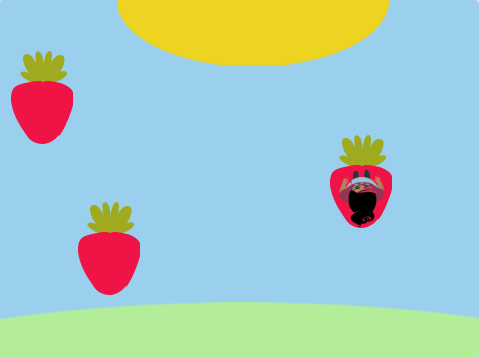

## Platforms

<div style="display: flex; flex-wrap: wrap">
<div style="flex-basis: 200px; flex-grow: 1; margin-right: 15px;">
Well that's too easy! In this step, you will add platforms to land on. Jumping on them will avoid falling in. 
</div>
<div>
{:width="300px"}
</div>
</div>

--- task ---

Create a **platform 1** sprite to land on. 

Paint a costume for your **platform 1** sprite.

**Choose:** If you want your sprite to `bounce`{:class="block3motion"} without the costume appearing to change direction you will need a costume that is symmetrical. 

**Choose:** If your costume has an outline you can add code later so your **character** sprite falls in if they only touch the edge. 

--- /task ---

--- task ---

Add code to your **platform 1** sprite to get it moving.

You may need your **platform 1** sprite to `point in direction`{:class="block3motion"} `0` to move up and down the screen. 

--- collapse ---

---
title: Make your platform move
---

```blocks3
when I receive [start v]
point in direction (0) // add this block for left to right games
forever
move (4) steps // try different numbers
if on edge, bounce
end
```

--- /collapse ---

--- /task ---

--- task ---

Duplicate your **platform 1** sprite twice and rename the new sprites **platform 2** and **platform 3**. 

[[[scratch3-duplicate-sprite]]]

Experiment with the number of steps and the sprite size to make each platforms easier or harder to jump on. 

--- /task ---

Detect `if`{:class="block3control"} your **character** sprite has landed on a **platform** sprite and is safe, `else`{:class="block3control"} your **character** sprite has fallen in!

--- task ---

Add code to your **character** sprite to sense `if touching`{:class="block3sensing"} a colour on the **platform** sprites.

**Choose:** If your platform has multiple colours, choose which colour your character needs to land on. You might want them to fall in if they are only on the edge!

--- collapse ---

---
title: If touching platform
---

```blocks3
when I receive [start v]
forever
if <(size) = [100]> then // not in the air
if <touching color (#b89d2f) ?> then // at end
go to (End v)
play sound (Win v) until done
stop [all v]
end
+ if <touching color (#762356) ?> then // choose a colour on your platform
if <touching (platform 1 v)> then
go to (platform 1 v)
end
if <touching (platform 2 v)> then
go to (platform 2 v)
end
if <touching (platform 3 v)> then
go to (platform 3 v)
end
else
end
end
end
```

--- /collapse ---

--- /task ---

--- task ---

Add code to your **character** sprite to sense `if touching`{:class="block3sensing"} the backdrop colour then end the game.

--- collapse ---

---
title: Else touching backdrop
---

```blocks3
when I receive [start v]
forever
if <(size) = [100]> then // not in the air
if <touching color (#b89d2f) ?> then // at end
go to (End v)
play sound (Win v) until done
stop [all v]
end
if <touching color (#762356) ?> then // choose a colour on your platform
if <touching (platform 1 v)> then
go to (platform 1 v)
end
if <touching (platform 2 v)> then
go to (platform 2 v)
end
if <touching (platform 3 v)> then
go to (platform 3 v)
end
else
+ if <touching color (#37ab37) ?> then // choose your backdrop colour
broadcast (stop v)
hide
play sound (lose v) until done // add a sound of your choice
stop [all v]
end
end
end
```

--- /collapse ---

--- /task ---

--- task ---

Add code to your **platform** sprites to stop them moving when the **character** sprite reaches the **end platform** - or falls in!

```blocks3
when I receive [stop v]
stop [other scripts in sprite v]
```

--- /task ---

--- save ----