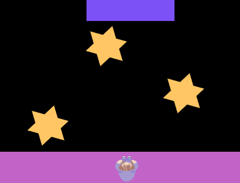

## Adjust the difficulty

Is your game too hard or too easy? 

{:width="300px"}

--- task ---

Here are some things you can try to get the difficulty just right:

+ Change the size of the platforms / character
+ Change the speed that the platforms move at 
+ Change how long it takes the character to jump to make the timing harder

--- /task ---

--- task ---
**Play:** Make sure play your game. It's useful as it's part of testing that your game works properly, and it's also fun!

--- /task ---

--- save ---