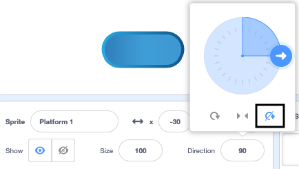

## Ride on platforms

<div style="display: flex; flex-wrap: wrap">
<div style="flex-basis: 200px; flex-grow: 1; margin-right: 15px;">
Well that's too easy! 

In this step, you will add platforms to land on. Jumping on them will avoid falling in. 
</div>
<div>
{:width="300px"}
</div>
</div>

--- task ---

Create a **Platform 1** sprite to land on. 

Paint a costume for your **Platform 1** sprite.

**Tip:** If you want your sprite to `bounce`{:class="block3motion"} without the costume appearing to change direction you will need a costume that is symmetrical or set the rotation style to `don't rotate`{:class="block3motion"}. 



--- /task ---

--- task ---

Add code to your **Platform 1** sprite to get it moving.

You may need your **Platform 1** sprite to `point in direction`{:class="block3motion"} `0` to move up and down the screen. 

--- collapse ---

---
title: Make your platform move
---

```blocks3
when I receive [start v]
point in direction (0) // add this block for left to right games
forever
move (4) steps // try different numbers
if on edge, bounce
end
```

--- /collapse ---

--- /task ---

--- task ---
**Test:** Click the green flag and make sure your platform moves correctly.

--- /task ---

--- task ---

Duplicate your **Platform 1** sprite and name it **Platform 2** .

**Choose:** If you want to have 3 platforms duplicate the **Platform 1** sprite again and name it **Platform 3**. 

[[[scratch3-duplicate-sprite]]]

Experiment with the number of steps and the sprite size to make each platforms easier or harder to jump on. 

--- /task ---

Detect `if`{:class="block3control"} your **Character** sprite has landed on a **Platform** sprite and is safe, `else`{:class="block3control"} your **Character** sprite has fallen in!

--- task ---

Add code to your **Character** sprite to sense `if touching`{:class="block3sensing"} a colour on the **Platform** sprites.

**Choose:** If your platform has multiple colours, choose which colour your character needs to land on. You might want them to fall in if they are only on the edge!

--- collapse ---

---
title: If touching platform
---

```blocks3
when I receive [start v]
forever
if <(size) = (landed) > then // not in the air
if <touching color (#b89d2f) ?> then // at end
broadcast (stop v) // stop other sprites
stop [other scripts in sprite v]
go to (End v)
play sound (Win v) until done
stop [all v]
end
+ if <touching color (#762356) ?> then // choose a colour on your platform
if <touching (Platform 1 v)> then
go to (Platform 1 v)
end
if <touching (Platform 2 v)> then
go to (Platform 2 v)
end
if <touching (Platform 3 v)> then
go to (Platform 3 v)
end
else
end
end
end
```

--- /collapse ---

--- /task ---

--- task ---
**Test:** Click the green flag and make sure your sprite can ride on the platforms.

--- /task ---

--- task ---

Add code to your **Character** sprite to sense `if`{:class="block3control"} `touching`{:class="block3sensing"} the backdrop colour then end the game.

--- collapse ---

---
title: Else touching backdrop
---

```blocks3
when I receive [start v]
forever
if <(size) = (landed)> then // not in the air
if <touching color (#b89d2f) ?> then // at end
broadcast (stop v) // stop other sprites
stop [other scripts in sprite v] 
go to (End v)
play sound (Win v) until done
stop [all v]
end
if <touching color (#762356) ?> then // choose a colour on your platform
if <touching (Platform 1 v)> then
go to (Platform 1 v)
end
if <touching (Platform 2 v)> then
go to (Platform 2 v)
end
if <touching (Platform 3 v)> then
go to (Platform 3 v)
end
else
+ if <touching color (#37ab37) ?> then // choose your backdrop colour
broadcast (stop v)
stop [other scripts in sprite v] // prevent jumping after losing
hide
play sound (lose v) until done // add a sound of your choice
stop [all v]
end
end
end
```

--- /collapse ---

--- /task ---

--- task ---
**Test:** Play your game and try missing a platform, make sure you hear the lose sound.

--- /task ---

--- task ---

Add code to your **Platform** sprites to stop them moving when the **Character** sprite reaches the **End platform** - or falls in!

```blocks3
when I receive [stop v]
stop [other scripts in sprite v]
```

--- /task ---

--- task ---
**Test:** Play again and make sure the platforms stop when the game ends. The game ends when you reach the End platform, or when you fall in.

--- /task ---

--- task ---
**Debug:**

--- collapse ---

---
title: The game ends too soon
---

Make sure you have the `if`{:class="block3control"} blocks in the correct order inside your `forever`{:class="block3control"} block. Check carefully against the example code.

If you check that the **Character** is touching the backdrop before it has had chance to land on a platform then your game could end unfairly!

Make sure your `if`{:class="block3control"} blocks to check game conditions are inside an `if`{:class="block3control"} block that checks the size of the **Character** is normal. It's fine for your sprite to be touching the backdrop colour when jumping, it's only a problem if they land in the custard, lava, radio-active goo or whatever hazard you have chosen.

--- /collapse ---

--- collapse ---

---
title: The platforms don't stop when I win or lose
---

Look at your **Platform** sprites `when I receive`{:class="block3events"} script and check the message is `stop`.

```blocks3
when I receive [stop v]
stop [other scripts in sprite v]
```
Check that the `broadcast`{:class="block3events"} block inside the win and lose `if`{:class="block3control"} blocks is `stop`. 

```blocks3
broadcast (stop v)
```

--- /collapse ---

--- /task ---

<p style="border-left: solid; border-width:10px; border-color: #0faeb0; background-color: aliceblue; padding: 10px;">
There are lots of <span style="color: #0faeb0">platform games</span> including 2D and 3D ones. Platforms are common in obstacle (obby) games and parkour games. Some games have platforms that move or show and hide or gradually disappear when you jump on them. Can you think of games that you have played that have platforms that you have to jump on? What about games with moving platforms?
</p>

--- save ----
