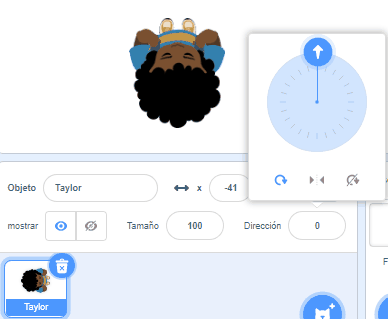

## Elige tu tema

<div style="display: flex; flex-wrap: wrap">
<div style="flex-basis: 200px; flex-grow: 1; margin-right: 15px;">
En este paso, agregarás un personaje y un fondo, y crearás la plataforma inicial y la final. 
</div>
<div>
{:width="300px"}
</div>
</div>

--- task ---

Abre un [nuevo proyecto de Scratch](http://rpf.io/scratch-new){:target="_blank"} y elimina el objeto gato. Scratch se abrirá en otra pestaña del navegador.

--- /task ---

--- task ---

Crea un fondo de color sólido.

[[[scratch-paint-single-colour-backdrop]]]

--- /task ---

--- task ---

**Elige:** ¿Tu personaje se moverá de izquierda a derecha o de abajo hacia arriba?


--- /task ---

--- task ---

Dibuja un nuevo objeto como plataforma de **Inicio**.

Empieza con una forma simple de un solo color. Puedes agregar más detalles después.

Centra tu disfraz en el Editor de dibujos.

[[[scratch-crosshair]]]

Coloca tu objeto de plataforma **Inicio** donde quieras que tu personaje comience el juego.

--- /task ---

--- task ---

Crea un objeto de plataforma **Fin**. Puedes agregar más detalles después.

Centra tu disfraz en el Editor de dibujos.

Coloca tu objeto **Fin** donde quieras que tu personaje termine el juego.

--- /task ---

--- task ---

Crea un objeto **personaje**.

**Elige:** ¿Quieres añadir o pintar un objeto **personaje**?

Es posible que quieras agregar un objeto **personaje** que se vea en top-down (de arriba hacia abajo), como **Tatiana**, **Taylor** o **Trisha**.


O dibujar tu propio objeto **personaje**. Comienza con formas simples y agrega detalles más tarde. Centra tu disfraz en el Editor de dibujos.

[[[generic-scratch3-draw-sprite]]]

--- /task ---

--- task ---

El objeto **personaje** tiene que tener un script de inicio para configurar todo lo necesario para que empiece el juego.

--- collapse ---

---
title: Prepara a tu personaje para empezar
---

Crea una `variable`{:class="block3variables"} llamada `aterrizaje` y configúrala con el tamaño que debería tener tu objeto cuando está apoyado y no está saltando.

Haz que tu personaje vaya al **Inicio** `al presionar la bandera`{:class="block3events"}. Agrega el bloque `ir a la capa de adelante`{:class="block3looks"} para que tu personaje esté encima de las plataformas.

**Personaje:**

```blocks3
when flag clicked // configuración
go to (Inicio v)
set [aterrizaje v] to [40] // tamaño cuando no está saltando
set size to (aterrizaje) % // no está saltando
go to [front v] layer
show
broadcast (comenzar v) // hace empezar otros scripts
```

**Sugerencia:** Desmarca la variable `aterrizaje`{:class="block3variables"} en el menú de Bloques de `Variables`{:class="block3variables"} para que no se muestre en el Escenario. El usuario no necesita ver esta variable.

--- /collapse ---

**Sugerencia:** Es una buena idea `enviar`{:class="block3events"} un mensaje de `inicio`{:class="block3events"} al final de tu script de configuración para que otros scripts sepan cuándo empezar, de lo contrario podrían hacerlo antes de que todo esté listo.

--- /task ---

--- task ---

**Depurar:**

--- collapse ---

---
title: Mi objeto va en la dirección equivocada
---

La propiedad **Dirección** en el panel Objeto se puede usar para controlar la dirección hacia la que va el objeto. Gira la rueda para hacer que un objeto apunte en la dirección que necesites.



--- /collapse ---

--- /task ---

--- task ---

Dale a tu proyecto un título que describa tu juego.

--- /task ---

--- save ---
