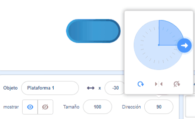

## Sube plataformas

<div style="display: flex; flex-wrap: wrap">
<div style="flex-basis: 200px; flex-grow: 1; margin-right: 15px;">
Bueno, ¡eso es demasiado fácil! 

En este paso agregarás plataformas en las que aterrizar. Saltar sobre ellas evitará que te caigas. 
</div>
<div>
{:width="300px"}
</div>
</div>

--- task ---

Crea un objeto **Plataforma 1** para aterrizar.

Dibuja un disfraz para tu objeto **Plataforma 1**.

**Sugerencia:** Si quieres hacer `rebotar`{:class="block3motion"} a tu objeto sin que parezca que el disfraz cambia de dirección, necesitarás un disfraz que sea simétrico o establecer el estilo de rotación en **No rotar**.



--- /task ---

--- task ---

Agrega código a tu objeto **Plataforma 1** para que se mueva.

Es posible que necesites que el objeto **Plataforma 1** `apunte en dirección`{:class="block3motion"} `0` para que se mueva hacia arriba y hacia abajo en la pantalla.

--- collapse ---

---
title: Haz que tu plataforma se mueva
---

```blocks3
when I receive [comenzar v]
point in direction (0) // agrega este bloque para juegos de izquierda a derecha
forever
move (4) steps // prueba diferentes números
if on edge, bounce
end
```

--- /collapse ---

--- /task ---

--- task ---

**Prueba:** Haz clic en la bandera verde y asegúrate de que tu plataforma se mueva correctamente.

--- /task ---

--- task ---

Duplica tu objeto **Plataforma 1** y asígnale el nombre **Plataforma 2**.

**Elige:** Si quieres tener 3 plataformas, duplica el objeto **Plataforma 1** nuevamente y dale el nombre de **Plataforma 3**.

[[[scratch3-duplicate-sprite]]]

Experimenta con la cantidad de pasos y el tamaño de los objetos para hacer que cada plataforma sea más fácil o más difícil de saltar.

--- /task ---

Detecta `si`{:class="block3control"} tu objeto **personaje** ha aterrizado en un objeto **plataforma** y está a salvo, `si no`{:class="block3control"} ¡tu objeto **personaje** se ha caído!

--- task ---

Añade código a tu objeto **personaje** para detectar `si toca`{:class="block3sensing"} un color en los objetos **plataforma**.

**Elige:** Si tu plataforma tiene varios colores, elige en qué color debe aterrizar tu personaje. ¡Tal vez quieras que se caigan si solo está en el borde!

--- collapse ---

---
title: Si toca la plataforma
---

```blocks3
when I receive [comenzar v]
forever
if <(size) = (aterrizaje) > then // no está en el aire
if <touching color (#b89d2f) ?> then // en el final
broadcast (detener v) // detiene otros objetos
stop [other scripts in sprite v]
go to (Fin v)
play sound (Win v) until done
stop [all v]
end
+ if <touching color (#762356) ?> then // elige un color en tu plataforma
if <touching (Plataforma 1 v)> then
go to (Plataforma 1 v)
end
if <touching (Plataforma 2 v)> then
go to (Plataforma 2 v)
end
if <touching (Plataforma 3 v)> then
go to (Plataforma 3 v)
end
else
end
end
end
```

--- /collapse ---

--- /task ---

--- task ---

**Prueba:** Haz clic en la bandera verde y asegúrate de que tu objeto pueda subirse a las plataformas.

--- /task ---

--- task ---

Agrega código a tu objeto **personaje** para detectar `si`{:class="block3control"} está `tocando`{:class="block3sensing"} el color de fondo, entonces finaliza el juego.

--- collapse ---

---
title: Si no toca el fondo
---

```blocks3
when I receive [comenzar v]
forever
if <(size) = (aterrizaje)> then // no está en el aire
if <touching color (#b89d2f) ?> then // en el final
broadcast (detener v) // detiene otros objetos
stop [other scripts in sprite v] 
go to (Fin v)
play sound (Win v) until done
stop [all v]
end
if <touching color (#762356) ?> then // elige un color en tu plataforma
if <touching (Plataforma 1 v)> then
go to (Plataforma 1 v)
end
if <touching (Plataforma 2 v)> then
go to (Plataforma 2 v)
end
if <touching (Plataforma 3 v)> then
go to (Plataforma 3 v)
end
else
+ if <touching color (#37ab37) ?> then // elige tu color de fondo
broadcast (detener v)
stop [other scripts in sprite v] // evita saltar después de perder
hide
play sound (Lose v) until done // agrega un sonido de tu elección
stop [all v]
end
end
end
```

--- /collapse ---

--- /task ---

--- task ---

**Prueba:** Reproduce el juego e intenta no aterrizar en una plataforma. Asegúrate de escuchar el sonido de derrota.

--- /task ---

--- task ---

Agrega código a tus objetos de **plataforma** para que se dejen de mover cuando el objeto **personaje** llegue a la plataforma **Fin** ¡o se caiga!

```blocks3
when I receive [detener v]
stop [other scripts in sprite v]
```

--- /task ---

--- task ---

**Prueba:** Juega de nuevo y asegúrate de que las plataformas se detengan cuando termine el juego. El juego termina cuando llegas a la plataforma **Fin** o cuando te caes.

--- /task ---

--- task ---

**Depurar:**

--- collapse ---

---
title: El juego termina demasiado pronto
---

Asegúrate de tener los bloques `si`{:class="block3control"} en el orden correcto dentro de tu bloque `por siempre`{:class="block3control"}. Compáralo cuidadosamente con el código de ejemplo.

Si compruebas que el **personaje** está tocando el fondo antes de que haya tenido la oportunidad de aterrizar en una plataforma, ¡entonces tu juego podría terminar injustamente!

Asegúrate de que tus bloques `si`{:class="block3control"} que verifican las condiciones del juego, estén dentro de un bloque `si`{:class="block3control"} que verifica que el tamaño del **personaje** es normal. Está bien que tu objeto toque el color de fondo al saltar. Solo es un problema si cae en la natilla, la lava, la sustancia radioactiva o cualquier peligro que hayas elegido.

--- /collapse ---

--- collapse ---

---
title: Las plataformas no paran cuando gano o pierdo
---

Observa el script de tus objetos **plataforma** que dice `al recibir`{:class="block3events"} y verifica que el mensaje sea `detener`{:class="block3events"}.

```blocks3
when I receive [detener v]
stop [other scripts in sprite v]
```
Verifica que el bloque `enviar`{:class="block3events"} dentro de los bloques de ganar y perder `si`{:class="block3control"} sea `detener`{:class="block3events"}.

```blocks3
broadcast (detener v)
```

--- /collapse ---

--- /task ---

<p style="border-left: solid; border-width:10px; border-color: #0faeb0; background-color: aliceblue; padding: 10px;">
Hay muchos <span style="color: #0faeb0">juegos de plataforma</span> incluidos los 2D y 3D. Las plataformas son comunes en juegos de obstáculos (obby) y juegos de parkour. Algunos juegos tienen plataformas que se mueven, se muestran y ocultan, o desaparecen gradualmente cuando saltas sobre ellas. ¿Puedes pensar en juegos que hayas jugado que tengan plataformas en las que tengas que saltar? ¿Y juegos con plataformas móviles?
</p>

--- save ----
