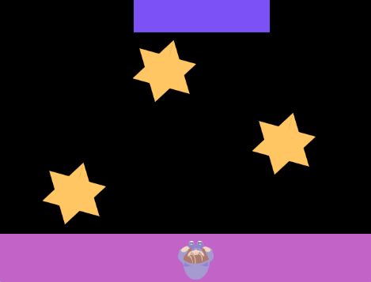

## Ajusta la dificultad

¿El juego es demasiado difícil o muy fácil para ti? En este paso ajusta la dificultad para que la jugabilidad sea perfecta. 

{:width="300px"}

--- task ---

Aquí hay algunas cosas que puedes probar para experimentar con la dificultad:

+ Cambiar el tamaño de las plataformas o del personaje
+ Cambiar la velocidad a la que se mueven las plataformas
+ Cambia el tiempo que tarda el personaje en saltar para que el ritmo sea más difícil

--- /task ---

--- task ---

**Jugar:** Jugando con tu juego puedes probar que este funcione correctamente. ¡Además es útil y divertido!

--- /task ---

--- save ---
