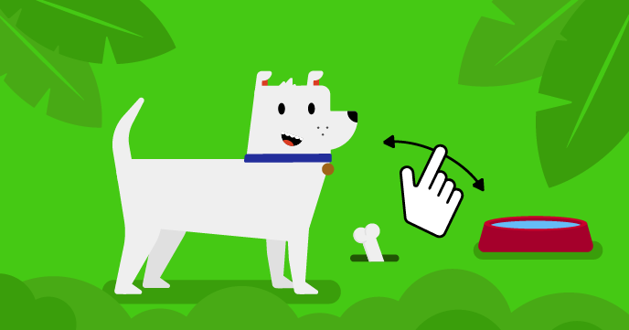

## Et ensuite ?

Si tu suis le parcours [Plus de Scratch](https://projects.raspberrypi.org/en/raspberrypi/more-scratch), tu peux passer au projet [Ce sprite a besoin de toi](https://projects.raspberrypi.org/en/projects/this-sprite-needs-you). Dans ce projet, tu créeras un animal de compagnie virtuel ou une simulation avec laquelle tu interagiras pour t'aider.

--- print-only ---

--- /print-only ---

--- no-print ---

  <iframe allowtransparency="true" width="485" height="402" src="https://scratch.mit.edu/projects/embed/530008968/?autostart=false" frameborder="0"></iframe>

--- /no-print ---

Si tu veux t'amuser davantage à explorer Scratch, tu peux essayer l'un de [ces projets](https://projects.raspberrypi.org/en/projects?software%5B%5D=scratch&curriculum%5B%5D=%201).
