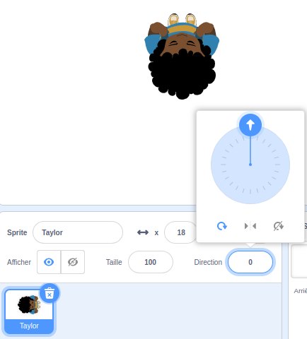

## Choisir ton thème

<div style="display: flex; flex-wrap: wrap">
<div style="flex-basis: 200px; flex-grow: 1; margin-right: 15px;">
Dans cette étape, tu vas ajouter un personnage et un arrière-plan, et créer des plateformes de début et de fin. 
</div>
<div>
{:width="300px"}
</div>
</div>

--- task ---

Ouvre un [nouveau projet Scratch](http://rpf.io/scratch-new){:target="_blank"} et supprime le sprite chat. Scratch s'ouvrira dans un autre onglet du navigateur.

--- /task ---

--- task ---

Crée un arrière-plan de couleur unie.

[[[scratch-paint-single-colour-backdrop]]]

--- /task ---

--- task ---

**Choisir :** Ton personnage se déplacera-t-il de gauche à droite ou de bas en haut ?


--- /task ---

--- task ---

Peins un nouveau sprite de plateforme **Départ**.

Commence avec une forme simple d'une seule couleur. Tu pourras ajouter plus de détails ultérieurement.

Centre ton costume dans l'éditeur de peinture.

[[[scratch-crosshair]]]

Positionne ton sprite de plateforme **Départ** à l'endroit où tu souhaites que ton personnage commence la partie.

--- /task ---

--- task ---

Crée un simple sprite de plateforme **Fin**. Tu pourras ajouter plus de détails ultérieurement.

Centre ton costume dans l'éditeur de peinture.

Positionne ton sprite **Fin** sur la scène où tu veux que ton personnage termine la partie.

--- /task ---

--- task ---

Crée un sprite **personnage**.

**Choisir :** Veux-tu ajouter ou peindre un sprite **personnage** ?

Tu voudras peut-être ajouter un sprite **personnage** en vue de dessus tel que **Tatiana**, **Taylor** ou **Trisha**.


Ou, peins ton propre sprite **personnage**. Commence avec des formes simples et ajoute des détails plus tard. Centre ton costume dans l'éditeur de peinture.

[[[generic-scratch3-draw-sprite]]]

--- /task ---

--- task ---

Ton sprite **personnage** a besoin d'un script de démarrage pour que tout soit configuré pour le début du jeu.

--- collapse ---
---
title: Préparer ton personnage à démarrer
---

Crée une `variable`{:class="block3variables"} appelée `atterri` et régle-la sur la taille que ton sprite devrait avoir lorsqu'il a atterri et ne saute pas.

Demande à ton personnage d'aller au **Départ** `quand le drapeau est cliqué`{:class="block3events"}. Ajoute un bloc `aller à l'avant plan`{:class="block3looks"}, afin que ton personnage soit au-dessus des plateformes.

**Personnage :**

```blocks3
when flag clicked // configuration
go to (Départ v)
set [atterri v] to [40] // taille lorsqu'il ne saute pas
set size to (atterri) % // ne pas sauter
go to [front v] layer
show
broadcast (départ v) // lancer d'autres scripts
```

**Astuce :** Décoche la variable `atterri`{:class="block3variables"} dans le menu des blocs `Variables`{:class="block3variables"} afin qu'elle ne s'affiche pas sur la scène. L'utilisateur n'a pas besoin de voir cette variable.

--- /collapse ---

**Astuce :** C'est une bonne idée d' `envoyer à tous`{:class="block3events"} un message `départ`{:class="block3events"} à la fin de ton script de configuration pour indiquer aux autres scripts quand commencer, sinon ils pourraient commencer avant que tout ne soit prêt.

--- /task ---

--- task ---

**Déboguer :**

--- collapse ---
---
title: Mon sprite pointe dans la mauvaise direction
---

La propriété **Direction** dans le volet Sprite peut être utilisée pour contrôler la direction dans laquelle pointe le sprite. Tourne la roue pour faire pointer un sprite dans la direction dont tu as besoin.



--- /collapse ---

--- /task ---

--- task ---

Donne à ton projet un titre qui décrit ton jeu.

--- /task ---

--- save ---
