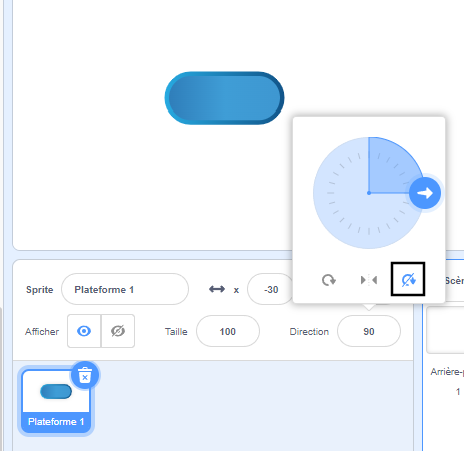

## Monter sur des plateformes

<div style="display: flex; flex-wrap: wrap">
<div style="flex-basis: 200px; flex-grow: 1; margin-right: 15px;">
Eh bien c'est trop facile ! 

Dans cette étape, tu ajouteras des plateformes sur lesquelles atterrir. Sauter dessus évitera de tomber. 
</div>
<div>
{:width="300px"}
</div>
</div>

--- task ---

Crée un sprite **Plateforme 1** sur lequel atterrir.

Peins un costume pour ton sprite **Plateforme 1**.

**Astuce :** Si tu veux que ton sprite `rebondisse`{:class="block3motion"} sans que le costume ne semble changer de direction, tu auras besoin d'un costume symétrique ou définis le sens de rotation sur **Ne tourne pas**.



--- /task ---

--- task ---

Ajoute du code à ton sprite **Plateforme 1** pour le faire bouger.

Tu auras peut-être besoin que ton sprite **Plateforme 1** `s'oriente à`{:class="block3motion"} `0` pour te déplacer de haut en bas sur l'écran.

--- collapse ---
---
title: Faire bouger ta plateforme
---

```blocks3
when I receive [départ v]
point in direction (0) // ajouter ce bloc pour les jeux de gauche à droite
forever
move (4) steps // essaye différents nombres
if on edge, bounce
end
```

--- /collapse ---

--- /task ---

--- task ---

**Test :** Clique sur le drapeau vert et assure-toi que ta plateforme se déplace correctement.

--- /task ---

--- task ---

Duplique ton sprite **Plateforme 1** et nomme-le **Plateforme 2**.

**Choisir :** Si tu veux avoir 3 plateformes, duplique à nouveau le sprite **Plateforme 1** et nomme-le **Plateforme 3**.

[[[scratch3-duplicate-sprite]]]

Expérimente avec le nombre de pas et la taille du sprite pour rendre chaque plateforme plus facile ou plus difficile à sauter.

--- /task ---

Détecte `si`{:class="block3control"} ton sprite **personnage** a atterri sur un sprite **Plateforme** et est en sécurité, `sinon`{:class="block3control"} ton sprite **personnage** est tombé !

--- task ---

Ajoute du code à ton sprite **personnage** pour détecter `si une couleur est touchée`{:class="block3sensing"} sur les sprites **plateformes**.

**Choisir :** Si ta plateforme a plusieurs couleurs, choisis la couleur sur laquelle ton personnage doit atterrir. Tu voudras peut-être qu'ils tombent à l'intérieur s'ils ne sont que sur le bord !

--- collapse ---
---
title: Si tu touches la plateforme
---

```blocks3
when I receive [départ v]
forever
if <(size) = (atterri) > then // pas dans les airs
if <touching color (#b89d2f) ?> then // à la fin
broadcast (stop v) // arrêter les autres sprites
stop [other scripts in sprite v]
go to (Fin v)
play sound (Win v) until done
stop [all v]
end
+ if <touching color (#762356) ?> then // choisir une couleur sur ta plateforme
if <touching (Plateforme 1 v)> then
go to (Plateforme 1 v)
end
if <touching (Plateforme 2 v)> then
go to (Plateforme 2 v)
end
if <touching (Plateforme 3 v)> then
go to (Plateforme 3 v)
end
else
end
end
end
```

--- /collapse ---

--- /task ---

--- task ---

**Test :** Clique sur le drapeau vert et assure-toi que ton sprite peut monter sur les plateformes.

--- /task ---

--- task ---

Ajoute du code à ton sprite **personnage** pour détecter `si`{:class="block3control"} `touche`{:class="block3sensing"} la couleur d'arrière-plan, alors termine le jeu.

--- collapse ---
---
title: Sinon touche l'arrière-plan
---

```blocks3
when I receive [départ v]
forever
if <(size) = (atterri)> then // pas dans les airs
if <touching color (#b89d2f) ?> then // à la fin
broadcast (stop v) // arrêter les autres sprites
stop [other scripts in sprite v] 
go to (Fin v)
play sound (Win v) until done
stop [all v]
end
if <touching color (#762356) ?> then // choisir une couleur sur ta plateforme
if <touching (Plateforme 1 v)> then
go to (Plateforme 1 v)
end
if <touching (Plateforme 2 v)> then
go to (Plateforme 2 v)
end
if <touching (Plateforme 3 v)> then
go to (Plateforme 3 v)
end
else
+ if <touching color (#37ab37) ?> then // choisir ta couleur d'arrière-plan
broadcast (stop v)
stop [other scripts in sprite v] // éviter de sauter après avoir perdu
hide
play sound (perdu v) until done // ajouter un son de ton choix
stop [all v]
end
end
end
```

--- /collapse ---

--- /task ---

--- task ---

**Test :** Joue à ton jeu et essaye de rater une plateforme. Assure-toi d'entendre le son d'échec.

--- /task ---

--- task ---

Ajoute du code à tes sprites **Plateforme** pour les empêcher de bouger lorsque le sprite **personnage** atteint la plateforme **Fin** ou tombe dedans !

```blocks3
when I receive [stop v]
stop [other scripts in sprite v]
```

--- /task ---

--- task ---

**Test :** Rejoue et assure-toi que les plateformes s'arrêtent à la fin de la partie. Le jeu se termine lorsque tu atteins la plateforme **Fin** ou lorsque tu tombes dedans.

--- /task ---

--- task ---

**Déboguer :**

--- collapse ---

---
title: Le jeu se termine trop tôt
---

Assure-toi que les blocs `si`{:class="block3control"} sont dans le bon ordre à l'intérieur de ton bloc `répéter indéfiniment`{:class="block3control"}. Vérifie soigneusement par rapport à l'exemple de code.

Si tu vérifies que le **personnage** touche l'arrière-plan avant qu'il n'ait eu la chance d'atterrir sur une plateforme, alors ta partie pourrait se terminer injustement !

Assure-toi que tes blocs `si`{:class="block3control"} pour vérifier les conditions de jeu sont à l'intérieur d'un bloc `si`{:class="block3control"} qui vérifie que la taille du **personnage** est normale. C'est bien que ton sprite touche la couleur d'arrière-plan en sautant. Ce n'est un problème que s'ils atterrissent dans la crème, la lave, la boue radioactive ou tout autre danger que tu as choisi.

--- /collapse ---

--- collapse ---
---
title: Les plateformes ne s'arrêtent pas lorsque je gagne ou que je perds
---

Regarde tes sprites **Plateforme** `quand je reçois`{:class="block3events"} et vérifie que le message est `stop`{:class="block3events"}.

```blocks3
when I receive [stop v]
stop [other scripts in sprite v]
```
Vérifie que le bloc `envoyer à tous`{:class="block3events"} à l'intérieur des blocs gagne et perd `si`{:class="block3control"} est `stop`{:class="block3events"}.

```blocks3
broadcast (stop v)
```

--- /collapse ---

--- /task ---

<p style="border-left: solid; border-width:10px; border-color: #0faeb0; background-color: aliceblue; padding: 10px;">
Il existe de nombreux <span style="color: #0faeb0">jeux de plateformes</span>, y compris des jeux 2D et 3D. Les plateformes sont courantes dans les jeux d'obstacles (obby) et les jeux de parkour. Certains jeux ont des plateformes qui se déplacent, s'affichent et se cachent, ou disparaissent progressivement lorsque tu sautes dessus. Peux-tu penser à des jeux auxquels tu as joué qui ont des plateformes sur lesquelles tu dois sauter ? Qu'en est-il des jeux avec des plateformes mobiles ?
</p>

--- save ----
