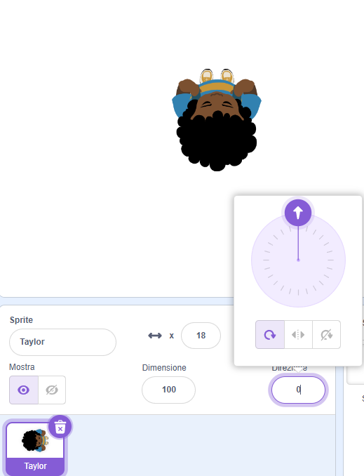

## Scegli un tema

<div style="display: flex; flex-wrap: wrap">
<div style="flex-basis: 200px; flex-grow: 1; margin-right: 15px;">
In questa fase aggiungerai un personaggio e uno sfondo e creerai le piattaforme di partenza e di arrivo. 
</div>
<div>
{:width="300px"}
</div>
</div>

--- task ---

Apri un [nuovo progetto Scratch](http://rpf.io/scratch-new){:target="_blank"} ed elimina lo sprite del gatto. Scratch si aprirà in una nuova scheda del browser.

--- /task ---

--- task ---

Crea uno sfondo di colore uniforme.

[[[scratch-paint-single-colour-backdrop]]]

--- /task ---

--- task ---

**Scegli:** Il tuo personaggio si muoverà da sinistra verso destra o dal basso verso l'alto?


--- /task ---

--- task ---

Dipingi un nuovo sprite della piattaforma **Partenza**.

Inizia con una semplice forma monocromatica. È possibile disattivare il contorno selezionando la linea diagonale rossa.


Potrai aggiungere ulteriori dettagli in seguito.

Creare un nuovo costume nell'editor di Paint.

[[[scratch-crosshair]]]

Posiziona lo sprite della piattaforma **Partenza** nel punto in cui vuoi che il tuo personaggio inizi la partita.

--- /task ---

--- task ---

Crea uno sprite della piattaforma semplice **Arrivo**. Potrai aggiungere ulteriori dettagli in seguito.

Creare un nuovo costume nell'editor di Paint.

Posiziona il tuo sprite **Arrivo** sullo Stage in cui vuoi che il tuo personaggio termini il gioco.

--- /task ---

--- task ---

Crea uno sprite del **personaggio**.

**Scegli:** Vuoi aggiungere o dipingere uno sprite del **personaggio**?

Potresti voler aggiungere uno sprite **personaggio** visto dall'alto come **Tatiana**, **Taylor**, o **Trisha**.


Oppure dipingi il tuo sprite del **personaggio**. Inizia con forme semplici e aggiungi i dettagli in un secondo momento. Creare un nuovo costume nell'editor di Paint.

[[[generic-scratch3-draw-sprite]]]

--- /task ---

--- task ---

Lo sprite del tuo **personaggio** ha bisogno di uno script di avvio per preparare tutto all'inizio del gioco.

Crea una `variabile`{:class="block3variables"} chiamata `atterrato` e impostala sulla dimensione che dovrebbe avere il tuo sprite quando è atterrato e non sta saltando.

Fai in modo che il tuo personaggio vada all'**inizio** `quando clicchi sulla bandiera`{:class="block3events"}. Aggiungi un blocco `passa allo sfondo`{:class="block3looks"}, in modo che il tuo personaggio sia in cima alle piattaforme.

**Carattere:**

```blocks3
when flag clicked // impostazioni
go to (Avvia v)
set [atterrato v] to [40] // dimensioni quando non si salta
set size to (atterrato) % // non saltare
go to [primo v] layer
show
broadcast (avvia v) // avvia altri script
```

**Suggerimento:** Deseleziona la variabile `atterrato`{:class="block3variables"} nel menu Blocchi `Variabili`{:class="block3variables"} in modo che non venga visualizzata sullo Stage. L'utente non ha bisogno di vedere questa variabile.

**Suggerimento:** è una buona idea `trasmettere`{:class="block3events"} un messaggio di `inizio`{:class="block3events"} alla fine dello script di installazione per far sapere agli altri script quando iniziare, altrimenti potrebbero avviarsi prima che tutto sia pronto.

--- /task ---

--- task ---

**Debug:**

--- collapse ---

---
title: Il mio sprite punta o salta nella direzione sbagliata
---

La proprietà **Direzione** nel riquadro Sprite può essere utilizzata per controllare la direzione in cui punta lo sprite. Gira la rotellina per far sì che uno sprite punti nella direzione desiderata.



--- /collapse ---

--- /task ---

--- task ---

Assegna al tuo progetto un titolo che descriva il tuo gioco.

--- /task ---

--- save ---
