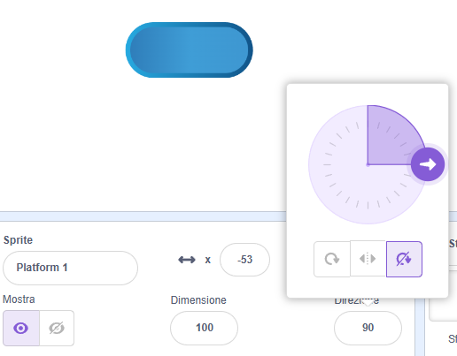

## Viaggia sulle piattaforme

<div style="display: flex; flex-wrap: wrap">
<div style="flex-basis: 200px; flex-grow: 1; margin-right: 15px;">
Beh, è troppo facile! 

In questa fase aggiungerai le piattaforme su cui atterrare. Jumping on them will stop your sprite falling in. 
</div>
<div>
{:width="300px"}
</div>
</div>

--- task ---

Crea uno sprite **Piattaforma 1** su cui atterrare.

Dipingi un costume per il tuo sprite **Piattaforma 1**.

**Suggerimento:** Se vuoi che il tuo sprite `rimbalzi`{:class="block3motion"} senza che il costume sembri cambiare direzione, avrai bisogno di un costume simmetrico o di impostare lo stile di rotazione su **Non ruotare**.



--- /task ---

--- task ---

Aggiungi il codice allo sprite **Piattaforma 1** per farlo muovere.

Potrebbe essere necessario che lo sprite **Piattaforma 1** `punti nella direzione`{:class="block3motion"} `0` per muoversi su e giù sullo schermo.

--- collapse ---

---
title: Fai muovere la tua piattaforma
---

```blocks3
when I receive [start v]
point in direction (0) // add this block for left to right games
forever
move (4) steps // try different numbers
if on edge, bounce
end
```

--- /collapse ---

--- /task ---

--- task ---

**Test:** Fai clic sulla bandiera verde e assicurati che la tua piattaforma si muova correttamente.

--- /task ---

--- task ---

Duplica lo sprite **Piattaforma 1** e chiamalo **Piattaforma 2** .

**Scegli:** Se vuoi avere 3 piattaforme, duplica di nuovo lo sprite **Piattaforma 1** e chiamalo **Piattaforma 3**.

[[[scratch3-duplicate-sprite]]]

Sperimenta con il numero di passaggi e con la dimensione degli sprite per rendere più facile o più difficile saltare su ciascuna piattaforma.

--- /task ---

Rileva `se`{:class="block3control"} lo sprite del tuo **personaggio** è atterrato su una **piattaforma**, ed è al sicuro, `oppure`{:class="block3control"} se lo sprite del tuo **personaggio** è caduto!

--- task ---

Aggiungi codice allo sprite del **personaggio** per rilevare `se tocca`{:class="block3sensing"} un colore sugli sprite della piattaforma ****.

**Scegli:** Se la tua piattaforma ha più colori, scegli su quale colore deve atterrare il tuo personaggio. Forse dovresti lasciarli cadere se si trovano solo sul bordo!

--- collapse ---

---
title: Se si tocca la piattaforma
---

```blocks3
when I receive [start v]
forever
if <(size) = (landed) > then // not in the air
if <touching color (#b89d2f) ?> then // at end
broadcast (stop v) // stop other sprites
stop [other scripts in sprite v]
go to (End v)
play sound (Win v) until done
stop [all v]
end
+ if <touching color (#762356) ?> then // choose a colour on your platform
if <touching (Platform 1 v)> then
go to (Platform 1 v)
end
if <touching (Platform 2 v)> then
go to (Platform 2 v)
end
if <touching (Platform 3 v)> then
go to (Platform 3 v)
end
else
end
end
end
```

--- /collapse ---

--- /task ---

--- task ---

**Test:** Fai clic sulla bandiera verde e assicurati che il tuo sprite possa salire sulle piattaforme.

--- /task ---

--- task ---

Aggiungi il codice allo sprite del tuo **personaggio ** per rilevare `se`{:class="block3control"} `tocca`{:class="block3sensing"} il colore dello sfondo, quindi termina il gioco.

--- collapse ---

---
title: Altrimenti toccando lo sfondo
---

```blocks3
when I receive [start v]
forever
if <(size) = (landed)> then // not in the air
if <touching color (#b89d2f) ?> then // at end
broadcast (stop v) // stop other sprites
stop [other scripts in sprite v] 
go to (End v)
play sound (Win v) until done
stop [all v]
end
if <touching color (#762356) ?> then // choose a colour on your platform
if <touching (Platform 1 v)> then
go to (Platform 1 v)
end
if <touching (Platform 2 v)> then
go to (Platform 2 v)
end
if <touching (Platform 3 v)> then
go to (Platform 3 v)
end
else
+ if <touching color (#37ab37) ?> then // choose your backdrop colour
broadcast (stop v)
stop [other scripts in sprite v] // prevent jumping after losing
hide
play sound (lose v) until done // add a sound of your choice
stop [all v]
end
end
end
```

--- /collapse ---

--- /task ---

--- task ---

**Test:** Gioca e prova a saltare una piattaforma. Assicuratevi di sentire il suono della sconfitta.

--- /task ---

--- task ---

Aggiungi codice ai tuoi sprite della **piattaforma** per impedirne il movimento quando lo sprite del **personaggio** raggiunge la piattaforma **finale** — o cade dentro!

```blocks3
when I receive [stop v]
stop [other scripts in sprite v]
```

--- /task ---

--- task ---

**Test:** Gioca di nuovo e assicurati che le piattaforme si fermino quando il gioco finisce. Il gioco termina quando raggiungi la piattaforma **finale**, oppure quando cadi dentro.

--- /task ---

--- task ---

**Debug:**

--- collapse ---

---
title: Il gioco finisce troppo presto
---

Assicurati di avere i blocchi `se`{:class="block3control"} nell'ordine corretto all'interno del tuo blocco `per sempre`{:class="block3control"}. Controllare attentamente il codice di esempio.

Se controlli che il **personaggio** tocchi lo sfondo prima di aver avuto la possibilità di atterrare su una piattaforma, la tua partita potrebbe concludersi ingiustamente!

Assicurati che i tuoi blocchi `se`{:class="block3control"} per controllare le condizioni del gioco siano all'interno di un blocco `se`{:class="block3control"} che controlla se è normale la dimensione del **personaggio**. Va bene che il tuo sprite tocchi il colore dello sfondo quando salta. Il problema è che finiscono nella crema pasticcera, nella lava, nella melma radioattiva o in qualsiasi altro pericolo tu abbia scelto.

--- /collapse ---

--- collapse ---

---
title: Le piattaforme non si fermano quando vinco o perdo
---

Osserva i tuoi sprite della **piattaforma** `quando ricevo `{:class="block3events"} script e controlla che il messaggio sia `stop`{:class="block3events"}.

```blocks3
when I receive [stop v]
stop [other scripts in sprite v]
```
Controlla che il blocco `inviare`{:class="block3events"} all'interno dei blocchi `se` vinci e perdi{:class="block3control"} sono uguali a ` stop`{:class="block3events"}.

```blocks3
broadcast (stop v)
```

--- /collapse ---

--- /task ---

--- save ---
