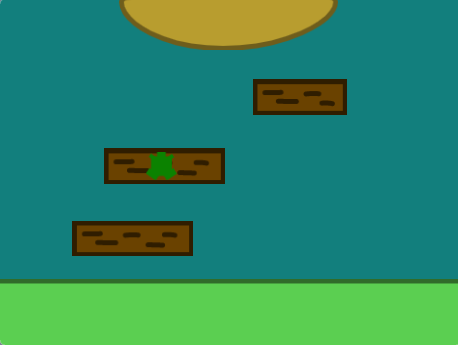

## はじめに

トップダウン視点の障害物やプラットフォームのパルクールゲームを設計および作成します。 主人公のキャラクターは、跳んだり、跳びまわったり、跳びはねたり、滑空したり、飛んだりして、移動するプラットフォームに乗りながら、最後までたどり着かなければなりません。

**トップダウン/俯瞰視点ゲーム**はゲームを上から見下ろします。 ゲーム全体がトップダウン視点を使用することもあれば、 デザインモードに入るときだけにこの視点を使用するゲームもあります。 トップダウン視点で遊ぶゲームを思いつきますか？ 

次のことを行います。
+ 重要なゲーム条件をチェックするアルゴリズムを使ってゴールのあるゲームを作成します
+ あなたの興味に合わせてゲームをパーソナライズします
+ ゲームの難易度を調整して、楽しくプレイできるようにします

--- no-print ---

--- task ---

  

### 試してみる ▶️ 

スペースバーを押すかステージをタップして次のプラットフォームにジャンプします。 カスタードに落ちないようにタイミングを計ってジャンプしましょう。

+ このゲームはどのようにトップダウン視点を作成していますか？ 
+ 飛ぶとキャラクターのサイズはどのように変化しますか？ 
+ プラットフォームに着陸しないとどうなりますか？ （続けて、カスタードに落ちてみてください！）

**カスタードに落ちないで！**：[中を見る](https://scratch.mit.edu/projects/525202210/editor){:target="_blank"}

  <iframe allowtransparency="true" width="485" height="402" src="https://scratch.mit.edu/projects/embed/525202210/?autostart=false" frameborder="0"></iframe>

--- /task ---

### アイデアを得る 💭

自分のトップダウン視点プラットフォームゲームを作るためにいくつか設計上の決定を行います。 テーマ、色、主人公のキャラクター、プラットフォームの数、そして難易度を選びます。

--- task ---

これらの例題プロジェクトを調べてより多くのアイデアを入手してください。

**ひな鳥**: [中を見る](https://scratch.mit.edu/projects/525236983/editor){:target="_blank"}

  <iframe allowtransparency="true" width="485" height="402" src="https://scratch.mit.edu/projects/embed/525236983/?autostart=false" frameborder="0"></iframe>

**丸太跳び**: [中を見る](https://scratch.mit.edu/projects/525236345/editor){:target="_blank"}

  <iframe allowtransparency="true" width="485" height="402" src="https://scratch.mit.edu/projects/embed/525236345/?autostart=false" frameborder="0"></iframe>

**惑星バウンス**: [中を見る](https://scratch.mit.edu/projects/525236603/editor){:target="_blank"}

  <iframe allowtransparency="true" width="485" height="402" src="https://scratch.mit.edu/projects/embed/525236603/?autostart=false" frameborder="0"></iframe>

--- / task ---

--- /no-print ---

--- print-only ---

### アイデアを得る 💭

自分のトップダウン視点プラットフォームゲームを作るためにいくつか設計上の決定を行います。 テーマ、色、主人公のキャラクター、プラットフォームの数、そして難易度を選びます。 Scratchスタジオの[Scratch 2: Don't fall in - Examples（落ちないで！ - 例）](https://scratch.mit.edu/studios/29599110/){:target="_blank"}にある例題プロジェクトの中を見てください。

   

--- /print-only ---

 
