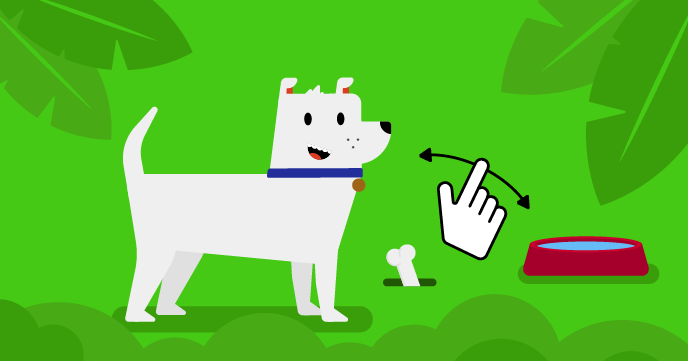

## 次は何をしますか？

[Scratch続編](https://projects.raspberrypi.org/en/raspberrypi/more-scratch)パスをたどっている場合は、 [このスプライトにはあなたが必要だ](https://projects.raspberrypi.org/en/projects/this-sprite-needs-you)プロジェクトに進むことができます。 このプロジェクトは、あなたが操作して役立つ仮想ペットまたはシミュレーションを作成します。

--- print-only ---

--- /print-only ---

--- no-print ---

  <iframe allowtransparency="true" width="485" height="402" src="https://scratch.mit.edu/projects/embed/530008968/?autostart=false" frameborder="0"></iframe>

--- /no-print ---

Scratchをもっと調べて楽しみたい場合は[これらのプロジェクト](https://projects.raspberrypi.org/en/projects?software%5B%5D=scratch&curriculum%5B%5D=%201)を試してみてください。
