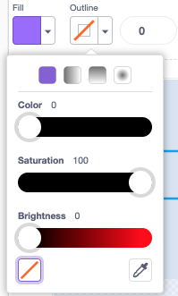
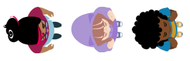

## テーマを決める

<div style="display: flex; flex-wrap: wrap">
<div style="flex-basis: 200px; flex-grow: 1; margin-right: 15px;">
このステップでは、キャラクターと背景を追加し、スタートとゴールのプラットフォームを作成します。 
</div>
<div>
{:width="300px"}
</div>
</div>

--- task ---

[新しいScratchプロジェクト](http://rpf.io/scratch-new){:target="_blank"}を開きます。 Scratchはブラウザの別のタブで開きます。

--- /task ---

--- task ---

単色の背景を作成します。

[[[scratch-paint-single-colour-backdrop]]]

--- /task ---

--- task ---

**選択：** あなたのキャラクターは左から右、それとも下から上に移動しますか？


--- /task ---

--- task ---

新しい**スタート**のプラットフォームのスプライトを描きます。

最初は単純に単色の形から始めてください。 You can turn the outline off by choosing the red diagonal line.



後で詳細を追加できます。

ペイントエディターでコスチュームを中央に配置します。

[[[scratch-crosshair]]]

ゲーム開始時にキャラクターがいてほしい場所に**スタート**プラットフォームを配置します。

--- /task ---

--- task ---

シンプルな**ゴール**のプラットフォームのスプライトを作ります。 後で詳細を追加できます。

ペイントエディターでコスチュームを中央に配置します。

ゲーム終了時にキャラクターがいてほしい場所に**ゴール**のプラットフォームを配置します。

--- /task ---

--- task ---

**キャラクター**のスプライトを作成します。

**選択：** **キャラクター**のスプライトを追加しますか、それとも描きたいですか？

**Tatiana**、**Taylor**、または **Trisha**のようなトップダウン**キャラクター**のスプライトを追加することをお勧めします。



もしくは、自分で**キャラクター**のスプライトを描きます。 単純な形状から始めて、詳細は後で追加しましょう。 ペイントエディターでコスチュームを中央に配置します。

[[[generic-scratch3-draw-sprite]]]

--- /task ---

--- task ---

**キャラクター**スプライトには、ゲームの初めにすべてをセットアップするための開始スクリプトが必要です。

Make a `variable`{:class="block3variables"} called `landed`, and set it to the size your sprite should be when it has landed and is not jumping.

Get your character to go to the **Start** `when flag clicked`{:class="block3events"}. Add a `go to front layer`{:class="block3looks"} block, so your character is on top of the platforms.

**Character:**

```blocks3
when flag clicked // setup
go to (Start v)
set [landed v] to [40] // size when not jumping
set size to (landed) % // not jumping
go to [front v] layer
show
broadcast (start v) // start other scripts
```

**Tip:** Uncheck the `landed`{:class="block3variables"} variable in the `Variables`{:class="block3variables"} Blocks menu so that it doesn't show on the Stage. The user doesn't need to see this variable.

**ヒント：** 他のスクリプトが始まるタイミングがわかるように、セットアップスクリプトの最後で`開始`{:class="block3events"}`メッセージを送信`{:class="block3events"}するのはよいアイデアです。そうしないと、準備がすべて整う前に他のスクリプトが始まってしまいます。

--- /task ---

--- task ---

**デバッグ:**

--- collapse ---

---
title: 私のスプライトが間違った方向を向いています
---

スプライトペインの**向き**プロパティを使用して、スプライトが指している方向を制御できます。 ホイールを回して、意図した方向にスプライトを向かせます。


--- /collapse ---

--- /task ---

--- task ---

プロジェクトにゲームを説明するタイトルを付けましょう。

--- /task ---

--- save ---
