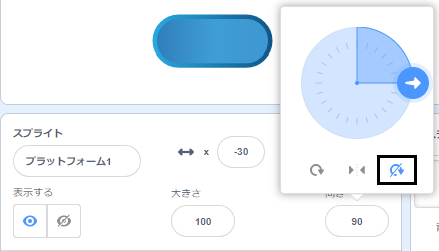

## プラットフォームに乗る

<div style="display: flex; flex-wrap: wrap">
<div style="flex-basis: 200px; flex-grow: 1; margin-right: 15px;">
うーん、これでは簡単すぎる！ 

このステップでは、着地するプラットフォームを追加します。 Jumping on them will stop your sprite falling in. 
</div>
<div>
{:width="300px"}
</div>
</div>

--- task ---

着地する**プラットフォーム1**のスプライトを作成します。

**プラットフォーム1**のスプライトのコスチュームを描きます。

**ヒント：** スプライトがコスチュームの方向を変えず`跳ね返る`{:class="block3motion"}ようにしたい場合は、コスチュームを対照的なものにするか、回転方法を**回転しない**に設定する必要があります。



--- /task ---

--- task ---

**プラットフォーム1**のスプライトにそれを動かすコードを追加します。

画面を上下に移動するには、**プラットフォーム1**のスプライトを`0``度に向ける`{:class="block3motion"}必要があるかもしれません。

--- collapse ---

---
title: プラットフォームを動かす
---

```blocks3
when I receive [start v]
point in direction (0) // add this block for left to right games
forever
move (4) steps // try different numbers
if on edge, bounce
end
```

--- /collapse ---

--- /task ---

--- task ---

**テスト：** 緑色の旗をクリックして、プラットフォームが正しく動くことを確認します。

--- /task ---

--- task ---

**プラットフォーム1**のスプライトを複製し**プラットフォーム2**という名前を付けます。

**選択：** プラットフォームが3つほしいなら、 **プラットフォーム1**のスプライトをもう一度複製し**プラットフォーム3**という名前を付けます。

[[[scratch3-duplicate-sprite]]]

歩数とスプライトのサイズを調整し、各プラットフォームへのジャンプを優しくしたり、難しくしたりします。

--- /task ---

もし</code>{:class="block3control"}で**キャラクター**のスプライトが**プラットフォーム**のスプライトに安全に着地したかを検出します。`でなければ`{:class="block3control"}**キャラクター**のスプライトは落ちてしまっています！

--- task ---

**キャラクター**のスプライトに、**プラットフォーム**のスプライトの色に`触れた`{:class="block3sensing"}ことを検出するコードを追加します。

**選択：** プラットフォームに複数の色がある場合、キャラクターが着地する必要のある色を選択します。 端に乗っかっているだけならば、落としてしまってもよいかもしれません！

--- collapse ---

---
title: プラットフォームに触れたら
---

```blocks3
when I receive [start v]
forever
if <(size) = (landed) > then // not in the air
if <touching color (#b89d2f) ?> then // at end
broadcast (stop v) // stop other sprites
stop [other scripts in sprite v]
go to (End v)
play sound (Win v) until done
stop [all v]
end
+ if <touching color (#762356) ?> then // choose a colour on your platform
if <touching (Platform 1 v)> then
go to (Platform 1 v)
end
if <touching (Platform 2 v)> then
go to (Platform 2 v)
end
if <touching (Platform 3 v)> then
go to (Platform 3 v)
end
else
end
end
end
```

--- /collapse ---

--- /task ---

--- task ---

**テスト：** 緑色の旗をクリックして、スプライトがプラットフォームに乗れることを確認します。

--- /task ---

--- task ---

`もし`{:class="block3control"}で背景色に`触れた`{:class="block3sensing"}ことを感知して、ゲームを終了させるように**キャラクター**のスプライトにコードを追加します。

--- collapse ---

---
title: あるいは背景に触れたら
---

```blocks3
when I receive [start v]
forever
if <(size) = (landed)> then // not in the air
if <touching color (#b89d2f) ?> then // at end
broadcast (stop v) // stop other sprites
stop [other scripts in sprite v] 
go to (End v)
play sound (Win v) until done
stop [all v]
end
if <touching color (#762356) ?> then // choose a colour on your platform
if <touching (Platform 1 v)> then
go to (Platform 1 v)
end
if <touching (Platform 2 v)> then
go to (Platform 2 v)
end
if <touching (Platform 3 v)> then
go to (Platform 3 v)
end
else
+ if <touching color (#37ab37) ?> then // choose your backdrop colour
broadcast (stop v)
stop [other scripts in sprite v] // prevent jumping after losing
hide
play sound (lose v) until done // add a sound of your choice
stop [all v]
end
end
end
```

--- /collapse ---

--- /task ---

--- task ---

**テスト：** ゲームをプレイして、プラットフォームに乗り損ねてみてください。 負けの音が聞こえることを確認します。

--- /task ---

--- task ---

**キャラクター**のスプライトが**ゴール**のプラットフォームに到達するか、落ちてしまったときに、**プラットフォーム**のスプライトが停止するようにスプライトへコードを追加します。

```blocks3
when I receive [stop v]
stop [other scripts in sprite v]
```

--- /task ---

--- task ---

**テスト：** もう一度プレイし、ゲームが終了したときにプラットフォームが停止することを確認します。 **ゴール**のプラットフォームに到達したとき、または落ちたときにゲームは終了します。

--- /task ---

--- task ---

**デバッグ:**

--- collapse ---

---
title: ゲームがすぐ終了してしまいます
---

`ずっと`{:class="block3control"}ブロックの中の`もし`{:class="block3control"}ブロックの順序が正しいことを確認します。 サンプルコードを注意深く確認します。

プラットフォームに着地する前に**キャラクター**が背景に触れていることを確認していると、ゲームが不当に終了する可能性があります。

ゲームの状態をチェックする`もし`{:class="block3control"}ブロックが、**キャラクター**のサイズをチェックする`もし`{:class="block3control"}ブロックの中にあることを確認します。 ジャンプするときにスプライトが背景色に触れていても問題ありません。 彼らがカスタード、溶岩、放射性グー、またはあなたが選んだ危険物に着陸した場合にのみ問題になります。

--- /collapse ---

--- collapse ---

---
title: 勝っても負けてもプラットフォームが止まらない
---

**プラットフォーム**のスプライトの`メッセージを受け取った`{:class="block3events"}スクリプトを見て、メッセージが`停止`{:class="block3events"}であることを確認してください。

```blocks3
when I receive [stop v]
stop [other scripts in sprite v]
```
勝ち負けの`もし`{:class="block3control"}ブロックの中で、`停止`の{:class="block3events"}`メッセージを送る`{:class="block3events"}としていることを確認します。

```blocks3
broadcast (stop v)
```

--- /collapse ---

--- /task ---

--- save ---
