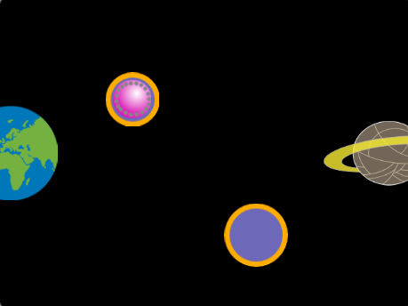

## Wat ga je maken

Ontwerp en maak een hindernis- of platformparkour-spel met bovenaanzicht. Je personage moet springen, huppelen, glijden, stuiteren of vliegen om een ritje te maken op bewegende platforms en het einde te halen.

**Bovenaanzicht/vogelvlucht** games kijken van bovenaf op het spel. Soms heeft het hele spel deze weergave. Andere games gebruiken bovenaanzichtweergave wanneer je een ontwerpmodus opent. Kun je spellen bedenken die je speelt met een weergave van bovenaf? 

Je gaat:
+ Een spel maken dat met behulp van een algoritme belangrijke spelvoorwaarden controleert om te zien of je (al dan niet) je doel hebt bereikt
+ Een game naar jouw interesses personaliseren
+ De moeilijkheidsgraad van het spel aanpassen, zodat het leuk is om te spelen

--- no-print ---

--- task ---

  

### Speel ▶️ 

Klik op de spatiebalk of tik op het speelveld om naar het volgende platform te springen. Denk goed na over de timing van je sprongen zodat je niet in de vla valt.

+ Hoe creëert het spel een bovenaanzicht? 
+ Hoe verandert de grootte van het personage als het vliegt? 
+ Wat gebeurt er als je niet op een platform landt? (Ga door, val in de vla!)

  <iframe allowtransparency="true" width="485" height="402" src="" frameborder="0"></iframe>

--- /task ---

### Doe inspiratie op 💭

Je gaat een aantal ontwerpbeslissingen nemen om je eigen platformgame met bovenaanzicht te maken. Je kiest het thema, de kleuren, het personage, het aantal platforms en de moeilijkheidsgraad.

--- task ---

Bekijk deze voorbeeldprojecten om meer ideeën op te doen:

  <iframe allowtransparency="true" width="485" height="402" src="" frameborder="0"></iframe>

  <iframe allowtransparency="true" width="485" height="402" src="" frameborder="0"></iframe>

  <iframe allowtransparency="true" width="485" height="402" src="" frameborder="0"></iframe>

--- /no-print ---

--- print-only ---

### Doe inspiratie op 💭

Je gaat een aantal ontwerpbeslissingen nemen om je eigen platformgame met bovenaanzicht te maken. Je kiest het thema, de kleuren, het personage, het aantal platforms en de moeilijkheidsgraad. Bekijk voorbeeldprojecten in [Scratch 2: Val er niet in - Voorbeelden](https://scratch.mit.edu/studios/29599110/){:target="_blank"} Scratch studio.

   

--- /print-only ---

 
