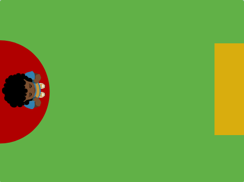
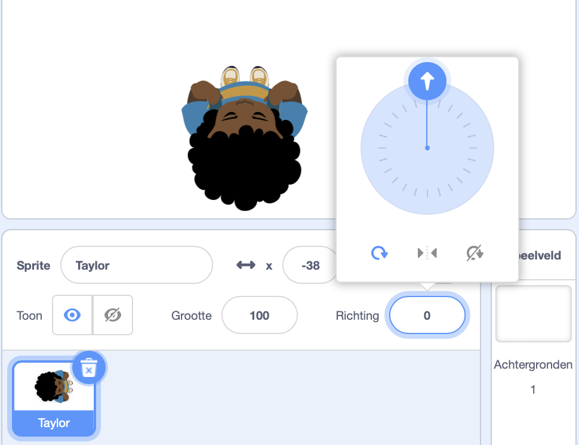

## Kies je thema

<div style="display: flex; flex-wrap: wrap">
<div style="flex-basis: 200px; flex-grow: 1; margin-right: 15px;">
In deze stap voeg je een personage en achtergrond toe en maak je start- en eindplatforms. 
</div>
<div>
{:width="300px"}
</div>
</div>

--- task ---

Open een [nieuw Scratch-project](http://rpf.io/scratch-new){:target="_blank"} en verwijder de kattensprite. Scratch wordt in een nieuw browsertabblad geopend.

--- /task ---

--- task ---

Creëer een effen achtergrondkleur.

[[[scratch-paint-single-colour-backdrop]]]

--- /task ---

--- task ---

**Maak een keuze:** Beweegt je personage van links naar rechts of van onder naar boven?


--- /task ---

--- task ---

Teken een nieuwe **Start**-platformsprite.

Begin met een eenvoudige vorm die een kleur heeft. Je kunt later nog meer details toevoegen.

Centreer je kostuum in de Teken-editor.

[[[scratch-crosshair]]]

Plaats je **Start**-platformsprite waar je wilt dat je personage het spel start.

--- /task ---

--- task ---

Maak een eenvoudige **Einde**-platformsprite. Je kunt later meer details toevoegen.

Centreer je kostuum in de Teken-editor.

Plaats je **Einde**-platformsprite waar je wilt dat je personage het spel start.

--- /task ---

--- task ---

Selecteer de **hoofdpersoon**-sprite.

**Kies:** Wil je een **hoofdpersoon**-sprite toevoegen of er zelf een tekenen?

Misschien wil je een **hoofdpersoon**-sprite met bovenaanzicht toevoegen, zoals **Tatiana**, **Taylor** of **Trisha**.


Of teken je eigen **hoofdpersoon**-sprite. Begin met eenvoudige vormen en voeg later details toe. Centreer je kostuum in de Teken-editor.

[[[generic-scratch3-draw-sprite]]]

--- /task ---

--- task ---

Je **hoofdpersoon**-sprite heeft een startscript nodig om alles in te stellen voor het begin van het spel.

--- collapse ---

---
title: Maak je hoofdpersoon klaar om te beginnen
---

Maak een `variabele`{:class="block3variables"} met de naam `geland`, en stel deze in op de grootte die je sprite zou moeten hebben als hij is geland en niet springt.

Laat je hoofdpersoon naar de **Start** gaan `wanneer op de vlag wordt geklikt`{:class="block3events"}. Voeg een `ga naar laag voorgrond`{:class="block3looks"} blok toe, zodat je personage bovenop de platforms staat.

**Hoofdpersoon:**

```blocks3
when flag clicked // instellen
go to (Start v)
set [geland v] to [40] // grootte als je niet springt
set size to (geland) % // niet springen
go to [front v] layer
show
broadcast (start v) // andere scripts starten
```

**Tip:** Schakel de variabele `geland`{:class="block3variables"} uit in het menu `Variabelen`{:class="block3variables"} zodat deze niet in het speelveld wordt weergegeven. De gebruiker hoeft deze variabele niet te zien.

--- /collapse ---

**Tip:** Het is een goed idee om een `zend signaal`{:class="block3events"} `start`{:class="block3events"}-bericht aan het einde van je installatiescript uit te sturen, om andere scripts te laten weten wanneer ze mogen beginnen, anders zouden ze kunnen beginnen voordat alles klaar is.

--- /task ---

--- task ---

**Fouten oplossen:**

--- collapse ---

---
title: Mijn sprite wijst in de verkeerde richting
---

De eigenschap **Richting** in het Sprite-paneel kan worden gebruikt om de richting te bepalen waarin de sprite wijst. Draai aan het wiel om een sprite in de gewenste richting te laten wijzen.



--- /collapse ---

--- /task ---

--- task ---

Geef je project een leuke titel waarin de beschrijving van je spel is opgenomen.

--- /task ---

--- save ---
