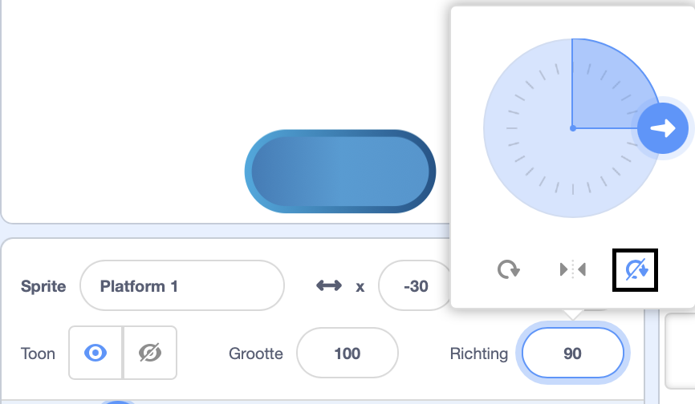

## Rijd op platforms

<div style="display: flex; flex-wrap: wrap">
<div style="flex-basis: 200px; flex-grow: 1; margin-right: 15px;">
Nou dat is te makkelijk! 

In deze stap voeg je platforms toe om op te landen. Door erop te springen voorkom je dat je erin valt. 
</div>
<div>
{:width="300px"}
</div>
</div>

--- task ---

Maak een **Platform 1** sprite om op te landen.

Geef je **Platform 1** sprite een mooie kleur.

**Tip:** Als je wilt dat je sprite `stuitert`{:class="block3motion"} zonder dat het uiterlijk van richting lijkt te veranderen, heb je een uiterlijk nodig dat symmetrisch is, of stel de draaistijl in op **Niet draaien**.



--- /task ---

--- task ---

Voeg code toe aan je **Platform 1** sprite om hem in beweging te krijgen.

Het kan zijn dat je **Platform 1** sprite een `richt naar`{:class="block3motion"} `0` moet doen om op en neer te bewegen op het scherm.

--- collapse ---

---
title: Laat je platform bewegen
---

```blocks3
when I receive [start v]
point in direction (0) // voeg dit blok toe voor games van links naar rechts
forever
move (4) steps // probeer verschillende getallen
if on edge, bounce
end
```

--- /collapse ---

--- /task ---

--- task ---

**Test:** Klik op de groene vlag en kijk of je platform op de juiste manier beweegt.

--- /task ---

--- task ---

Maak een kopie (dat noemen we ook wel dupliceren) van je **Platform1** sprite en geef deze de naam **Platform 2**.

**Maak een keuze:** Als je 3 platforms wilt hebben, kopieer je de sprite **Platform 1** opnieuw en geef je deze de naam **Platform 3**.

[[[scratch3-duplicate-sprite]]]

Experimenteer met het aantal stappen en de sprite-grootte om elk platform gemakkelijker of moeilijker te maken om op te springen.

--- /task ---

Detecteer `als`{:class="block3control"} je **hoofdpersoon** is geland op een **platform**-sprite en dus veilig is, `anders`{:class="block3control"} is je **hoofdpersoon**gevallen!

--- task ---

Voeg code toe aan je **hoofdpersoon** om te controleren of je hoofdpersoon op een platform is geland. Hiervoor gebruik je het blok `raak ik kleur aan`{:class="block3sensing"} en kies de (exacte) kleur van het platform.

**Maak een keuze:** Als je platform meerdere kleuren heeft, kies dan op welke kleur je personage moet landen. Je kan het bijvoorbeeld zo coderen dat ze erin vallen als ze alleen op de rand zijn geland!

--- collapse ---

---
title: Als je op het platform landt
---

```blocks3
when I receive [start v]
forever
if <(size) = (geland) > then // niet in de lucht
if <touching color (#b89d2f) ?> then // aan het einde
broadcast (stop v) // stop andere sprites
stop [other scripts in sprite v]
go to (Einde v)
play sound (Win v) until done
stop [all v]
end
+ if <touching color (#762356) ?> then // kies een kleur voor je platform
if <touching (Platform 1 v)> then
go to (Platform 1 v)
end
if <touching (Platform 2 v)> then
go to (Platform 2 v)
end
if <touching (Platform 3 v)> then
go to (Platform 3 v)
end
else
end
end
end
```

--- /collapse ---

--- /task ---

--- task ---

**Test:** Klik op de groene vlag en test dat je sprite op de platforms kan rijden.

--- /task ---

--- task ---

Voeg code to aan je **hoofdpersoon** om waar te nemen `als`{:class="block3control"} het hoofdpersoon de achtergrondkleur raakt en het spel dan eindigt. Dit doe je door een blok `raak ik kleur`{:class="block3sensing} toe te voegen aan je personage met de exacte kleur van het speelveld.

--- collapse ---

---
title: Anders wanneer de achtergrond wordt geraakt
---

```blocks3
when I receive [start v]
forever
if <(size) = (geland)> then // niet in de lucht
if <touching color (#b89d2f) ?> then // aan het einde
broadcast (stop v) // stop andere sprites
stop [other scripts in sprite v] 
go to (Einde v)
play sound (Win v) until done
stop [all v]
end
if <touching color (#762356) ?> then // kies een kleur voor je platform
if <touching (Platform 1 v)> then
go to (Platform 1 v)
end
if <touching (Platform 2 v)> then
go to (Platform 2 v)
end
if <touching (Platform 3 v)> then
go to (Platform 3 v)
end
else
+ if <touching color (#37ab37) ?> then // kies je achtergrondkleur
broadcast (stop v)
stop [other scripts in sprite v] // voorkomt dat je personage blijft springen na verlies
hide
play sound (Lose v) until done // voeg een geluid naar keuze toe
stop [all v]
end
end
end
```

--- /collapse ---

--- /task ---

--- task ---

**Test:** Speel je spel en probeer een platform te missen. Hoor je het "verliezen" geluid?

--- /task ---

--- task ---

Voeg code toe aan je **platform**-sprites om te voorkomen dat ze blijven bewegen wanneer het **hoofdpersoon** het **Einde**-platform heeft bereikt - of erin valt!

```blocks3
when I receive [stop v]
stop [other scripts in sprite v]
```

--- /task ---

--- task ---

**Test:** Speel je spel nog eens en kijk of de platforms stoppen wanneer het spel eindigt. Het spel eindigt wanneer je het **Einde**-platform bereikt, of wanneer je erin valt.

--- /task ---

--- task ---

**Fouten oplossen:**

--- collapse ---

---
title: Het spel eindigt te vroeg
---

Zorg ervoor dat je de `als`{:class="block3control"} blokken in de juiste volgorde in je `herhaal`{:class="block3control"} blok hebt staan. Kijk het goed na aan de hand van de voorbeeldcode.

Als je controleert of de **hoofdpersoon** de achtergrond raakt voordat het de kans heeft gehad om op een platform te landen, kan je spel oneerlijk eindigen!

Zorg ervoor dat je `als`{:class="block3control"}-blokken om de spelvoorwaarden te controleren zich in een `als`{:class="block3control"}-blok bevinden dat controleert of de grootte van de **hoofdpersoon** normaal is. Het is prima dat je hoofdpersoon de achtergrondkleur aanraakt tijdens het springen. Het is alleen een probleem als ze in de vla, lava, radioactieve smurrie of welk gevaar dan ook belanden dat jij voor je spel hebt gekozen.

--- /collapse ---

--- collapse ---

---
title: De platforms stoppen niet als ik win of verlies
---

Kijk naar je **platform** sprites' `wanneer ik signaal ontvang`{:class="block3events"}-script en controleer of het bericht `stop`{:class="block3events"} is.

```blocks3
when I receive [stop v]
stop [other scripts in sprite v]
```
Controleer of het `zend signaal`{:class="block3events"} bericht in de winst en verlies `als`{:class="block3control"}-blokken `stop`{:class="block3events"} is.

```blocks3
broadcast (stop v)
```

--- /collapse ---

--- /task ---

<p style="border-left: solid; border-width:10px; border-color: #0faeb0; background-color: aliceblue; padding: 10px;">
Er zijn veel <span style="color: #0faeb0">platformspellen</span> in 2D of soms zelfs in 3D!  Platforms komen veel voor in obstakel games en parkour-games. Sommige games hebben platforms die bewegen, worden getoond en verborgen, of geleidelijk verdwijnen als je erop springt. Heb jij wel eens een game gespeeld die platforms had waarop je moest springen? Hoe zit het met games met bewegende platforms?
</p>

--- save ----
