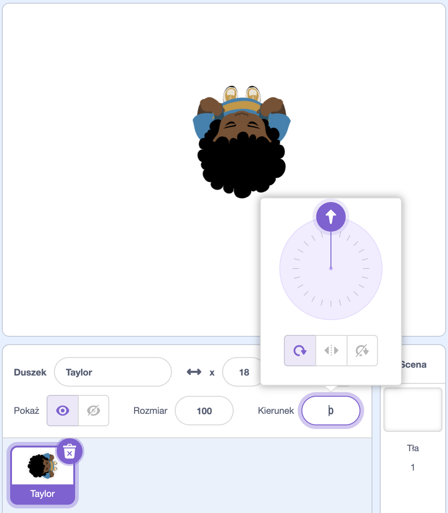

## Wybierz swój motyw

<div style="display: flex; flex-wrap: wrap">
<div style="flex-basis: 200px; flex-grow: 1; margin-right: 15px;">
W tym kroku dodasz postać i tło oraz stworzysz platformę początkową i końcową. 
</div>
<div>
{:width="300px"}
</div>
</div>

--- task ---

Otwórz [nowy projekt Scratch](http://rpf.io/scratch-new){:target="_blank"} i usuń duszka kota. Scratch otworzy się w nowej karcie przeglądarki.

--- /task ---

--- task ---

Utwórz tło w jednolitym kolorze.

[[[scratch-paint-single-colour-backdrop]]]

--- /task ---

--- task ---

**Wybierz:** Czy Twoja postać będzie poruszać się od lewej do prawej, czy od dołu do góry?


--- /task ---

--- task ---

Namaluj nowego duszka platformy **Start**.

Zacznij od prostego, jednokolorowego kształtu. You can turn the outline off by choosing the red diagonal line.


Możesz dodać więcej szczegółów później.

Wyśrodkuj swój kostium w edytorze Paint.

[[[scratch-crosshair]]]

Ustaw duszka platformy **Start** w miejscu, w którym chcesz, aby Twoja postać rozpoczęła grę.

--- /task ---

--- task ---

Utwórz prostego duszka platformy **Koniec**. Możesz dodać więcej szczegółów później.

Wyśrodkuj swój kostium w edytorze Paint.

Umieść swojego duszka **Koniec** w miejscu, w którym chcesz, aby twoja postać zakończyła grę.

--- /task ---

--- task ---

Stwórz duszka **Postaci**.

**Wybierz:** Czy chcesz dodać czy namalować duszka **postaci**?

Możesz dodać duszka **postaci** z widokiem z góry, takiego jak **Tatiana**, **Taylor** lub **Trisha**.


Lub namaluj własnego duszka **postaci**. Zacznij od prostych kształtów i dodawaj szczegóły później. Wyśrodkuj swój kostium w edytorze Paint.

[[[generic-scratch3-draw-sprite]]]

--- /task ---

--- task ---

Twój duszek **postaci** potrzebuje skryptu początkowego, aby przygotować wszystko na rozpoczęcie gry.

Make a `variable`{:class="block3variables"} called `landed`, and set it to the size your sprite should be when it has landed and is not jumping.

Get your character to go to the **Start** `when flag clicked`{:class="block3events"}. Add a `go to front layer`{:class="block3looks"} block, so your character is on top of the platforms.

**Character:**

```blocks3
when flag clicked // setup
go to (Start v)
set [landed v] to [40] // size when not jumping
set size to (landed) % // not jumping
go to [front v] layer
show
broadcast (start v) // start other scripts
```

**Tip:** Uncheck the `landed`{:class="block3variables"} variable in the `Variables`{:class="block3variables"} Blocks menu so that it doesn't show on the Stage. The user doesn't need to see this variable.

**Wskazówka:** Dobrym pomysłem jest `nadanie`{:class="block3events"} komunikatu `start`{:class="block3events"} na końcu skryptu instalacyjnego, aby inne skrypty wiedziały, kiedy wystartować. W przeciwnym razie mogą się uruchomić, zanim wszystko będzie gotowe.

--- /task ---

--- task ---

**Debugowanie:**

--- collapse ---

---
title: Mój duszek wskazuje w złym kierunku
---

Właściwość **Kierunek** w panelu duszka może być użyta do kontrolowania kierunku, w którym wskazuje duszek. Obróć kółko, aby ustawić duszka w żądanym kierunku.



--- /collapse ---

--- /task ---

--- task ---

Nadaj swojemu projektowi tytuł opisujący Twoją grę.

--- /task ---

--- save ---
