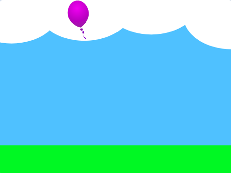

## Zwycięzca

<div style="display: flex; flex-wrap: wrap">
<div style="flex-basis: 200px; flex-grow: 1; margin-right: 15px;">
Na tym etapie wykryjesz, że gracz dotarł do platformy **Koniec**, aby wygrać grę. 
</div>
<div>
{:width="300px"}
</div>
</div>

Dodasz pętlę `zawsze`{:class="block3control"}, która sprawdza, czy Twoja **postać** jest na poziomie platformy, a jeśli tak, `, jeżeli`{:class="block3control"} osiągnęła poziom platformy **Koniec**.

--- task ---

**Wybierz:** Dodaj dźwięk zwycięstwa do swojej postaci.

--- /task ---

--- task ---

Dodaj kod, aby wykryć, kiedy Twoja postać dotrze do platformy **Koniec**, używając `dotyka koloru`{:class="block3sensing"}.

--- collapse ---

---
title: Zakończ grę, gdy gracz dotknie koloru
---

**Postać**:

```blocks3
when I receive [start v]
forever
if <(size) = (landed)> then // not in the air
if <touching color (#b89d2f) ?> then // at end
broadcast (stop v) // stop other sprites
stop [other scripts in sprite v] // stop jumping after win
go to (End v)
play sound (Win v) until done
stop [all v]
end
end
end
```

Dobrym pomysłem jest `nadanie`{:class="block3events"} komunikatu „zatrzymaj”, aby inne duszki wiedziały, że gra się zakończyła. Blok `zatrzymaj inne skrypty duszka`{:class="block3control"} zatrzymuje pętlę powodującą przeskok postaci.

--- /collapse ---

Będziesz musiał ustawić wykrywany kolor na kolor platformy **Koniec**.

[[[scratch3-set-block-input-colour-with-eyedropper]]]

**Wskazówka:** Dobrym pomysłem jest `nadawanie`{:class="block3events"} komunikatu `-stop`{:class="block3events"}, gdy wykryjesz, że gra się zakończyła, aby inne duszki mogły się zatrzymać. Dany duszek może np. odtworzyć dźwięk, zanim się zatrzyma.

--- /task ---

--- task ---

**Test:** Kliknij zieloną flagę, a następnie przeskocz swoją postacią przez scenę. Upewnij się, że usłyszysz zwycięski dźwięk, gdy dotrzesz do platformy **Koniec**.

**Wskazówka:** Bardzo ważne jest przetestowanie swojego projektu przed przejściem do następnego kroku i dodaniem kolejnego kodu. Trudniej będzie Ci znaleźć i naprawić błędy, gdy dodasz więcej kodu.

--- /task ---


--- task ---

**Debugowanie:**

--- collapse ---

---
title: Mój duszek nie trafia na środek platformy Koniec
---

Musisz się upewnić, że wszystkie kostiumy duszków są wyśrodkowane w edytorze Paint.

Blok `idź do (innego duszka)`{:class="block3motion"} przesuwa duszka tak, że jego środek znajduje się w tej samej pozycji, co środek drugiego duszka. Jeśli ich środki znajdują się w niewłaściwym miejscu, twoja **postać** nie trafi na środek platformy.

--- /collapse ---

--- collapse ---

---
title: Gra kończy się zbyt szybko
---

Sprawdź, czy duszek nie dotyka koloru Koniec, gdy nie znajduje się na platformie **Koniec** — jeśli użyjesz tego samego koloru w innym miejscu projektu, Twoja postać może umrzeć zbyt wcześnie.

--- /collapse ---

--- collapse ---

---
title: Dźwięk nie jest odtwarzany, gdy ląduję na platformie Koniec
---

Kliknij duszka **postaci**, a następnie zakładkę „Dźwięki”. Upewnij się, że do duszka dodano dźwięk Koniec. Kliknij przycisk **Odtwórz**, aby upewnić się, że dźwięk odtwarza się na Twoim komputerze.

Kliknij zakładkę **Skrypt** i sprawdź, czy poprawny dźwięk znajduje się w bloku `Graj dźwięk`{:class="block3sound"}, który jest uruchamiany, gdy duszek dotrze na platformę **Koniec**.

Upewnij się, że kolor w bloku `dotyka koloru`{:class="block3sensing"} jest prawidłowy. Wybierz kolor ponownie, jeśli nie jesteś pewien. Czasami kolory wyglądają podobnie, ale nie są takie same.

```blocks3
when I receive [start v]
forever
if < (size) = (landed) > then // not in the air
+if <touching color (#b89d2f) ?> then // at end
broadcast (stop v) // stop other sprites
go to (End v)
+play sound (Win v) until done
stop [all v]
end
end
end
```

--- /collapse ---

Jeśli masz błąd, którego tutaj nie omówiliśmy, daj nam znać w komentarzu. Jeśli sam naprawiłeś błąd (brawo!), daj nam znać.

**Wskazówka:** Jeśli utkniesz, spróbuj przeczytać kod na głos lub w myślach, aby upewnić się, że robi to, co myślisz. Być może wtedy znajdziesz błąd.

--- /task ---

--- save ---
