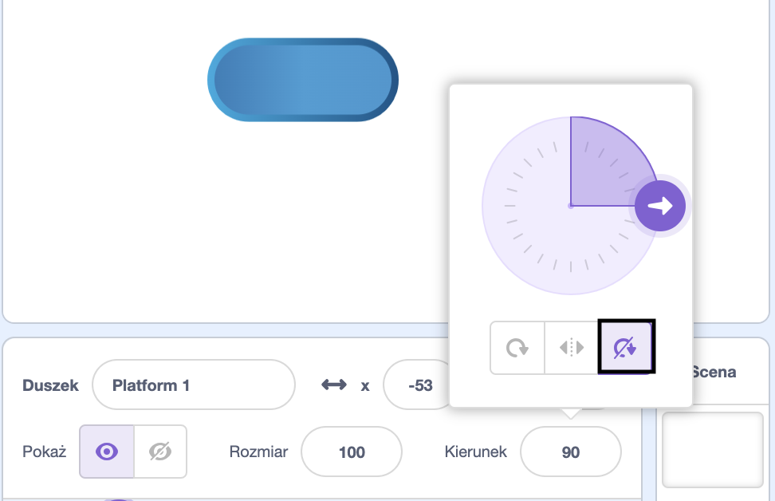

## Jeździj na platformach

<div style="display: flex; flex-wrap: wrap">
<div style="flex-basis: 200px; flex-grow: 1; margin-right: 15px;">
Cóż, to zbyt proste! 

W tym kroku dodasz platformy, na których będziesz mógł wylądować. Wskakując na nie, unikniesz upadku. 
</div>
<div>
{:width="300px"}
</div>
</div>

--- task ---

Utwórz duszka **Platforma 1**, na którym będziesz mógł wylądować.

Namaluj kostium swojemu duszkowi **Platforma 1**.

**Wskazówka:** Jeśli chcesz, aby duszek `podskakiwał`{:class="block3motion"} bez wrażenia zmiany kierunku kostiumu, będziesz potrzebować kostiumu symetrycznego lub ustaw styl obrotu na **Nie obracaj**.



--- /task ---

--- task ---

Dodaj kod do duszka **Platforma 1**, aby go uruchomić.

Być może będziesz musiał ustawić duszka **Platforma 1** używając `ustaw w kierunku`{:class="block3motion"} `0`, aby poruszać się w górę i w dół ekranu.

--- collapse ---

---
title: Spraw, aby Twoja platforma się poruszała
---

```blocks3
when I receive [start v]
point in direction (0) // add this block for left to right games
forever
move (4) steps // try different numbers
if on edge, bounce
end
```

--- /collapse ---

--- /task ---

--- task ---

**Test:** Kliknij na zieloną flagę i upewnij się, że platforma porusza się prawidłowo.

--- /task ---

--- task ---

Zduplikuj duszka **Platforma 1** i nazwij go **Platforma 2**.

**Wybierz:** Jeśli chcesz mieć 3 platformy, zduplikuj duszka **Platforma 1** ponownie i nazwij go **Platforma 3**.

[[[scratch3-duplicate-sprite]]]

Poeksperymentuj z liczbą stopni i rozmiarem duszka, aby ułatwić lub utrudnić wskoczenie na każdą z platform.

--- /task ---

Wykryj `jeżeli`{:class="block3control"} twój duszek **postaci** wylądował na duszku **platformy** i jest bezpieczny, `w przeciwnym razie`{:class="block3control"} twój duszek **postaci** spadł!

--- task ---

Dodaj kod do duszka **postaci**, aby sprawdzić `jeżeli dotyka`{:class="block3sensing"} koloru na duszkach **platformy**.

**Wybierz:** Jeśli Twoja platforma ma wiele kolorów, wybierz kolor, na którym ma wylądować Twoja postać. Możesz chcieć, żeby postacie wpadły, jeśli dotykają tylko krawędzi!

--- collapse ---

---
title: Jeśli dotykasz platformy
---

```blocks3
when I receive [start v]
forever
if <(size) = (landed) > then // not in the air
if <touching color (#b89d2f) ?> then // at end
broadcast (stop v) // stop other sprites
stop [other scripts in sprite v]
go to (End v)
play sound (Win v) until done
stop [all v]
end
+ if <touching color (#762356) ?> then // choose a colour on your platform
if <touching (Platform 1 v)> then
go to (Platform 1 v)
end
if <touching (Platform 2 v)> then
go to (Platform 2 v)
end
if <touching (Platform 3 v)> then
go to (Platform 3 v)
end
else
end
end
end
```

--- /collapse ---

--- /task ---

--- task ---

**Test:** Kliknij na zieloną flagę i upewnij się, że duszek może jeździć na platformach.

--- /task ---

--- task ---

Dodaj kod do duszka **postaci**, aby wiedzieć `jeżeli`{:class="block3control"} `dotyka`{:class="block3sensing"} koloru tła, a następnie zakończ grę.

--- collapse ---

---
tytuł: Jeżeli dotyka tła
---

```blocks3
when I receive [start v]
forever
if <(size) = (landed)> then // not in the air
if <touching color (#b89d2f) ?> then // at end
broadcast (stop v) // stop other sprites
stop [other scripts in sprite v] 
go to (End v)
play sound (Win v) until done
stop [all v]
end
if <touching color (#762356) ?> then // choose a colour on your platform
if <touching (Platform 1 v)> then
go to (Platform 1 v)
end
if <touching (Platform 2 v)> then
go to (Platform 2 v)
end
if <touching (Platform 3 v)> then
go to (Platform 3 v)
end
else
+ if <touching color (#37ab37) ?> then // choose your backdrop colour
broadcast (stop v)
stop [other scripts in sprite v] // prevent jumping after losing
hide
play sound (lose v) until done // add a sound of your choice
stop [all v]
end
end
end
```

--- /collapse ---

--- /task ---

--- task ---

**Test:** Zagraj w swoją grę i spróbuj ominąć platformę. Upewnij się, że słyszysz dźwięk przegranej.

--- /task ---

--- task ---

Dodaj kod do swoich duszków **platform**, aby zatrzymać je w ruchu, gdy duszek **-postaci** dotrze na platformę **Koniec** — lub spadnie!

```blocks3
when I receive [stop v]
stop [other scripts in sprite v]
```

--- /task ---

--- task ---

**Test:** Zagraj ponownie i upewnij się, że platformy zatrzymają się po zakończeniu gry. Gra kończy się, gdy dotrzesz do platformy **Koniec** lub gdy spadniesz.

--- /task ---

--- task ---

**Debugowanie:**

--- collapse ---

---
title: Gra kończy się zbyt szybko
---

Upewnij się, że bloki `jeżeli`{:class="block3control"} znajdują się we właściwej kolejności w bloku `zawsze`{:class="block3control"}. Sprawdź dokładnie w odniesieniu do przykładowego kodu.

Jeśli sprawdzisz warunek, czy **postać** dotyka tła, zanim zdąży wylądować na platformie, Twoja gra może zakończyć się niesprawiedliwie!

Upewnij się, że Twoje `jeżeli`{:class="block3control"} służące do sprawdzania warunków gry znajdują się wewnątrz bloku `jeżeli`{:class="block3control"}, który sprawdza, czy rozmiar ** postaci **jest normalny. Nie ma nic złego w tym, że duszek dotyka koloru tła podczas skoku. Problem pojawia się tylko wtedy, gdy wylądują w kremie, lawie, radioaktywnej mazi lub innej wybranej przez ciebie niebezpiecznej substancji.

--- /collapse ---

--- collapse ---

---
title: Platformy nie zatrzymują się, gdy wygrywam lub przegrywam
---

Spójrz na skrypty **kiedy otrzymam**{:class="block3events"} przypisane do twoich duszków `platform` i sprawdź, czy wiadomość to `stop`{:class="block3events"}.

```blocks3
when I receive [stop v]
stop [other scripts in sprite v]
```
Sprawdź, czy blok `nadaj komunikat`{:class="block3events"} wewnątrz bloku `jeżeli`{:class="block3control"} dla wygrywania i przegrywania to `stop`{:class="block3events"}.

```blocks3
broadcast (stop v)
```

--- /collapse ---

--- /task ---

<p style="border-left: solid; border-width:10px; border-color: #0faeb0; background-color: aliceblue; padding: 10px;">
Istnieje wiele <span style="color: #0faeb0">gier platformowych</span> w tym gry 2D i 3D. Platformy są powszechne w grach z przeszkodami obby (od ang. "obstacle" oznaczającego przeszkodę) i grach parkour. Niektóre gry mają platformy, które się poruszają, pokazują i chowają lub stopniowo znikają, gdy po nich skaczesz. Czy przychodzą Ci do głowy gry, w które grałeś, mające platformy, po których musisz wskakiwać? A co z grami z ruchomymi platformami?
</p>

--- save ----
