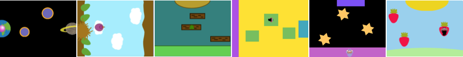

## O que você vai fazer

Projete e construa uma visão de cima para baixo, obstáculo ou plataforma, jogo de parkour. Seu personagem precisará pular, saltar, planar, quicar ou voar para pegar carona em plataformas móveis e chegar até o fim.

**Jogos de cima para baixo/visão panorâmica** observe o jogo de cima. Às vezes, todo o jogo tem essa visão. Outros jogos usam visualizações de cima para baixo quando você entra no modo de design. Você consegue pensar em algum jogo que use a visualização de cima para baixo? 

Você deve:
+ Faça um jogo com um objetivo usando um algoritmo que verifica condições importantes do jogo
+ Personalizar um jogo de acordo com seus interesses
+ Ajustar a dificuldade de um jogo para que ele seja divertido jogar

--- no-print ---

--- task ---

  

### Jogar ▶️ 

Clique na barra de espaço ou toque no Palco para pular para a próxima plataforma. Cronometre seus saltos para não cair no creme.

+ Como o jogo cria uma visão de cima para baixo? 
+ Como o tamanho do personagem muda quando ele voa? 
+ O que acontece se você não pousar em uma plataforma? (Vá em frente, caia no creme!)

  <iframe allowtransparency="true" width="485" height="402" src="" frameborder="0"></iframe>

--- /task ---

### Tenha ideias 💭

Você tomará algumas decisões de design para criar seu próprio jogo de plataforma de cima para baixo. Você escolherá o tema, as cores, o personagem, o número de plataformas e o nível de dificuldade.

--- task ---

Explore estes projetos de exemplo para obter ideia para o seu livro:

  <iframe allowtransparency="true" width="485" height="402" src="" frameborder="0"></iframe>

  <iframe allowtransparency="true" width="485" height="402" src="" frameborder="0"></iframe>

  <iframe allowtransparency="true" width="485" height="402" src="" frameborder="0"></iframe>

--- /no-print ---

--- print-only ---

### Tenha ideias 💭

Você tomará algumas decisões de design para criar seu próprio jogo de plataforma de cima para baixo. Você escolherá o tema, as cores, o personagem, o número de plataformas e o nível de dificuldade. Veja exemplos de projetos em [Scratch 2: Don't fall in - Exemplos](https://scratch.mit.edu/studios/29599110/){:target="_blank"} Scratch Studio.

   

--- /print-only ---

 
