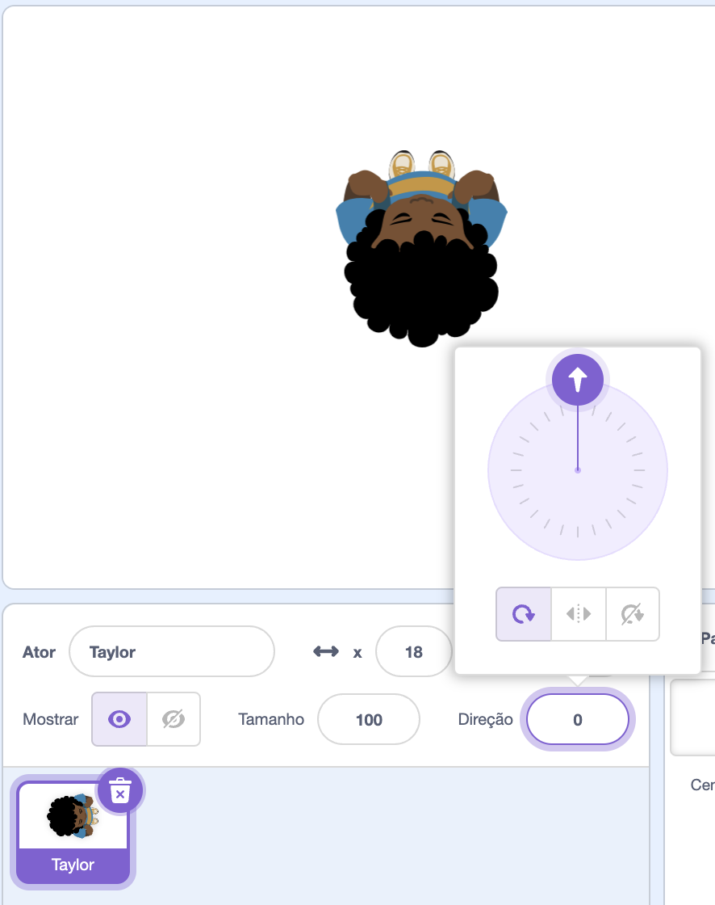

## Escolha um tema

<div style="display: flex; flex-wrap: wrap">
<div style="flex-basis: 200px; flex-grow: 1; margin-right: 15px;">
Nesta etapa, você adicionará um personagem e um cenário e criará plataformas iniciais e finais. 
</div>
<div>
{:width="300px"}
</div>
</div>

--- task ---

Abra um [novo projeto Scratch](http://rpf.io/scratch-new){:target="_blank"} e exclua o sprite do gato. O Scratch será aberto em outra aba do navegador.

--- /task ---

--- task ---

Crie um cenário de cor sólida.

[[[scratch-paint-single-colour-backdrop]]]

--- /task ---

--- task ---

**Escolha:** Seu personagem se moverá da esquerda para a direita ou de baixo para cima?


--- /task ---

--- task ---

Pinte um novo sprite de plataforma **Iniciar**.

Comece com uma forma simples de cor única. Você pode adicionar mais detalhes posteriormente.

Centralize sua fantasia no editor Paint.

[[[scratch-crosshair]]]

Posicione seu sprite de plataforma **Iniciar** onde deseja que seu personagem inicie o jogo.

--- /task ---

--- task ---

Crie um sprite de plataforma **Fim** simples. Você pode adicionar mais detalhes posteriormente.

Centralize sua fantasia no editor Paint.

Posicione seu sprite de plataforma **Iniciar** onde deseja que seu personagem inicie o jogo.

--- /task ---

--- task ---

Selecione o ator **personagem**.

**Escolha:** Você deseja adicionar ou pintar um sprite de **personagem**?

Você pode querer adicionar um ator de **personagem** de cima para baixo, como **Tatiana**, **Taylor** ou **Trisha**.


Ou pinte seu próprio sprite **personagem**. Comece com formas simples e adicione detalhes mais tarde. Centralize sua fantasia no editor Paint.

[[[generic-scratch3-draw-sprite]]]

--- /task ---

--- task ---

Seu sprite **personagem** precisa de um script inicial para ter tudo configurado para o início do jogo.

--- collapse ---

---
título: Prepare seu personagem para começar
---

Faça uma `variável`{:class="block3variables"} chamada `pousou`e defina-a com o tamanho que seu sprite deve ter quando pousar e for não pulando.

Faça seu personagem ir para **Iniciar** `quando a bandeira for clicada`{:class="block3events"}. Adicione um bloco `vá para a camada frontal`{:class="block3looks"}, para que seu personagem fique no topo das plataformas.

**Personagem:**

```blocks3
when flag clicked // setup
go to (Start v)
set [landed v] to [40] // size when not jumping
set size to (landed) % // not jumping
go to [front v] layer
show
broadcast (start v) // start other scripts
```

**Dica:** Desmarque a variável `pouso`{:class="block3variables"} em `Variáveis`{:class ="block3variables"} Bloqueia o menu para que ele não apareça no Palco. O usuário não precisa ver esta variável.

--- /collapse ---

**Dica:** É uma boa ideia `transmitir`{:class="block3events"} um `iniciar`{: class="block3events"} no final do seu script de configuração para que outros scripts saibam quando começar, caso contrário, eles poderão começar antes que tudo esteja pronto.

--- /task ---

--- task ---

**Depurar:**

--- collapse ---

---
título: Meu sprite está apontando na direção errada
---

A propriedade **Direção** no painel Sprite pode ser usada para controlar a direção para a qual o sprite está apontando. Gire a roda para fazer um sprite apontar na direção que você precisa.



--- /collapse ---

--- /task ---

--- task ---

Dê ao seu projeto um título que descreva o seu jogo.

--- /task ---

--- save ---
