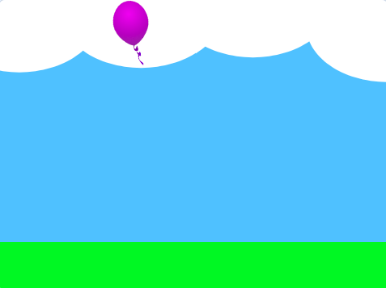

## Ganhador

<div style="display: flex; flex-wrap: wrap">
<div style="flex-basis: 200px; flex-grow: 1; margin-right: 15px;">
Nesta etapa, você detectará o jogador chegando à plataforma **Fim** para vencer o jogo. 
</div>
<div>
{:width="300px"}
</div>
</div>

Você adicionará um laço `forever`{:class="block3control"} que verifica se seu **personagem** está no nível da plataforma e, em caso afirmativo, `se`{:class="block3control"} atingiu a plataforma **Fim**.

--- task ---

**Escolha:** Adicione um som vencedor ao seu personagem.

--- /task ---

--- task ---

Adicione código para detectar quando seu personagem atinge a plataforma **Fim** usando `tocando a cor`{:class="block3sensing"}.

--- collapse ---

---
title: Termine o jogo ao tocar na cor
---

**Personagem**:

```blocks3
when I receive [início v]
forever
if <(size) = (pousado)> then // não no ar
if <touching color (#b89d2f) ?> then // no final
broadcast (parar v) // pare outros sprites
stop [outros scripts no ator v] // pare de pular depois da vitória
go to (Fim v)
play sound (Win v) until done
stop [todos v]
end
end
end
```

É uma boa ideia `transmitir`{:class="block3events"} uma mensagem de 'parar' para que outros sprites saibam que o jogo terminou. O bloco `parar outros scripts no sprite`{:class="block3control"} interrompe o laço que faz o personagem pular.

--- /collapse ---

Você precisará definir a cor detectada para a cor da sua plataforma **Fim**.

[[[scratch3-set-block-input-colour-with-eyedropper]]]

**Dica:** É uma boa ideia `transmitir`{:class="block3events"} uma `parar`{:class="block3events"} quando você detecta que seu jogo terminou para que outros sprites possam parar, mas esse sprite pode fazer algo como reproduzir um som antes de parar.

--- /task ---

--- task ---

**Teste:** Clique na bandeira verde e pule seu personagem pelo palco. Certifique-se de ouvir o som vencedor quando chegar à plataforma **Fim**.

**Dica:** É muito importante que você teste seu projeto antes de passar para a próxima etapa e adicionar mais código. É mais difícil encontrar e corrigir bugs quando você adiciona mais código.

--- /task ---


--- task ---

**Depurar:**

--- collapse ---

---
title: Meu sprite não vai para o centro da plataforma Fim
---

Você precisa ter certeza de que todas as suas fantasias de sprite estão centralizadas no editor Paint.

O bloco `vá para (outro sprite)`{:class="block3motion"} outro sprite move um sprite para que seu centro fique na mesma posição que o centro do outro sprite. Se os centros deles estiverem no lugar errado, então seu **personagem** não irá para o centro das plataformas.

--- /collapse ---

--- collapse ---

---
title: O jogo termina muito cedo
---

Verifique se seu sprite não está tocando a cor final quando não estiver na plataforma **Fim** — se você usar a mesma cor em outro lugar do seu projeto, seu personagem poderá morrer muito cedo.

--- /collapse ---

--- collapse ---

---
title: O som não toca quando eu pouso na plataforma Fim
---

Clique no seu sprite **personagem** e depois na aba 'Sons'. Certifique-se de ter adicionado o som final ao seu sprite. Clique no botão **Jogar** para garantir que o som esteja funcionando no seu computador.

Clique na aba **Código** e verifique se o som correto está no bloco `tocar som`{:class="block3sound"} que é executado quando o sprite atinge a plataforma **Fim**.

Certifique-se de que a cor esteja correta no bloco `tocar cores`{:class="block3sensing"}. Selecione-o novamente se não tiver certeza. Às vezes, as cores parecem semelhantes, mas não são iguais.

```blocks3
when I receive [início v]
forever
if < (size) = (pousado) > then // não no ar
+if <touching color (#b89d2f) ?> then // no final
broadcast (parar v) // pare outros sprites
go to (Fim v)
+play sound (Win v) until done
stop [todos v]
end
end
end
```

--- /collapse ---

Se você tiver um bug que não abordamos aqui, informe-nos nos comentários. Se você mesmo corrigiu o bug (muito bem!), informe-nos também.

**Dica:** Se você estiver travado, tente ler seu código em voz alta ou mentalmente para ter certeza de que ele diz o que você pensa. Você pode encontrar o bug.

--- /task ---

--- save ---
