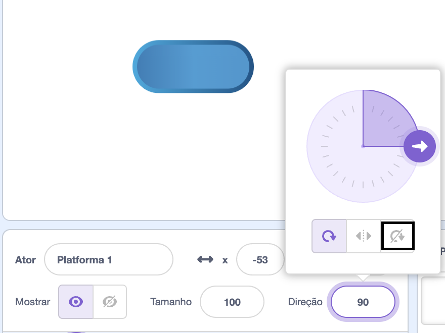

## Ande nas plataformas

<div style="display: flex; flex-wrap: wrap">
<div style="flex-basis: 200px; flex-grow: 1; margin-right: 15px;">
Bem, isso é muito fácil! 

Nesta etapa, você adicionará plataformas para pousar. Pular sobre eles evitará cair. 
</div>
<div>
{:width="300px"}
</div>
</div>

--- task ---

Crie um sprite **Plataforma 1** para pousar.

Pinte uma fantasia para seu sprite **Plataforma 1**.

**Dica:** Se você quiser que seu sprite `salte`{:class="block3motion"} sem que a fantasia pareça mudar de direção, você precisará de uma fantasia que seja simétrico ou defina o estilo de rotação para **Não rotar**.



--- /task ---

--- task ---

Adicione o código ao seu sprite **Platforma 1** para colocá-lo em movimento.

Você pode precisar do seu sprite **Plataforma 1** para `apontar na direção`{:class="block3motion"} `0` para mover para cima e para baixo na tela.

--- collapse ---

---
title: Faça sua plataforma se mover
---

```blocks3
when I receive [início v]
point in direction (0) // adicione este bloco para jogos da esquerda para a direita
forever
move (4) steps // tente diferentes números
if on edge, bounce
end
```

--- /collapse ---

--- /task ---

--- task ---

**Teste:** Clique na bandeira verde e certifique-se de que sua plataforma se mova corretamente.

--- /task ---

--- task ---

Duplique seu sprite **Plataforma 1** e nomeie-o como **Plataforma 2**.

**Escolha:** Se você deseja ter 3 plataformas, duplique o sprite **Plataforma 1** novamente e nomeie-o como **Plataforma 3**.

[[[scratch3-duplicate-sprite]]]

Experimente o número de etapas e o tamanho do sprite para tornar cada plataforma mais fácil ou mais difícil de pular.

--- /task ---

Detecte `se`{:class="block3control"} seu **personagem** sprite pousou em uma **plataforma** sprite e está seguro, `se`{:class="block3control"} seu **personagem** sprite caiu!

--- task ---

Adicione código ao seu sprite de **personagem** para sentir `se tocar`{:class="block3sensing"} uma cor nos sprites da **plataforma**.

**Escolha:** Se sua plataforma tiver múltiplas cores, escolha em qual cor seu personagem precisa pousar. Você pode querer que eles caiam se estiverem apenas no limite!

--- collapse ---

---
title: Se tocar na plataforma
---

```blocks3
when I receive [início v]
forever
if <(size) = (pousado) > then // não no ar
if <touching color (#b89d2f) ?> then // no final
broadcast (parar v) // pare outros sprites
stop [outros scripts no ator v]
go to (Fim v)
play sound (Win v) until done
stop [todos v]
end
+ if <touching color (#762356) ?> then // escolha uma cor na sua plataforma
if <touching (Plataforma 1 v)> then
go to (Plataforma 1 v)
end
if <touching (Plataforma 2 v)> then
go to (Plataforma 2 v)
end
if <touching (Plataforma 3 v)> then
go to (Plataforma 3 v)
end
else
end
end
end
```

--- /collapse ---

--- /task ---

--- task ---

**Teste:** Clique na bandeira verde e certifique-se de que seu sprite pode andar nas plataformas.

--- /task ---

--- task ---

Adicione código ao seu **personagem** sprite para detectar `if`{:class="block3control"} `tocando`{:class="block3sensing"} a cor de fundo e encerre o jogo.

--- collapse ---

---
title: Se tocado pano de fundo
---

```blocks3
when I receive [início v]
forever
if <(size) = (pousado)> then // não no ar
if <touching color (#b89d2f) ?> then // no final
broadcast (parar v) // pare outros sprites
stop [outros scripts no ator v] 
go to (Fim v)
play sound (Win v) until done
stop [todos v]
end
if <touching color (#762356) ?> then // escolha uma cor na sua plataforma
if <touching (Plataforma 1 v)> then
go to (Plataforma 1 v)
end
if <touching (Plataforma 2 v)> then
go to (Plataforma 2 v)
end
if <touching (Plataforma 3 v)> then
go to (Plataforma 3 v)
end
else
+ if <touching color (#37ab37) ?> then // escolha a cor do seu cenário
broadcast (parar v)
stop [outros scripts no ator v] // evitar pular depois de perder
hide
play sound (lose v) until done // adicione um som de sua escolha
stop [todos v]
end
end
end
```

--- /collapse ---

--- /task ---

--- task ---

**Teste:** Jogue seu jogo e tente perder uma plataforma. Certifique-se de ouvir o som perdido.

--- /task ---

--- task ---

Adicione código aos sprites da **plataforma** para impedi-los de se mover quando o sprite do **personagem** atingir a plataforma **Fim** - ou cai!

```blocks3
when I receive [parar v]
stop [outros scripts no ator v]
```

--- /task ---

--- task ---

**Teste:** Jogue novamente e certifique-se de que as plataformas parem quando o jogo terminar. O jogo termina quando você alcança a plataforma **Fim** ou quando você cai nela.

--- /task ---

--- task ---

**Depurar:**

--- collapse ---

---
title: O jogo termina muito cedo
---

Certifique-se de ter os blocos `se`{:class="block3control"} na ordem correta dentro de seu `sempre`{:class="block3control"} bloquear. Verifique cuidadosamente o código de exemplo.

Se você verificar se o **personagem** está tocando o cenário antes de pousar em uma plataforma, seu jogo poderá terminar injustamente!

Certifique-se de que seus blocos `se`{:class="block3control"} para verificar as condições do jogo estejam dentro de um bloco `se`{:class="block3control"} que verifica se o tamanho do **personagem** é normal. Não há problema em seu sprite tocar na cor do fundo ao pular. Só será um problema se eles caírem no creme, na lava, na gosma radioativa ou em qualquer outro perigo que você tenha escolhido.

--- /collapse ---

--- collapse ---

---
title: As plataformas não param quando eu ganho ou perco
---

Veja o script `quando eu receber`{:class="block3events"} dos seus sprites da **plataforma** e verifique se a mensagem é `parar`{:class="block3events"}.

```blocks3
when I receive [parar v]
stop [outros scripts no ator v]
```
Verifique se o bloco `transmitir`{:class="block3events"} dentro dos blocos `se`{:class="block3control"} de vitória e perda é `parar`{:class="block3events"}.

```blocks3
broadcast (parar v)
```

--- /collapse ---

--- /task ---

<p style="border-left: solid; border-width:10px; border-color: #0faeb0; background-color: aliceblue; padding: 10px;">
Existem muitos <span style="color: #0faeb0">jogos de plataforma</span> incluindo jogos 2D e 3D. As plataformas são comuns em jogos de obstáculos (obby) e jogos de parkour. Alguns jogos possuem plataformas que se movem, mostram e escondem, ou desaparecem gradualmente quando você salta sobre elas. Você consegue pensar em jogos que você jogou e que possuem plataformas nas quais você precisa pular? E os jogos com plataformas móveis?
</p>

--- save ---
