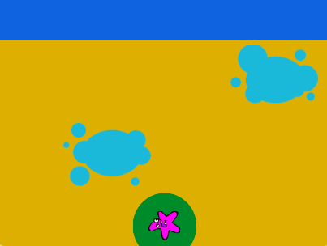

## Melhore o seu projeto

Se você tiver tempo, pode atualizar seu projeto. 

{:width="300px"}

Aqui estão algumas ideias que você pode tentar:
- Adicione outro nível. Quando o jogador vence, `transmite`{:class="block3events"} uma mensagem `nível2`{:class="block3events"} e altera a velocidade que os sprites se movem, usando uma variável `velocidade`{:class="block3variables"}.
- Faça as plataformas aparecerem e desaparecerem em um bloco `para sempre`{:class="block3control"} usando `exibir`{:class="block3looks"}, `esconder`{:class="block3looks"} e `aguarde`{:class="block3control"}.
- Adicione mais plataformas ou faça com que mais plataformas apareçam quando você chegar ao próximo nível. Você precisará considerar o que mais precisa ser alterado para fazer seu jogo funcionar no segundo nível e redefinir corretamente para o primeiro nível `quando o sinalizador for clicado`{:class="block3events"}.
- Crie seu próprio personagem de cima para baixo no editor Paint.

Dê uma olhada em nosso [Não caia - Exemplos Scratch studio](https://scratch.mit.edu/studios/29599110){:target="_blank"} cada projeto tem um link **Veja dentro** para você abre o projeto no Scratch e olha o código para ter ideias e ver como elas funcionam.

Para mais inspiração, dê uma olhada no estúdio [Don't fall in - Comunidade Scratch](https://scratch.mit.edu/studios/29601182){:target="_blank"} para ver projetos criados por membros da comunidade.

--- save ---
