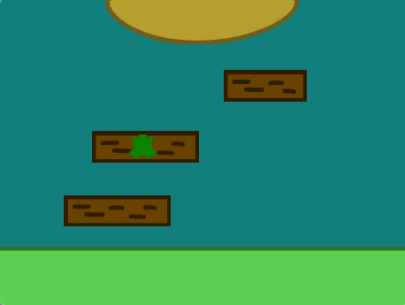

## Що ти зробиш

Розроби та побудуй гру з видом згори, де можна стрибати з платформи на платформу або долати перешкоди. Твоєму персонажу доведеться стрибати вгору, вперед чи вбік, ковзати або літати, щоб пересуватися рухомими платформами і дійти до фінішу.

**Гра з видом згори або з висоти пташиного польоту** — це гра, де ти ніби дивишся зверху на те, що відбувається у грі. Іноді гра повністю має вид згори. Деякі ігри вмикають вид згори, коли ти переходиш у режим розробки. Можеш згадати гру, де використовується вид згори? 

--- no-print ---

  

### Грай

Натисни на пробіл або торкнися сцени, щоб стрибнути на наступну платформу. Вибирай правильний момент для стрибка, щоб не впасти у заварний крем.

+ Як у грі створюється вид зверху вниз? 
+ Як змінюється розмір персонажа, коли той у повітрі? 
+ Що станеться, якщо ти не приземлишся на платформу? (Спробуй впасти у заварний крем!)

**Не впади в заварний крем!**: [Переглянути код](https://scratch.mit.edu/projects/525202210/editor){:target="_blank"}

  <iframe allowtransparency="true" width="485" height="402" src="https://scratch.mit.edu/projects/embed/525202210/?autostart=false" frameborder="0"></iframe>

### Отримай ідеї 💭

Ти приймеш дизайнерські рішення і зробиш свою власну гру-платформер із видом зверху вниз. Ти вибереш тему, кольори, персонажів, кількість платформ і рівень складності.

--- task ---

Переглянь приклади проєктів, щоб отримати більше ідей:

**Пташеня**: [Переглянути код](https://scratch.mit.edu/projects/525236983/editor){:target="_blank"}

  <iframe allowtransparency="true" width="485" height="402" src="https://scratch.mit.edu/projects/embed/525236983/?autostart=false" frameborder="0"></iframe>

**З колоду на колоду**: [Переглянути код](https://scratch.mit.edu/projects/525236345/editor){:target="_blank"}

  <iframe allowtransparency="true" width="485" height="402" src="https://scratch.mit.edu/projects/embed/525236345/?autostart=false" frameborder="0"></iframe>

**Планетні стрибки**: [Переглянути код](https://scratch.mit.edu/projects/525236603/editor){:target="_blank"}

  <iframe allowtransparency="true" width="485" height="402" src="https://scratch.mit.edu/projects/embed/525236603/?autostart=false" frameborder="0"></iframe>

--- /task ---

--- /no-print ---

--- print-only ---

### Отримай ідеї 💭

Ти приймеш дизайнерські рішення і зробиш свою власну гру-платформер із видом зверху вниз. Ти вибереш тему, кольори, персонажів, кількість платформ і рівень складності. Переглянь приклади проєктів у Скретч-студії [Скретч: Не впади! — приклади](https://scratch.mit.edu/studios/29599110/){:target="_blank"}.

   

--- /print-only ---

 
