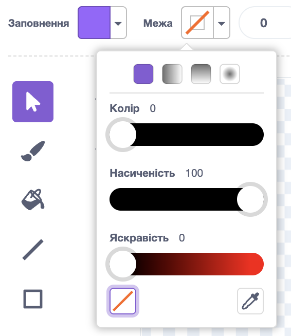
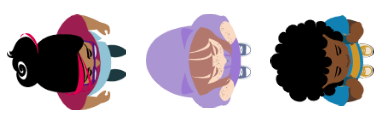
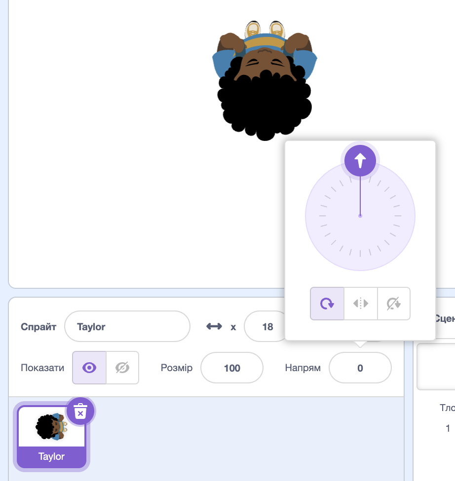

## Choose your theme

<div style="display: flex; flex-wrap: wrap">
<div style="flex-basis: 200px; flex-grow: 1; margin-right: 15px;">
In this step, you will add a character and backdrop, and create start and end platforms. 
</div>
<div>
{:width="300px"}
</div>
</div>

--- task ---

Open a [new Scratch project](http://rpf.io/scratch-new){:target="_blank"} and delete the cat sprite. Scratch will open in another browser tab.

--- /task ---

--- task ---

Create a solid colour backdrop. 

[[[scratch-paint-single-colour-backdrop]]]

--- /task ---

--- task ---

**Choose:** Will your character move from left to right, or bottom to top? 


--- /task ---

--- task ---

Paint a new **Start** platform sprite. 

Start with a simple single coloured shape. You can turn the outline off by choosing the red diagonal line.



You can add more detail later. 

Centre your costume in the Paint editor.

[[[scratch-crosshair]]]

Position your **Start** platform sprite where you want your character to start the game.

--- /task ---

--- task ---

Create a simple **End** platform sprite. You can add more detail later. 

Centre your costume in the Paint editor.

Position your **End** sprite on the Stage where you want your character to finish the game.

--- /task ---

--- task ---

Create a **character** sprite. 

**Choose:** Do you want to add or paint a **character** sprite? 

You might want to add a top-down **character** sprite such as **Tatiana**, **Taylor**, or **Trisha**. 



Or, paint your own **character** sprite. Start with simple shapes and add details later. Centre your costume in the Paint editor.

[[[generic-scratch3-draw-sprite]]]

--- /task ---

--- task ---

Your **character** sprite needs a start script to get everything set up for the beginning of the game.

Make a `variable`{:class="block3variables"} called `landed`, and set it to the size your sprite should be when it has landed and is not jumping.

Get your character to go to the **Start** `when flag clicked`{:class="block3events"}. Add a `go to front layer`{:class="block3looks"} block, so your character is on top of the platforms. 

**Character:**

```blocks3
when flag clicked // setup
go to (Start v)
set [landed v] to [40] // size when not jumping
set size to (landed) % // not jumping
go to [front v] layer
show
broadcast (start v) // start other scripts
```

**Tip:** Uncheck the `landed`{:class="block3variables"} variable in the `Variables`{:class="block3variables"} Blocks menu so that it doesn't show on the Stage. The user doesn't need to see this variable.

**Tip:** It's a good idea to `broadcast`{:class="block3events"} a `start`{:class="block3events"} message at the end of your setup script to let other scripts know when to start, otherwise they might start before everything is ready.

--- /task ---

--- task ---

**Debug:**

--- collapse ---

---
title: My sprite is pointing in the wrong direction
---

The **Direction** property in the Sprite pane can be used to control the direction the sprite is pointing in. Turn the wheel to make a sprite point in the direction you need. 



--- /collapse ---

--- /task ---

--- task ---

Give your project a title that describes your game.

--- /task ---

--- save ---
