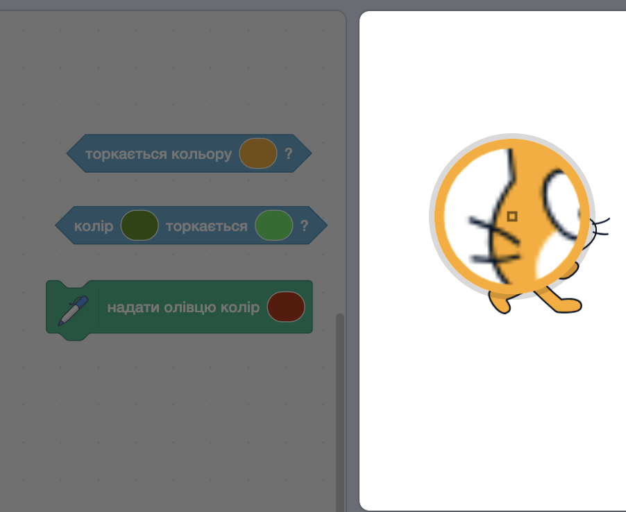

## Перемога

<div style="display: flex; flex-wrap: wrap">
<div style="flex-basis: 200px; flex-grow: 1; margin-right: 15px;">
На цьому етапі ти навчишся виявляти, коли гравець досягає **фінішної** платформи і виграє. 
</div>
<div>
{:width="300px"}
</div>
</div>

Ти додаси цикл `завжди`{:class="block3control"}, який перевіряє, чи знаходиться **персонаж** на рівні з платформами і, якщо так, чи він досяг **фінішної** платформи. Для цього використовуй блок `якщо`{:class="block3control"}.

--- task ---

**Вибери** звук перемоги для свого персонажа.

--- /task ---

###  Як завершити гру, коли персонаж торкається кольорової платформи

--- task ---

Щоб виявити, коли спрайт персонажа досягає **фінішної** платформи, використовуй блок `торкається кольору`{:class="block3sensing"}.


```blocks3
when I receive [старт v]
forever
if <(size) = (на землі)> then // не в повітрі
if <touching color (#b89d2f) ?> then // біля фінішу
broadcast (стоп v) // зупинити інші спрайти
stop [інші скрипти цього спрайту v] // не стрибати після виграшу
go to (Фініш v)
play sound (Win v) until done
stop [все v]
end
end
end
```

Блок `зупинити інші скрипти цього спрайту`{:class="block3control"} припиняє цикл, який змушує персонажа стрибати.

Використовуй блок `оповістити (стоп v)`{:class="block3events"}, коли гра закінчується, щоб інші спрайти теж зупинилися. Але цей спрайт може, наприклад, відтворювати звук перед тим, як зупиниться.

--- /task ---

Щоб вибрати колір **фінішної** платформи, використовуй піпетку.

--- task ---

```blocks3
<touching color (#20f73b) ?>

```
Клацни на поле вводу кольору, щоб відкрити панель вибору кольору, а далі клацни на піпетку внизу.


Перемісти вказівник миші на фінішну платформу на Сцені та клацни на неї, щоб вибрати колір.



Колір у полі вводу блока поміняється на обраний колір. Клацни в області коду, щоб закрити панель вибору кольору.

--- /task ---

--- task ---

**Протестуй:** натисни на зелений прапорець і стрибай персонажем через Сцену. Ти маєш почути звук перемоги, коли досягнеш **фінішної** платформи.

**Порада:** дуже важливо протестувати свій проєкт перед тим, як додавати новий код. Коли ти додаси ще код, знаходити і виправляти помилки буде важче.

--- /task ---


--- task ---

**Налагодження:**

--- collapse ---

---
title: Мій спрайт не йде у центр фінішної платформи
---

Переконайся, що всі образи спрайтів відцентровані у редакторі Малювання.

Блок `перейти до (іншого спрайта)`{:class="block3motion"} пересуває спрайт таким чином, щоб його центр знаходився в тій же точці, що й центр іншого спрайта. Якщо центри зміщені, то **персонаж** не буде переходити на центр платформ.

--- /collapse ---

--- collapse ---

---
title: Гра закінчується надто рано
---

Переконайся, що твій спрайт не торкається фінального кольору до того, як він досягне **фінішної** платформи. Якщо ти використовуєш такий самий колір в іншому місці, твій персонаж може програти зарано.

--- /collapse ---

--- collapse ---

---
title: Коли я приземляюся на фінішну платформу, звук не відтворюється
---

Натисни на спрайт свого **персонажа**, а потім на вкладку «Звуки». Переконайся, що ти додав/-ла фінішний звук до свого спрайта. Натисни кнопку **Відтворити**, щоб перевірити, чи працює звук на твоєму компʼютері.

Натисни на вкладку **Код** і перевір, чи має блок `відтворити звук`{:class="block3sound"} правильний звук. Саме цей блок відтворює звук, коли спрайт досягає **фінішної** платформи.

Переконайся, що блок `торкається кольору`{:class="block3sensing"} має правильний колір. Вибери колір знову, якщо ти точно не знаєш. Іноді кольори схожі, але не однакові.

```blocks3
when I receive [старт v]
forever
if < (size) = (на землі) > then // не в повітрі
+if <touching color (#b89d2f) ?> then // біля фінішу
broadcast (стоп v) // зупинити інші спрайти
go to (Фініш v)
+play sound (Win v) until done
stop [все v]
end
end
end
```

--- /collapse ---

Якщо у тебе зʼявилася помилка, про яку ми тут не розповідали, повідом нам про це у відгуку. Якщо ти виправив/-ла помилку самостійно (молодець!), розкажи нам про це.

**Порада:** якщо у тебе виникли складнощі, прочитай свій код вголос або про себе. Так ти зможеш перевірити, чи він робить те, що має робити. Можливо, ти знайдеш помилку.

--- /task ---

--- save ---
