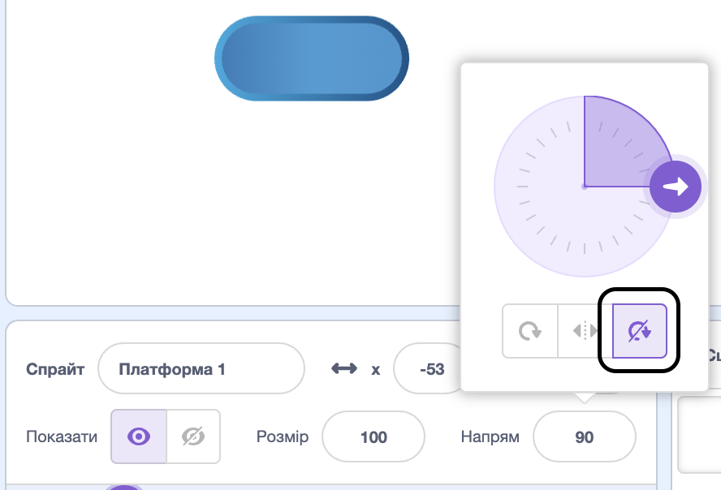

## Катайся на платформах

<div style="display: flex; flex-wrap: wrap">
<div style="flex-basis: 200px; flex-grow: 1; margin-right: 15px;">
Ну це надто легко! 

У цьому кроці ти додаси платформи, на які можна стрибати. Потрібно стрибати по них, щоб спрайт не провалився вниз. 
</div>
<div>
{:width="300px"}
</div>
</div>

--- task ---

Створи спрайт **Платформа 1**, на який можна стрибнути.

Намалюй образ для спрайта **Платформа 1**.

**Порада:** якщо ти хочеш, щоб твій спрайт `відбивався`{:class="block3motion"}, але образ з тим не розвертався, тобі потрібно або обрати симетричний образ, або встановити стиль обертання **не обертати**.



--- /task ---

--- task ---

Додай код до спрайта **Платформа 1**, щоб він почав рухатися.

Можливо, тобі доведеться `повернути в напрямку`{:class="block3motion"} `0` спрайт **Платформа 1**, щоб він рухався вгору й униз по екрану.

--- collapse ---

---
title: Додай руху платформі
---

```blocks3
when I receive [старт v]
point in direction (0) // додай цей блок до ігор, де треба стрибати зліва направо
forever
move (4) steps // спробуй різні числа
if on edge, bounce
end
```

--- /collapse ---

--- /task ---

--- task ---

**Протестуй:** натисни на зелений прапорець і перевір, чи правильно рухається твоя платформа.

--- /task ---

--- task ---

Здублюй спрайт **Платформа 1** і назви новий спрайт **Платформа 2**.

**Вибери** кількість платформ. Якщо ти хочеш мати три платформи, знову здублюй спрайт **Платформа 1** і назви новий спрайт **Платформа 3**.

[[[scratch3-duplicate-sprite]]]

Експериментуй з кількістю кроків і розміром спрайтів, щоб на якусь платформу стрибнути було легше, а на якусь важче.

--- /task ---

Визнач за допомогою блока `якщо`{:class="block3control"}, чи приземлився твій **персонаж** на спрайт **платформи** і знаходиться в безпеці, чи (блок `інакше`{:class="block3control"}) твій **персонаж** провалився!

--- task ---

Додай код до спрайта **персонажа**, щоб перевірити, чи він `торкається кольору`{:class="block3sensing"} спрайтів **платформ**.

**Вибери** колір, на який потрібно приземлитися твоєму персонажу, якщо твої платформи різних кольорів. Можливо, якщо він на самому краєчку платформи, він має впасти!

--- collapse ---

---
title: Якщо персонаж торкається платформи
---

```blocks3
when I receive [старт v]
forever
if <(size) = (на землі) > then // не в повіртрі
if <touching color (#b89d2f) ?> then // біля фінішу
broadcast (стоп v) // зупинити інші спрайти
stop [інші скрипти цього спрайту v]
go to (Фініш v)
play sound (Win v) until done
stop [все v]
end
+ if <touching color (#762356) ?> then // вибери колір платформи
if <touching (Платформа 1 v)> then
go to (Платформа 1 v)
end
if <touching (Платформа 2 v)> then
go to (Платформа 2 v)
end
if <touching (Платформа 3 v)> then
go to (Платформа 3 v)
end
else
end
end
end
```

--- /collapse ---

--- /task ---

--- task ---

**Протестуй:** натисни на зелений прапорець і перевір, чи може персонаж стрибати по платформах.

--- /task ---

--- task ---

Додай код до спрайта **персонажа**, який за допомогою блока `якщо`{:class="block3control"} перевірятиме, чи `торкається`{:class="block3sensing"} він кольору тла, а потім завершуватиме гру.

--- collapse ---

---
title: Блок «інакше»
---

```blocks3
when I receive [старт v]
forever
if <(size) = (на землі)> then // не в повітрі
if <touching color (#b89d2f) ?> then // біля фінішу
broadcast (стоп v) // зупинити інші спрайти
stop [інші скрипти цього спрайту v] 
go to (Фініш v)
play sound (Win v) until done
stop [все v]
end
if <touching color (#762356) ?> then // вибери колір платформи
if <touching (Платформа 1 v)> then
go to (Платформа 1 v)
end
if <touching (Платформа 2 v)> then
go to (Платформа 2 v)
end
if <touching (Платформа 3 v)> then
go to (Платформа 3 v)
end
else
+ if <touching color (#37ab37) ?> then // вибери колір тла
broadcast (стоп v)
stop [інші скрипти цього спрайту v] // не стрибати після програшу
hide
play sound (lose v) until done // додай звук на свій вибір
stop [все v]
end
end
end
```

--- /collapse ---

--- /task ---

--- task ---

**Протестуй:** почни грати у свою гру та пропусти одну платформу. Ти маєш почути звук програшу.

--- /task ---

--- task ---

Додай код до спрайтів **платформи**, щоб вони більше не рухалися, коли спрайт **персонажа** дійде до **фінішної** платформи — або ж провалиться!

```blocks3
when I receive [стоп v]
stop [інші скрипти цього спрайту v]
```

--- /task ---

--- task ---

**Протестуй:** зіграй знову і подивися, чи перестають платформи рухатися, кола гра закінчується. Гра закінчується, коли ти доходиш до **фінішної** платформи або коли провалюєшся.

--- /task ---

--- task ---

**Налагодження:**

--- collapse ---

---
title: Гра закінчується надто рано
---

Переконайся, що блоки `якщо`{:class="block3control"} розташовані у правильному порядку всередині блока `завжди`{:class="block3control"}. Порівняй свій код з прикладом вище.

Якщо **персонаж** торкнеться тла до того, як він приземлиться на платформу, гра може закінчитися несправедливо!

Переконайся, що блоки `якщо`{:class="block3control"}, які перевіряють умови гри, розміщені всередині блока `якщо`{:class="block3control"}, який перевіряє розмір **персонажа**. Якщо твій спрайт торкається кольору тла під час стрибка, це нормально. Проблема постає, тільки якщо він приземлиться в заварний крем, лаву, радіоактивний слиз або іншу небезпеку на твій вибір.

--- /collapse ---

--- collapse ---

---
title: Платформи продовжують рухатися, коли я виграю або програю
---

Подивись на скрипт у спрайтах **платформ** `коли я отримую`{:class="block3events"} і перевір, чи має він повідомлення `стоп`{:class="block3events"}.

```blocks3
when I receive [стоп v]
stop [інші скрипти цього спрайту v]
```
Блок `оповістити`{:class="block3events"} всередині блоків `якщо`{:class="block3control"} для перемоги й програшу повинен містити повідомлення `стоп`{:class="block3events"}.

```blocks3
broadcast (стоп v)
```

--- /collapse ---

--- /task ---

--- save ---
